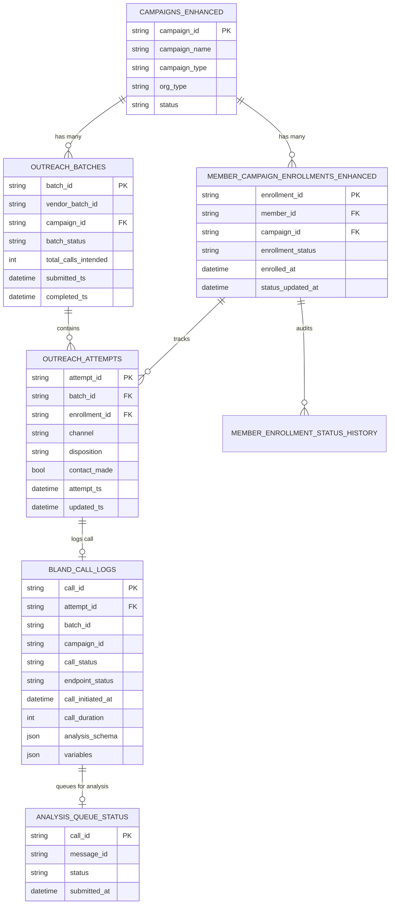
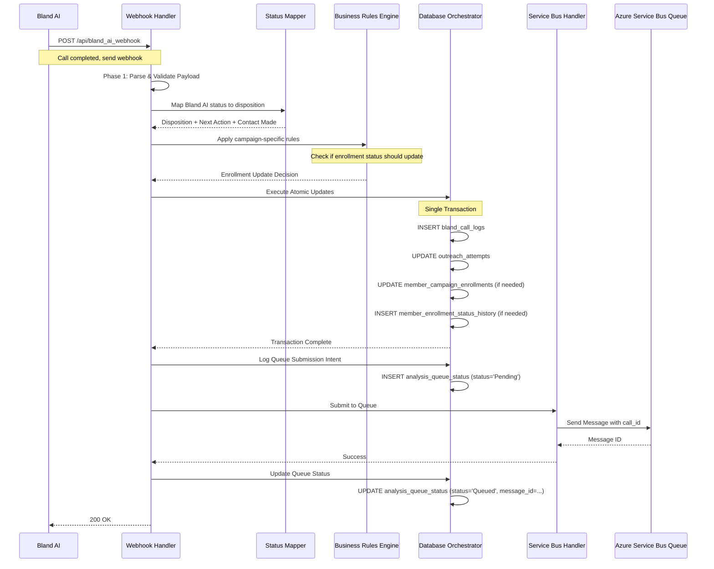
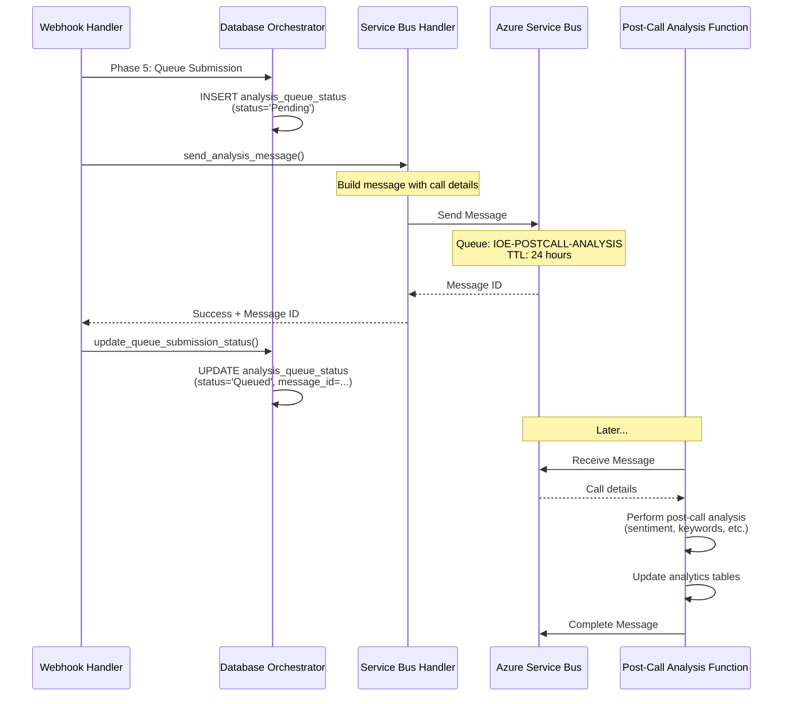

# Batch Creation and Navigation Flow - Complete Documentation

## Table of Contents
1. [Executive Summary](#executive-summary)
2. [Complete Lifecycle Flow](#complete-lifecycle-flow)
3. [Database Tables Overview](#database-tables-overview)
4. [3-Phase Batch Creation Pattern](#3-phase-batch-creation-pattern)
5. [Webhook Processing Pipeline](#webhook-processing-pipeline)
6. [Disposition Mapping Logic](#disposition-mapping-logic)
7. [Queue Integration for Post-Call Analysis](#queue-integration-for-post-call-analysis)
8. [Tables to Access for Active Calls and Batches](#tables-to-access-for-active-calls-and-batches)
9. [SQL Query Reference](#sql-query-reference)
10. [Code Implementation Details](#code-implementation-details)

---

## Executive Summary

This document provides comprehensive documentation for the batch creation and navigation flow in the IOE system. It covers:

- **Campaign Call Creation**: How calls are created via Bland AI batch API for every campaign
- **Batch Tracking**: How `outreach_batches` table is updated (INSERT new batch)
- **Attempt Tracking**: How `outreach_attempts` table is updated (INSERT attempts - one per member)
- **Column Management**: vendor_batch_id (from Bland AI) and internal batch_id (Python UUID)
- **Webhook Processing**: How Bland AI calls webhook to update `bland_call_logs` table
- **Disposition Logic**: How call outcomes are mapped to internal dispositions
- **Queue Integration**: How call_id is added to queue for post-call analysis

### Key Architecture Patterns

1. **3-Phase Batch Tracking**: Proactive database record creation BEFORE API call
2. **Synchronous Submission**: HTTP POST blocks until Bland AI confirms batch acceptance
3. **Asynchronous Processing**: Bland AI makes actual calls in background (30 min - 2 hrs)
4. **Webhook-Driven Updates**: Call completion triggers webhook to update database
5. **Atomic Transactions**: All webhook updates happen in single transaction
6. **Queue-Based Analysis**: Post-call analysis via Azure Service Bus

---

## Complete Lifecycle Flow

```mermaid
graph TB
    Start[Campaign Scheduler Trigger] --> CheckCampaigns[Find Qualified Campaigns]
    CheckCampaigns --> FindMembers[Find Eligible Members]
    FindMembers --> Phase1[PHASE 1: Create Batch Record]

    Phase1 --> InsertBatch[INSERT into outreach_batches<br/>status='Pending'<br/>batch_id=UUID<br/>vendor_batch_id=NULL]

    InsertBatch --> Phase2[PHASE 2: Create Attempt Records]
    Phase2 --> InsertAttempts[INSERT into outreach_attempts<br/>disposition='Pending'<br/>One per member]

    InsertAttempts --> Phase3[PHASE 3: Submit to Bland AI]
    Phase3 --> BlandAPI[POST to Bland AI<br/>https://api.bland.ai/v2/batches/create]

    BlandAPI --> APISuccess{API Success?}
    APISuccess -->|Yes| UpdateBatch[UPDATE outreach_batches<br/>SET vendor_batch_id=bland_batch_id<br/>SET batch_status='Submitted']
    APISuccess -->|No| MarkFailed[UPDATE outreach_batches<br/>SET batch_status='Failed']

    UpdateBatch --> BlandProcessing[Bland AI Processes Calls<br/>30 min - 2 hours]

    BlandProcessing --> CallComplete[Call Completes]
    CallComplete --> Webhook[Bland AI Calls Webhook]

    Webhook --> WebhookPhase1[Webhook Phase 1:<br/>Parse & Validate Payload]
    WebhookPhase1 --> WebhookPhase2[Webhook Phase 2:<br/>Map Status to Disposition]
    WebhookPhase2 --> WebhookPhase3[Webhook Phase 3:<br/>Apply Business Rules]
    WebhookPhase3 --> WebhookPhase4[Webhook Phase 4:<br/>Atomic Database Updates]

    WebhookPhase4 --> DBUpdate1[INSERT into bland_call_logs<br/>Complete call details]
    DBUpdate1 --> DBUpdate2[UPDATE outreach_attempts<br/>SET disposition, contact_made]
    DBUpdate2 --> DBUpdate3{Business Rules?}
    DBUpdate3 -->|Yes| DBUpdate4[UPDATE member_campaign_enrollments_enhanced<br/>SET enrollment_status]
    DBUpdate3 -->|No| QueuePhase
    DBUpdate4 --> QueuePhase[Webhook Phase 5:<br/>Queue Submission]

    QueuePhase --> QueueLog[INSERT into analysis_queue_status<br/>submission_intent='Pending']
    QueueLog --> ServiceBus[Submit to Azure Service Bus<br/>Queue: IOE-POSTCALL-ANALYSIS]
    ServiceBus --> QueueSuccess{Queue Success?}
    QueueSuccess -->|Yes| QueueUpdate[UPDATE analysis_queue_status<br/>status='Queued'<br/>message_id=sb_message_id]
    QueueSuccess -->|No| QueueFailed[UPDATE analysis_queue_status<br/>status='Failed']

    QueueUpdate --> PostCallAnalysis[Post-Call Analysis Function<br/>Processes from Queue]

    style Phase1 fill:#e1f5ff
    style Phase2 fill:#e1f5ff
    style Phase3 fill:#e1f5ff
    style WebhookPhase4 fill:#fff3cd
    style QueuePhase fill:#d4edda
```



---

## Database Tables Overview

### Tables Involved in Batch Creation and Navigation

| Table Name | Purpose | When Updated | Update Type |
|------------|---------|--------------|-------------|
| `engage360.outreach_batches` | Tracks batch metadata | Phase 1 (before API), Phase 3 (after API) | INSERT, UPDATE |
| `engage360.outreach_attempts` | Tracks individual call attempts | Phase 2 (before API), Webhook (after call) | INSERT, UPDATE |
| `engage360.bland_call_logs` | Complete call details from Bland AI | Webhook (after call) | INSERT |
| `engage360.member_campaign_enrollments_enhanced` | Member enrollment status | Webhook (if business rules apply) | UPDATE |
| `engage360.member_enrollment_status_history` | Audit trail of status changes | Webhook (if enrollment updated) | INSERT |
| `engage360.analysis_queue_status` | Post-call analysis queue tracking | Webhook (queue submission) | INSERT, UPDATE |
| `engage360.campaigns_enhanced` | Campaign configuration | Read-only during processing | SELECT |
| `engage360.campaign_call_configs_enhanced` | Bland AI configuration | Read-only during processing | SELECT |
| `engage360.members` | Member demographics | Read-only during processing | SELECT |
| `engage360.system_locks` | Distributed locking for reconciliation | Batch reconciliation | INSERT, DELETE |

### Table Relationships



---

## 3-Phase Batch Creation Pattern

Both DTC and Partner campaigns use the same **3-Phase Batch Tracking Pattern** to ensure complete traceability even if API calls fail.

### Phase 1: Create Batch Record (BEFORE API Call)

**Purpose**: Create database record for batch tracking BEFORE calling Bland AI API

**Table**: `engage360.outreach_batches`

**Operation**: INSERT

**Columns Set**:
- `batch_id` (string, UUID) - Python-generated UUID, NOT database auto-increment
- `campaign_id` (string) - Reference to campaign
- `batch_status` (string) - Set to 'Pending'
- `total_calls_intended` (int) - Number of members in batch
- `submitted_ts` (datetimeoffset) - Current timestamp
- `vendor_batch_id` (string) - NULL at this point (set in Phase 3)

**SQL Query**:
```sql
INSERT INTO engage360.outreach_batches
(batch_id, campaign_id, batch_status, total_calls_intended, submitted_ts)
VALUES (?, ?, 'Pending', ?, SYSDATETIMEOFFSET())
```

**Code Location**:
- DTC: `af_code/af_dtc_intro_call/services/blandai_service.py:60-80`
- Partner: `af_code/partner_campaign_scheduler/services/batch_orchestrator.py:327-358`

**Example**:
```python
batch_id = str(uuid.uuid4())  # e.g., "a1b2c3d4-e5f6-7890-abcd-ef1234567890"

query = """
    INSERT INTO engage360.outreach_batches
    (batch_id, campaign_id, batch_status, total_calls_intended, submitted_ts)
    VALUES (%s, %s, 'Pending', %s, SYSDATETIMEOFFSET())
"""

db_service.execute_query(query, (batch_id, campaign_id, len(members)), fetch_results=False)
```

### Phase 2: Create Attempt Records (BEFORE API Call)

**Purpose**: Create individual attempt records for each member BEFORE calling Bland AI API

**Table**: `engage360.outreach_attempts`

**Operation**: INSERT (bulk insert - one per member)

**Columns Set**:
- `attempt_id` (string, UUID) - Python-generated UUID for each member
- `enrollment_id` (string) - Member's enrollment ID
- `batch_id` (string) - Reference to batch created in Phase 1
- `channel` (string) - Set to 'Voice'
- `disposition` (string) - Set to 'Pending'
- `retry_seq` (int) - Set to 0 (first attempt)
- `attempt_ts` (datetimeoffset) - Current timestamp
- `contact_made` (bit) - NULL at this point (set by webhook)

**SQL Query**:
```sql
INSERT INTO engage360.outreach_attempts
(attempt_id, enrollment_id, batch_id, channel, disposition, retry_seq, attempt_ts)
VALUES (?, ?, ?, 'Voice', 'Pending', 0, SYSDATETIMEOFFSET())
```

**Code Location**:
- DTC: `af_code/af_dtc_intro_call/services/blandai_service.py:82-99`
- Partner: `af_code/partner_campaign_scheduler/services/batch_orchestrator.py:360-396`

**Example**:
```python
# Bulk insert for all members in batch
for member in eligible_members:
    attempt_id = str(uuid.uuid4())

    query = """
        INSERT INTO engage360.outreach_attempts
        (attempt_id, enrollment_id, batch_id, channel, disposition, retry_seq, attempt_ts)
        VALUES (%s, %s, %s, 'Voice', 'Pending', 0, SYSDATETIMEOFFSET())
    """

    db_service.execute_query(query, (attempt_id, member.enrollment_id, batch_id), fetch_results=False)
```

### Phase 3: Submit to Bland AI and Update with Vendor Batch ID

**Purpose**: Submit batch to Bland AI API and update database with vendor's batch ID

**API Endpoint**: `https://api.bland.ai/v2/batches/create`

**HTTP Method**: POST (SYNCHRONOUS - blocks until response or timeout)

**Timeout**: 60 seconds

**Headers**:
```python
headers = {
    "Authorization": f"Bearer {api_key}",  # Bland AI API key from Key Vault (BlandAIkey)
    "Content-Type": "application/json",
    "encrypted_key": encrypted_key  # Twilio encryption key from Key Vault (Blandaitwilio)
}
```

**Payload Structure**:
```json
{
  "global": {
    "pathway_id": "pathway-uuid",
    "pathway_version": "v1.0",
    "voice": "voice-id",
    "wait_for_greeting": true,
    "record": true,
    "answered_by_enabled": true,
    "noise_cancellation": true,
    "interruption_threshold": 100,
    "max_duration": 30,
    "model": "enhanced",
    "temperature": 0.7,
    "language": "en-US",
    "from": "+1234567890",
    "webhook": "https://your-function-app.azurewebsites.net/api/bland_ai_webhook"
  },
  "call_objects": [
    {
      "phone_number": "+1987654321",
      "request_data": {
        "member_name": "John Doe",
        "campaign_specific_data": "..."
      },
      "metadata": {
        "attempt_id": "uuid-1",
        "enrollment_id": "uuid-2",
        "campaign_id": "uuid-3",
        "batch_id": "uuid-4"
      }
    }
  ]
}
```

**Response from Bland AI**:
```json
{
  "batch_id": "bland-ai-batch-uuid",
  "status": "queued",
  "calls_accepted": 100
}
```

**Database Update After API Success**:

**Table**: `engage360.outreach_batches`

**Operation**: UPDATE

**Columns Updated**:
- `vendor_batch_id` (string) - Set to batch_id from Bland AI response
- `batch_status` (string) - Changed from 'Pending' to 'Submitted'

**SQL Query**:
```sql
UPDATE engage360.outreach_batches
SET vendor_batch_id = ?, batch_status = 'Submitted'
WHERE batch_id = ?
```

**Code Location**:
- DTC: `af_code/af_dtc_intro_call/services/blandai_service.py:267-279`
- Partner: `af_code/partner_campaign_scheduler/services/batch_orchestrator.py:398-425`

**Example**:
```python
# Submit to Bland AI
response = requests.post(
    "https://api.bland.ai/v2/batches/create",
    headers=headers,
    json=payload,
    timeout=60  # SYNCHRONOUS - blocks for up to 60 seconds
)

if response.status_code == 200:
    response_data = response.json()
    vendor_batch_id = response_data.get("batch_id")

    # Update database with vendor batch ID
    query = """
        UPDATE engage360.outreach_batches
        SET vendor_batch_id = %s, batch_status = 'Submitted'
        WHERE batch_id = %s
    """

    db_service.execute_query(query, (vendor_batch_id, batch_id), fetch_results=False)
```

### Phase 3 Failure Handling

If Bland AI API call fails, the batch is marked as failed:

**SQL Query**:
```sql
UPDATE engage360.outreach_batches
SET batch_status = 'Failed', error_message = ?
WHERE batch_id = ?
```

This ensures complete traceability - you can always find batches that failed to submit by querying `batch_status = 'Failed'`.

---

## Webhook Processing Pipeline

After Bland AI completes each call (30 minutes to 2 hours later), it sends a webhook to your Azure Function.

### Webhook Flow Diagram



### Webhook Payload from Bland AI

```json
{
  "call_id": "bland-call-uuid",
  "batch_id": "bland-batch-uuid",
  "to": "+1987654321",
  "from": "+1234567890",
  "status": "completed",
  "endpoint_status": "CONTACT_MADE",
  "call_length": 180,
  "started_at": "2025-10-18T10:30:00Z",
  "completed_at": "2025-10-18T10:33:00Z",
  "recording_url": "https://...",
  "transcripts": [],
  "variables": {
    "member_name": "John Doe",
    "appointment_scheduled": "yes"
  },
  "analysis_schema": {
    "call_successful": true,
    "appointment_booked": true,
    "sentiment": "positive"
  },
  "metadata": {
    "attempt_id": "uuid-1",
    "enrollment_id": "uuid-2",
    "campaign_id": "uuid-3",
    "batch_id": "uuid-4"
  }
}
```

### Webhook Phase 1: Parse & Validate Payload

**Code Location**: `af_code/bland_ai_webhook/webhook_handler.py:52-67`

**Operations**:
1. Parse JSON payload
2. Extract `call_id`, `batch_id`, `status`, `endpoint_status`
3. Extract metadata (`attempt_id`, `enrollment_id`, `campaign_id`)
4. Check for duplicate webhook (query `bland_call_logs` for existing `call_id`)
5. Log webhook receipt

### Webhook Phase 2: Map Status to Disposition

**Code Location**: `af_code/bland_ai_webhook/services/status_mapper.py`

**Mapping Logic**:
- Bland AI sends two status fields: `status` (call-level) and `endpoint_status` (outcome)
- These are mapped to internal disposition values

**Example Mappings**:

| Bland AI Status | Bland AI Endpoint Status | Internal Disposition | Next Action | Contact Made |
|-----------------|-------------------------|---------------------|-------------|--------------|
| completed | CONTACT_MADE | Completed | Close | true |
| completed | NO_ANSWER | NoAnswer | Retry | false |
| completed | OPT_OUT | OptOut | Close | true |
| completed | VOICEMAIL | NoAnswer | Retry | false |
| failed | ERROR | Failed | Retry | false |
| no-answer | NO_ANSWER | NoAnswer | Retry | false |

**Code Example**:
```python
def map_status(status: str, endpoint_status: str):
    key = (status, endpoint_status)

    mapping = {
        ("completed", "CONTACT_MADE"): {
            "disposition": "Completed",
            "next_action": "Close",
            "contact_made": True
        },
        ("completed", "NO_ANSWER"): {
            "disposition": "NoAnswer",
            "next_action": "Retry",
            "contact_made": False
        },
        # ... 15+ more mappings
    }

    return mapping.get(key, default_mapping)
```

### Webhook Phase 3: Apply Business Rules

**Code Location**: `af_code/bland_ai_webhook/services/business_rules_engine.py`

**Purpose**: Determine if member's enrollment status should be updated based on call outcome

**Campaign-Specific Logic**:

#### DTC Intro Call Logic (Lines 53-136)

```python
# If member completed action or interested → ENROLLED
if disposition_tag in ["COMPLETED_ACTION", "INTERESTED"]:
    return EnrollmentUpdate(
        should_update=True,
        new_status="ENROLLED",
        reason="DTC_INTRO_CALL: Member interested; enrolling"
    )

# If member opted out → OPTED_OUT
if mapped.opt_out_requested:
    return EnrollmentUpdate(
        should_update=True,
        new_status="OPTED_OUT",
        reason="Member opted out"
    )

# If no answer or failed → No status change
if disposition in ["NoAnswer", "Failed"]:
    return EnrollmentUpdate(
        should_update=False,
        reason="No contact made"
    )
```

#### Partner Campaign Logic (Lines 138-189)

```python
# If contact made and positive outcome → CONTACTED
if mapped.contact_made and disposition == "Completed":
    return EnrollmentUpdate(
        should_update=True,
        new_status="CONTACTED",
        reason="PARTNER: Contact made successfully"
    )

# If opted out → OPTED_OUT
if mapped.opt_out_requested:
    return EnrollmentUpdate(
        should_update=True,
        new_status="OPTED_OUT",
        reason="Member opted out"
    )
```

### Webhook Phase 4: Atomic Database Updates

**Code Location**: `af_code/bland_ai_webhook/services/database_orchestrator.py:32-100`

**Purpose**: Execute ALL database updates in a SINGLE atomic transaction

**Transaction Components**:

#### 1. INSERT into bland_call_logs (ALWAYS)

**Purpose**: Store complete call details from Bland AI

**Table**: `engage360.bland_call_logs`

**Operation**: INSERT

**Columns Set**:
- `call_id` (string, PK) - Bland AI's call identifier
- `attempt_id` (string, FK) - Links to outreach_attempts
- `batch_id` (string) - Internal batch_id (from metadata)
- `vendor_batch_id` (string) - Bland AI's batch_id
- `campaign_id` (string, FK) - Campaign identifier
- `member_id` (string, FK) - Member identifier
- `call_status` (string) - Bland AI status
- `endpoint_status` (string) - Bland AI endpoint_status
- `call_initiated_at` (datetimeoffset) - When call started
- `call_completed_at` (datetimeoffset) - When call completed
- `call_duration` (int) - Duration in seconds
- `recording_url` (string) - URL to call recording
- `transcript` (nvarchar(max)) - Full transcript
- `analysis_schema` (nvarchar(max)) - JSON analysis from Bland AI
- `variables` (nvarchar(max)) - JSON variables from call
- `disposition` (string) - Internal disposition (from status mapper)
- `contact_made` (bit) - Whether contact was made
- `opt_out_requested` (bit) - Whether member opted out
- `created_at` (datetimeoffset) - Record creation timestamp

**SQL Query**:
```sql
INSERT INTO engage360.bland_call_logs (
    call_id, attempt_id, batch_id, vendor_batch_id, campaign_id, member_id,
    call_status, endpoint_status, call_initiated_at, call_completed_at, call_duration,
    recording_url, transcript, analysis_schema, variables,
    disposition, contact_made, opt_out_requested, created_at
)
VALUES (?, ?, ?, ?, ?, ?, ?, ?, ?, ?, ?, ?, ?, ?, ?, ?, ?, ?, SYSDATETIMEOFFSET())
```

**Code Location**: `af_code/bland_ai_webhook/services/database_orchestrator.py:205-263`

#### 2. UPDATE outreach_attempts (IF attempt_id exists)

**Purpose**: Update attempt record with call outcome

**Table**: `engage360.outreach_attempts`

**Operation**: UPDATE

**Columns Updated**:
- `disposition` (string) - Changed from 'Pending' to actual disposition
- `contact_made` (bit) - Set to true/false based on outcome
- `next_action` (string) - Set to Close/Retry/Follow_Up/etc
- `updated_ts` (datetimeoffset) - Current timestamp
- `call_duration` (int) - Duration in seconds
- `recording_url` (string) - URL to call recording

**SQL Query**:
```sql
UPDATE engage360.outreach_attempts
SET disposition = ?,
    contact_made = ?,
    next_action = ?,
    call_duration = ?,
    recording_url = ?,
    updated_ts = SYSDATETIMEOFFSET()
WHERE attempt_id = ?
```

**Code Location**: `af_code/bland_ai_webhook/services/database_orchestrator.py:265-293`

#### 3. UPDATE member_campaign_enrollments_enhanced (IF business rules say so)

**Purpose**: Update member's enrollment status based on business rules

**Table**: `engage360.member_campaign_enrollments_enhanced`

**Operation**: UPDATE

**Columns Updated**:
- `enrollment_status` (string) - New status (ENROLLED, CONTACTED, OPTED_OUT, etc.)
- `status_updated_at` (datetimeoffset) - Current timestamp
- `last_contact_date` (date) - Date of contact (if contact made)
- `opt_out_date` (date) - Date of opt-out (if opted out)

**SQL Query**:
```sql
UPDATE engage360.member_campaign_enrollments_enhanced
SET enrollment_status = ?,
    status_updated_at = SYSDATETIMEOFFSET(),
    last_contact_date = CAST(SYSDATETIMEOFFSET() AS DATE)
WHERE enrollment_id = ?
```

**Code Location**: `af_code/bland_ai_webhook/services/database_orchestrator.py:295-577`

**Special Case - DTC Auto-Transition**:

For DTC Intro Call campaigns, if member is enrolled (COMPLETED_ACTION or INTERESTED), the system:
1. Updates DTC Intro Call enrollment to "ENROLLED"
2. Creates NEW enrollment in DTC Wellness Campaign with status "ENROLLED"
3. Logs status change in history table

```sql
-- Update intro call enrollment
UPDATE engage360.member_campaign_enrollments_enhanced
SET enrollment_status = 'ENROLLED', status_updated_at = SYSDATETIMEOFFSET()
WHERE enrollment_id = ?

-- Insert new wellness campaign enrollment
INSERT INTO engage360.member_campaign_enrollments_enhanced
(enrollment_id, member_id, campaign_id, enrollment_status, enrolled_at)
VALUES (?, ?, ?, 'ENROLLED', SYSDATETIMEOFFSET())
```

#### 4. INSERT into member_enrollment_status_history (IF enrollment updated)

**Purpose**: Audit trail of enrollment status changes

**Table**: `engage360.member_enrollment_status_history`

**Operation**: INSERT

**Columns Set**:
- `history_id` (string, UUID) - Unique identifier
- `enrollment_id` (string, FK) - Links to enrollment
- `previous_status` (string) - Old status
- `new_status` (string) - New status
- `change_reason` (string) - Reason for change
- `changed_at` (datetimeoffset) - When change occurred
- `changed_by` (string) - System/user who made change

**SQL Query**:
```sql
INSERT INTO engage360.member_enrollment_status_history
(history_id, enrollment_id, previous_status, new_status, change_reason, changed_at, changed_by)
VALUES (?, ?, ?, ?, ?, SYSDATETIMEOFFSET(), 'SYSTEM_WEBHOOK')
```

### Atomic Transaction Example

```python
def execute_atomic_updates(webhook_data, mapped_data, enrollment_update):
    """Execute ALL updates in SINGLE transaction"""

    queries_to_run = []

    # 1. Always insert bland_call_logs
    log_query, log_params = build_insert_bland_call_logs(webhook_data)
    queries_to_run.append((log_query, log_params))

    # 2. Update outreach_attempts if attempt_id exists
    if webhook_data.get("metadata", {}).get("attempt_id"):
        att_query, att_params = build_update_outreach_attempts(webhook_data, mapped_data)
        queries_to_run.append((att_query, att_params))

    # 3. Update enrollment if business rules say so
    if enrollment_update.should_update:
        enr_query, enr_params = build_update_enrollment(webhook_data, enrollment_update)
        queries_to_run.append((enr_query, enr_params))

        # 3a. Insert status history
        hist_query, hist_params = build_insert_status_history(webhook_data, enrollment_update)
        queries_to_run.append((hist_query, hist_params))

    # Execute ALL queries in SINGLE transaction with retry logic
    db_service.execute_transaction(queries_to_run)
```

**Retry Logic**: If transaction fails, retry up to 3 times with exponential backoff (1s, 2s, 4s)

---

## Disposition Mapping Logic

### Status Mapper Architecture

The Status Mapper (`af_code/bland_ai_webhook/services/status_mapper.py`) translates Bland AI's status codes into internal disposition values.

### Mapping Table - Complete Reference

| Bland AI `status` | Bland AI `endpoint_status` | Internal `disposition` | `next_action` | `contact_made` | Description |
|-------------------|---------------------------|----------------------|---------------|----------------|-------------|
| completed | CONTACT_MADE | Completed | Close | true | Call successfully connected, conversation occurred |
| completed | COMPLETED_ACTION | Completed | Close | true | Member completed desired action (appointment, enrollment, etc.) |
| completed | INTERESTED | Completed | Follow_Up | true | Member expressed interest, follow-up required |
| completed | NOT_INTERESTED | Completed | Close | true | Member not interested, close gracefully |
| completed | OPT_OUT | OptOut | Close | true | Member requested to opt out of future calls |
| completed | NO_ANSWER | NoAnswer | Retry | false | Call completed but no answer (voicemail, etc.) |
| completed | VOICEMAIL | NoAnswer | Retry | false | Reached voicemail |
| completed | WRONG_NUMBER | Failed | Close | false | Wrong number |
| completed | BUSY | NoAnswer | Retry | false | Line busy |
| completed | CALL_BACK_LATER | NoAnswer | Retry | true | Member asked to call back later |
| completed | TRANSFERRED | Completed | Follow_Up | true | Call transferred to another party |
| no-answer | NO_ANSWER | NoAnswer | Retry | false | No answer detected |
| failed | ERROR | Failed | Retry | false | Technical error during call |
| failed | MACHINE | NoAnswer | Retry | false | Answering machine detected |
| cancelled | CANCELLED | Failed | Retry | false | Call was cancelled |
| busy | BUSY | NoAnswer | Retry | false | Line busy |
| voicemail | VOICEMAIL | NoAnswer | Retry | false | Voicemail reached |

### Disposition Value Meanings

| Disposition | Meaning | Typical Actions |
|-------------|---------|-----------------|
| Completed | Call successfully completed with contact | Close enrollment or mark as contacted |
| NoAnswer | No contact made (voicemail, busy, no answer) | Schedule retry attempt |
| Failed | Technical failure or wrong number | Schedule retry or close if wrong number |
| OptOut | Member requested opt-out | Update enrollment to OPTED_OUT, stop future calls |

### Next Action Value Meanings

| Next Action | Meaning | Typical Actions |
|-------------|---------|-----------------|
| Close | No further action required | Mark enrollment complete |
| Retry | Schedule another attempt | Add to retry queue |
| Follow_Up | Manual follow-up required | Create task for care team |
| Scheduled | Appointment scheduled | Update appointment system |
| Transferred | Transferred to live agent | Update transfer tracking |
| Escalate | Requires escalation | Create escalation ticket |

### Code Implementation

```python
class StatusMapper:
    """Maps Bland AI status to internal disposition"""

    # Complete mapping dictionary
    status_disposition_mapping = {
        ("completed", "CONTACT_MADE"): {
            "disposition": "Completed",
            "next_action": "Close",
            "contact_made": True,
            "opt_out_requested": False
        },
        ("completed", "OPT_OUT"): {
            "disposition": "OptOut",
            "next_action": "Close",
            "contact_made": True,
            "opt_out_requested": True
        },
        ("completed", "NO_ANSWER"): {
            "disposition": "NoAnswer",
            "next_action": "Retry",
            "contact_made": False,
            "opt_out_requested": False
        },
        # ... 15+ more mappings
    }

    def map_status(self, status: str, endpoint_status: str) -> MappedStatus:
        """Map Bland AI status to internal disposition"""
        key = (status, endpoint_status)

        mapping = self.status_disposition_mapping.get(key)

        if not mapping:
            # Default mapping for unknown status
            return MappedStatus(
                disposition="Failed",
                next_action="Retry",
                contact_made=False,
                opt_out_requested=False
            )

        return MappedStatus(**mapping)
```

---

## Queue Integration for Post-Call Analysis

After webhook processing completes, the system submits each call to an Azure Service Bus queue for post-call analysis.

### Queue Flow Diagram



### Queue Configuration

**Queue Name**: `IOE-POSTCALL-ANALYSIS`

**Message TTL**: 24 hours

**Retry Policy**: 3 attempts with 2-second delay

**Connection String**: Retrieved from Key Vault secret `ServiceBusConnectionString`

**Code Location**: `af_code/bland_ai_webhook/services/service_bus_handler.py`

### Queue Message Format

```json
{
  "call_id": "bland-call-uuid",
  "campaign_id": "campaign-uuid",
  "enrollment_id": "enrollment-uuid",
  "member_id": "member-uuid",
  "timestamp": "2025-10-18T10:33:00Z",
  "priority": "high",
  "disposition": "Completed",
  "contact_made": true,
  "call_duration": 180,
  "recording_url": "https://...",
  "transcript": "Full call transcript...",
  "analysis_schema": {
    "call_successful": true,
    "appointment_booked": true,
    "sentiment": "positive"
  },
  "variables": {
    "member_name": "John Doe",
    "appointment_scheduled": "yes"
  },
  "attempt_id": "attempt-uuid",
  "batch_id": "batch-uuid"
}
```

### Message Properties

```python
message = ServiceBusMessage(
    body=json.dumps(message_content),
    message_id=f"{call_id}_{request_id}",  # Unique message ID
    time_to_live=timedelta(hours=24),  # Expire after 24 hours
    application_properties={
        "source": "bland_webhook",
        "priority": "high" if contact_made else "normal",
        "campaign_id": campaign_id,
        "disposition": disposition
    }
)
```

### Queue Submission Process

#### Step 1: Log Queue Submission Intent

**Table**: `engage360.analysis_queue_status`

**Operation**: INSERT

**Columns Set**:
- `call_id` (string, PK) - Bland AI call identifier
- `submission_intent` (string) - Set to 'Pending'
- `submitted_at` (datetimeoffset) - Current timestamp
- `message_id` (string) - NULL at this point
- `queue_name` (string) - 'IOE-POSTCALL-ANALYSIS'

**SQL Query**:
```sql
INSERT INTO engage360.analysis_queue_status
(call_id, submission_intent, submitted_at, queue_name)
VALUES (?, 'Pending', SYSDATETIMEOFFSET(), 'IOE-POSTCALL-ANALYSIS')
```

**Code Location**: `af_code/bland_ai_webhook/services/database_orchestrator.py:159-171`

#### Step 2: Submit to Service Bus

**Code Location**: `af_code/bland_ai_webhook/services/service_bus_handler.py:45-125`

```python
async def send_analysis_message(webhook_data, mapped_data, request_id):
    """Submit call to Service Bus queue for post-call analysis"""

    # Build message content
    message_content = {
        "call_id": webhook_data["call_id"],
        "campaign_id": metadata.get("campaign_id"),
        "enrollment_id": metadata.get("enrollment_id"),
        "member_id": webhook_data.get("from"),  # Phone number
        "timestamp": datetime.utcnow().isoformat(),
        "priority": determine_priority(webhook_data, mapped_data),
        "disposition": mapped_data.disposition,
        "contact_made": mapped_data.contact_made,
        "call_duration": webhook_data.get("call_length", 0),
        "recording_url": webhook_data.get("recording_url"),
        "transcript": webhook_data.get("concatenated_transcript"),
        "analysis_schema": webhook_data.get("analysis_schema", {}),
        "variables": webhook_data.get("variables", {}),
        "attempt_id": metadata.get("attempt_id"),
        "batch_id": metadata.get("batch_id")
    }

    # Create Service Bus message
    message = ServiceBusMessage(
        body=json.dumps(message_content),
        message_id=f"{call_id}_{request_id}",
        time_to_live=timedelta(hours=24),
        application_properties={
            "source": "bland_webhook",
            "priority": priority,
            "campaign_id": campaign_id,
            "disposition": mapped_data.disposition
        }
    )

    # Submit with retry logic
    for attempt in range(3):
        try:
            await sender.send_messages(message)
            logger.info(f"✅ [QUEUE] Message sent to queue: {message.message_id}")
            return True, message.message_id
        except Exception as e:
            logger.error(f"❌ [QUEUE] Attempt {attempt + 1} failed: {str(e)}")
            if attempt < 2:
                await asyncio.sleep(2 ** attempt)  # Exponential backoff
            else:
                return False, None
```

#### Step 3: Update Queue Submission Status

**Table**: `engage360.analysis_queue_status`

**Operation**: UPDATE

**Columns Updated**:
- `submission_intent` (string) - Changed from 'Pending' to 'Queued' or 'Failed'
- `message_id` (string) - Set to Service Bus message ID
- `updated_at` (datetimeoffset) - Current timestamp

**SQL Query (Success)**:
```sql
UPDATE engage360.analysis_queue_status
SET submission_intent = 'Queued',
    message_id = ?,
    updated_at = SYSDATETIMEOFFSET()
WHERE call_id = ?
```

**SQL Query (Failure)**:
```sql
UPDATE engage360.analysis_queue_status
SET submission_intent = 'Failed',
    error_message = ?,
    updated_at = SYSDATETIMEOFFSET()
WHERE call_id = ?
```

**Code Location**: `af_code/bland_ai_webhook/services/database_orchestrator.py:173-200`

### Priority Determination

**High Priority** (processed first):
- Contact made AND disposition = "Completed"
- Appointment scheduled (from analysis_schema)
- Member opted out (requires immediate action)

**Normal Priority**:
- No answer or failed calls
- Retry attempts

```python
def determine_priority(webhook_data, mapped_data):
    """Determine message priority for queue processing"""

    # High priority if contact made and completed
    if mapped_data.contact_made and mapped_data.disposition == "Completed":
        return "high"

    # High priority if appointment scheduled
    analysis = webhook_data.get("analysis_schema", {})
    if analysis.get("appointment_booked"):
        return "high"

    # High priority if opted out (immediate action required)
    if mapped_data.opt_out_requested:
        return "high"

    # Normal priority for everything else
    return "normal"
```

---

## Tables to Access for Active Calls and Batches

### Querying Active Calls

**Definition**: Active calls are those currently in progress or recently submitted but not yet completed.

#### Query 1: Calls Submitted to Bland AI (Pending Completion)

```sql
-- Find all calls in batches that were submitted but not yet completed
SELECT
    oa.attempt_id,
    oa.enrollment_id,
    oa.batch_id,
    oa.disposition,
    oa.attempt_ts,
    ob.vendor_batch_id,
    ob.campaign_id,
    ob.batch_status,
    ob.submitted_ts,
    m.member_id,
    m.first_name,
    m.last_name,
    m.phone_number
FROM engage360.outreach_attempts oa
INNER JOIN engage360.outreach_batches ob
    ON oa.batch_id = ob.batch_id
INNER JOIN engage360.member_campaign_enrollments_enhanced mce
    ON oa.enrollment_id = mce.enrollment_id
INNER JOIN engage360.members m
    ON mce.member_id = m.member_id
WHERE oa.disposition = 'Pending'  -- Not yet completed
  AND ob.batch_status = 'Submitted'  -- Batch was successfully submitted to Bland AI
  AND ob.submitted_ts >= DATEADD(hour, -4, SYSDATETIMEOFFSET())  -- Within last 4 hours
ORDER BY oa.attempt_ts DESC
```

**Use Case**: Dashboard showing calls currently being processed by Bland AI

#### Query 2: Recently Completed Calls (Last 24 Hours)

```sql
-- Find all calls completed in last 24 hours
SELECT
    bcl.call_id,
    bcl.attempt_id,
    bcl.batch_id,
    bcl.campaign_id,
    bcl.member_id,
    bcl.call_status,
    bcl.endpoint_status,
    bcl.disposition,
    bcl.contact_made,
    bcl.call_duration,
    bcl.call_initiated_at,
    bcl.call_completed_at,
    bcl.recording_url,
    oa.enrollment_id,
    mce.enrollment_status
FROM engage360.bland_call_logs bcl
LEFT JOIN engage360.outreach_attempts oa
    ON bcl.attempt_id = oa.attempt_id
LEFT JOIN engage360.member_campaign_enrollments_enhanced mce
    ON oa.enrollment_id = mce.enrollment_id
WHERE bcl.call_completed_at >= DATEADD(day, -1, SYSDATETIMEOFFSET())
ORDER BY bcl.call_completed_at DESC
```

**Use Case**: Recent call activity report

#### Query 3: Calls Awaiting Post-Call Analysis

```sql
-- Find calls that completed but haven't been analyzed yet
SELECT
    bcl.call_id,
    bcl.campaign_id,
    bcl.disposition,
    bcl.call_completed_at,
    aqs.submission_intent,
    aqs.message_id,
    aqs.submitted_at
FROM engage360.bland_call_logs bcl
LEFT JOIN engage360.analysis_queue_status aqs
    ON bcl.call_id = aqs.call_id
WHERE bcl.call_completed_at >= DATEADD(day, -1, SYSDATETIMEOFFSET())
  AND (aqs.submission_intent IS NULL OR aqs.submission_intent = 'Pending')
ORDER BY bcl.call_completed_at DESC
```

**Use Case**: Monitor queue backlog

### Querying Current Batch Information

#### Query 1: All Active Batches

```sql
-- Find all batches currently active (submitted but not completed)
SELECT
    ob.batch_id,
    ob.vendor_batch_id,
    ob.campaign_id,
    ob.batch_status,
    ob.total_calls_intended,
    ob.submitted_ts,
    ob.completed_ts,
    c.campaign_name,
    c.org_type,
    COUNT(oa.attempt_id) AS attempts_created,
    SUM(CASE WHEN oa.disposition = 'Pending' THEN 1 ELSE 0 END) AS pending_calls,
    SUM(CASE WHEN oa.disposition != 'Pending' THEN 1 ELSE 0 END) AS completed_calls,
    SUM(CASE WHEN oa.contact_made = 1 THEN 1 ELSE 0 END) AS successful_contacts
FROM engage360.outreach_batches ob
INNER JOIN engage360.campaigns_enhanced c
    ON ob.campaign_id = c.campaign_id
LEFT JOIN engage360.outreach_attempts oa
    ON ob.batch_id = oa.batch_id
WHERE ob.batch_status IN ('Submitted', 'In Progress')
  AND ob.submitted_ts >= DATEADD(day, -7, SYSDATETIMEOFFSET())  -- Last 7 days
GROUP BY
    ob.batch_id, ob.vendor_batch_id, ob.campaign_id, ob.batch_status,
    ob.total_calls_intended, ob.submitted_ts, ob.completed_ts,
    c.campaign_name, c.org_type
ORDER BY ob.submitted_ts DESC
```

**Use Case**: Batch monitoring dashboard

#### Query 2: Batch Details with Call Statistics

```sql
-- Get detailed statistics for a specific batch
DECLARE @batch_id VARCHAR(100) = 'your-batch-id-here'

SELECT
    ob.batch_id,
    ob.vendor_batch_id,
    ob.campaign_id,
    c.campaign_name,
    ob.batch_status,
    ob.total_calls_intended,
    ob.submitted_ts,
    ob.completed_ts,

    -- Attempt statistics
    COUNT(oa.attempt_id) AS total_attempts,
    SUM(CASE WHEN oa.disposition = 'Pending' THEN 1 ELSE 0 END) AS pending_calls,
    SUM(CASE WHEN oa.disposition = 'Completed' THEN 1 ELSE 0 END) AS completed_calls,
    SUM(CASE WHEN oa.disposition = 'NoAnswer' THEN 1 ELSE 0 END) AS no_answer_calls,
    SUM(CASE WHEN oa.disposition = 'Failed' THEN 1 ELSE 0 END) AS failed_calls,
    SUM(CASE WHEN oa.disposition = 'OptOut' THEN 1 ELSE 0 END) AS opt_out_calls,

    -- Contact statistics
    SUM(CASE WHEN oa.contact_made = 1 THEN 1 ELSE 0 END) AS successful_contacts,

    -- Call logs statistics
    COUNT(DISTINCT bcl.call_id) AS calls_logged,
    AVG(bcl.call_duration) AS avg_call_duration,
    SUM(bcl.call_duration) AS total_call_duration

FROM engage360.outreach_batches ob
INNER JOIN engage360.campaigns_enhanced c
    ON ob.campaign_id = c.campaign_id
LEFT JOIN engage360.outreach_attempts oa
    ON ob.batch_id = oa.batch_id
LEFT JOIN engage360.bland_call_logs bcl
    ON oa.attempt_id = bcl.attempt_id
WHERE ob.batch_id = @batch_id
GROUP BY
    ob.batch_id, ob.vendor_batch_id, ob.campaign_id, c.campaign_name,
    ob.batch_status, ob.total_calls_intended, ob.submitted_ts, ob.completed_ts
```

**Use Case**: Detailed batch report

#### Query 3: Recent Batches by Campaign

```sql
-- Find recent batches for a specific campaign
DECLARE @campaign_id VARCHAR(100) = 'your-campaign-id-here'

SELECT
    ob.batch_id,
    ob.vendor_batch_id,
    ob.batch_status,
    ob.total_calls_intended,
    ob.submitted_ts,
    ob.completed_ts,
    COUNT(oa.attempt_id) AS attempts_created,
    SUM(CASE WHEN oa.disposition != 'Pending' THEN 1 ELSE 0 END) AS calls_completed,
    SUM(CASE WHEN oa.contact_made = 1 THEN 1 ELSE 0 END) AS successful_contacts
FROM engage360.outreach_batches ob
LEFT JOIN engage360.outreach_attempts oa
    ON ob.batch_id = oa.batch_id
WHERE ob.campaign_id = @campaign_id
  AND ob.submitted_ts >= DATEADD(day, -30, SYSDATETIMEOFFSET())  -- Last 30 days
GROUP BY
    ob.batch_id, ob.vendor_batch_id, ob.batch_status,
    ob.total_calls_intended, ob.submitted_ts, ob.completed_ts
ORDER BY ob.submitted_ts DESC
```

**Use Case**: Campaign performance tracking

### Table Access Summary

| Use Case | Primary Tables | Join Tables | Key Filters |
|----------|----------------|-------------|-------------|
| Active calls in progress | `outreach_attempts`, `outreach_batches` | `members`, `member_campaign_enrollments_enhanced` | `disposition='Pending'`, `batch_status='Submitted'` |
| Recently completed calls | `bland_call_logs` | `outreach_attempts`, `member_campaign_enrollments_enhanced` | `call_completed_at >= DATEADD(day, -1, ...)` |
| Calls awaiting analysis | `bland_call_logs`, `analysis_queue_status` | N/A | `submission_intent IS NULL OR ='Pending'` |
| Active batches | `outreach_batches` | `campaigns_enhanced`, `outreach_attempts` | `batch_status IN ('Submitted', 'In Progress')` |
| Batch details | `outreach_batches` | `outreach_attempts`, `bland_call_logs`, `campaigns_enhanced` | `batch_id = ?` |
| Campaign batches | `outreach_batches` | `outreach_attempts` | `campaign_id = ?` |

---

## SQL Query Reference

### Complete Query List

#### Batch Creation Queries

```sql
-- PHASE 1: Create batch record
INSERT INTO engage360.outreach_batches
(batch_id, campaign_id, batch_status, total_calls_intended, submitted_ts)
VALUES (?, ?, 'Pending', ?, SYSDATETIMEOFFSET())

-- PHASE 2: Create attempt records (bulk insert)
INSERT INTO engage360.outreach_attempts
(attempt_id, enrollment_id, batch_id, channel, disposition, retry_seq, attempt_ts)
VALUES (?, ?, ?, 'Voice', 'Pending', 0, SYSDATETIMEOFFSET())

-- PHASE 3: Update batch with vendor ID (after Bland AI response)
UPDATE engage360.outreach_batches
SET vendor_batch_id = ?, batch_status = 'Submitted'
WHERE batch_id = ?

-- PHASE 3 (Error): Mark batch as failed
UPDATE engage360.outreach_batches
SET batch_status = 'Failed', error_message = ?
WHERE batch_id = ?
```

#### Webhook Processing Queries

```sql
-- 1. Insert bland_call_logs (always)
INSERT INTO engage360.bland_call_logs (
    call_id, attempt_id, batch_id, vendor_batch_id, campaign_id, member_id,
    call_status, endpoint_status, call_initiated_at, call_completed_at, call_duration,
    recording_url, transcript, analysis_schema, variables,
    disposition, contact_made, opt_out_requested, created_at
)
VALUES (?, ?, ?, ?, ?, ?, ?, ?, ?, ?, ?, ?, ?, ?, ?, ?, ?, ?, SYSDATETIMEOFFSET())

-- 2. Update outreach_attempts (if attempt_id exists)
UPDATE engage360.outreach_attempts
SET disposition = ?,
    contact_made = ?,
    next_action = ?,
    call_duration = ?,
    recording_url = ?,
    updated_ts = SYSDATETIMEOFFSET()
WHERE attempt_id = ?

-- 3. Update enrollment status (if business rules apply)
UPDATE engage360.member_campaign_enrollments_enhanced
SET enrollment_status = ?,
    status_updated_at = SYSDATETIMEOFFSET(),
    last_contact_date = CAST(SYSDATETIMEOFFSET() AS DATE)
WHERE enrollment_id = ?

-- 3a. Insert status history (if enrollment updated)
INSERT INTO engage360.member_enrollment_status_history
(history_id, enrollment_id, previous_status, new_status, change_reason, changed_at, changed_by)
VALUES (?, ?, ?, ?, ?, SYSDATETIMEOFFSET(), 'SYSTEM_WEBHOOK')

-- 3b. DTC Auto-Transition: Create wellness enrollment
INSERT INTO engage360.member_campaign_enrollments_enhanced
(enrollment_id, member_id, campaign_id, enrollment_status, enrolled_at)
SELECT ?, member_id, ?, 'ENROLLED', SYSDATETIMEOFFSET()
FROM engage360.member_campaign_enrollments_enhanced
WHERE enrollment_id = ?
```

#### Queue Submission Queries

```sql
-- Log queue submission intent
INSERT INTO engage360.analysis_queue_status
(call_id, submission_intent, submitted_at, queue_name)
VALUES (?, 'Pending', SYSDATETIMEOFFSET(), 'IOE-POSTCALL-ANALYSIS')

-- Update queue submission status (success)
UPDATE engage360.analysis_queue_status
SET submission_intent = 'Queued',
    message_id = ?,
    updated_at = SYSDATETIMEOFFSET()
WHERE call_id = ?

-- Update queue submission status (failure)
UPDATE engage360.analysis_queue_status
SET submission_intent = 'Failed',
    error_message = ?,
    updated_at = SYSDATETIMEOFFSET()
WHERE call_id = ?
```

#### Batch Reconciliation Queries

```sql
-- Find stale batches (need reconciliation)
SELECT DISTINCT
    ob.batch_id,
    ob.vendor_batch_id,
    ob.campaign_id,
    ob.submitted_ts,
    ob.batch_status
FROM engage360.outreach_batches ob
WHERE ob.batch_status IN ('Submitted', 'In Progress')
  AND ob.submitted_ts >= DATEADD(day, -1, SYSDATETIMEOFFSET())
  AND (
      NOT EXISTS (
          SELECT 1 FROM engage360.outreach_attempts oa
          WHERE oa.batch_id = ob.batch_id
            AND oa.updated_ts >= DATEADD(hour, -2, SYSDATETIMEOFFSET())
      )
      OR ob.last_status_check_ts IS NULL
  )

-- Acquire distributed lock
INSERT INTO engage360.system_locks (lock_name, acquired_by, acquired_at, expires_at)
VALUES ('batch_reconciliation', ?, SYSDATETIMEOFFSET(), DATEADD(minute, 10, SYSDATETIMEOFFSET()))

-- Release distributed lock
DELETE FROM engage360.system_locks
WHERE lock_name = 'batch_reconciliation' AND acquired_by = ?

-- Update batch reconciliation status
UPDATE engage360.outreach_batches
SET batch_status = ?,
    last_status_check_ts = SYSDATETIMEOFFSET(),
    total_calls_completed = ?,
    completed_ts = ?
WHERE batch_id = ?
```

---

## Code Implementation Details

### File Structure Overview

```
IOE-functions/
├── af_code/
│   ├── af_dtc_intro_call/          # DTC-specific campaign logic
│   │   ├── services/
│   │   │   └── blandai_service.py  # DTC batch creation and API submission
│   │   └── utils/
│   │       └── config.py           # SQL queries and constants
│   │
│   ├── partner_campaign_scheduler/ # Partner campaign logic
│   │   ├── services/
│   │   │   ├── batch_orchestrator.py        # Partner batch creation
│   │   │   ├── campaign_qualifier.py        # Find qualified campaigns
│   │   │   ├── member_eligibility.py        # Find eligible members
│   │   │   └── status_tracker.py            # Track campaign status
│   │   └── __init__.py
│   │
│   ├── bland_ai_webhook/           # Webhook processing (shared by all campaigns)
│   │   ├── services/
│   │   │   ├── database_orchestrator.py     # Atomic database updates
│   │   │   ├── status_mapper.py             # Disposition mapping
│   │   │   ├── business_rules_engine.py     # Campaign-specific rules
│   │   │   ├── service_bus_handler.py       # Queue integration
│   │   │   ├── config_manager.py            # Configuration management
│   │   │   └── database_service.py          # Database operations
│   │   ├── webhook_handler.py      # Main webhook entry point
│   │   └── __init__.py
│   │
│   └── shared/
│       ├── bland_ai_client.py      # Shared Bland AI API client
│       └── batch_sync_coordinator.py # Batch reconciliation
│
├── functions/
│   ├── partner_campaign_scheduler.py # Timer + HTTP trigger
│   ├── bland_ai_webhook.py          # Webhook HTTP trigger
│   └── function_app.py              # Main app registration
│
└── BATCH_CREATION_AND_NAVIGATION_FLOW.md  # This document
```

### Key Implementation Files

#### 1. DTC Batch Creation (`af_code/af_dtc_intro_call/services/blandai_service.py`)

**Lines 60-80**: Create batch record
```python
def create_outreach_batch(self, campaign_id: str, member_count: int) -> str:
    """PHASE 1: Create outreach batch record BEFORE Bland AI call"""
    batch_id = str(uuid.uuid4())

    query = CREATE_BATCH_QUERY  # From config.py

    self.db_service.execute_query(
        query,
        (batch_id, campaign_id, member_count),
        fetch_results=False
    )

    return batch_id
```

**Lines 82-99**: Create attempt records
```python
def create_outreach_attempts(self, batch_id: str, enrollments: list) -> list:
    """PHASE 2: Create outreach attempts BEFORE Bland AI call"""
    attempt_ids = []

    for enrollment in enrollments:
        attempt_id = str(uuid.uuid4())

        query = CREATE_ATTEMPT_QUERY  # From config.py

        self.db_service.execute_query(
            query,
            (attempt_id, enrollment.enrollment_id, batch_id),
            fetch_results=False
        )

        attempt_ids.append(attempt_id)

    return attempt_ids
```

**Lines 239-265**: Submit to Bland AI
```python
def call_bland_ai_api(self, payload: dict, api_key: str) -> dict:
    """Submit batch to Bland AI (SYNCHRONOUS)"""
    encrypted_key = self.get_bland_encrypted_key()

    headers = {
        "Authorization": f"Bearer {api_key}",
        "Content-Type": "application/json",
        "encrypted_key": encrypted_key  # DTC-specific Twilio encryption
    }

    response = requests.post(
        BLAND_AI_BATCH_URL,  # https://api.bland.ai/v2/batches/create
        json=payload,
        headers=headers,
        timeout=30  # SYNCHRONOUS - blocks for 30 seconds
    )

    return response.json()
```

**Lines 267-279**: Update with vendor batch ID
```python
def update_batch_with_vendor_id(self, batch_id: str, vendor_batch_id: str):
    """PHASE 3: Update batch with Bland AI's vendor_batch_id"""
    query = UPDATE_BATCH_VENDOR_ID_QUERY  # From config.py

    self.db_service.execute_query(
        query,
        (vendor_batch_id, batch_id),
        fetch_results=False
    )
```

#### 2. Partner Batch Creation (`af_code/partner_campaign_scheduler/services/batch_orchestrator.py`)

**Lines 327-358**: Create batch record (same pattern as DTC)
```python
def _create_outreach_batch(self, campaign_id: str, member_count: int) -> str:
    """PHASE 1: Create outreach batch record"""
    batch_id = str(uuid.uuid4())

    query = """
        INSERT INTO engage360.outreach_batches
        (batch_id, campaign_id, batch_status, total_calls_intended, submitted_ts)
        VALUES (%s, %s, 'Pending', %s, SYSDATETIMEOFFSET())
    """

    self.db_service.execute_query(query, (batch_id, campaign_id, member_count), fetch_results=False)

    return batch_id
```

**Lines 360-396**: Create attempt records (bulk insert)
```python
def _create_outreach_attempts(self, batch_id: str, members: list) -> list:
    """PHASE 2: Create outreach attempts (bulk insert)"""
    attempt_data = []

    for member in members:
        attempt_id = str(uuid.uuid4())

        query = """
            INSERT INTO engage360.outreach_attempts
            (attempt_id, enrollment_id, batch_id, channel, disposition, retry_seq, attempt_ts)
            VALUES (%s, %s, %s, 'Voice', 'Pending', 0, SYSDATETIMEOFFSET())
        """

        self.db_service.execute_query(query, (attempt_id, member.enrollment_id, batch_id), fetch_results=False)

        attempt_data.append({
            "attempt_id": attempt_id,
            "enrollment_id": member.enrollment_id
        })

    return attempt_data
```

#### 3. Shared Bland AI Client (`af_code/shared/bland_ai_client.py`)

**Lines 40-246**: Submit batch calls (synchronous)

This file was shown in the system reminder at the beginning. Key points:

- **Line 24**: Configurable batch URL (defaults to https://api.bland.ai/v2/batches/create)
- **Lines 59-67**: Builds headers with Authorization, Content-Type, and encrypted_key
- **Lines 74-100**: Builds global config with ALL 18+ Bland AI parameters
- **Lines 115-128**: Converts calls to call_objects with phone_number format
- **Lines 174-179**: SYNCHRONOUS HTTP POST with 60-second timeout
- **Lines 201-213**: Extracts vendor_batch_id from response

#### 4. Webhook Handler (`af_code/bland_ai_webhook/webhook_handler.py`)

**Lines 52-161**: Main webhook processing flow
```python
async def handle_webhook(req: func.HttpRequest) -> func.HttpResponse:
    """Main webhook entry point"""

    # Phase 1: Parse and validate
    webhook_data = req.get_json()
    call_id = webhook_data.get("call_id")

    # Check for duplicates
    if self.db_orchestrator.call_already_logged(call_id):
        return func.HttpResponse("Duplicate", status_code=200)

    # Phase 2: Map status to disposition
    mapped_data = self.status_mapper.map_status(
        webhook_data.get("status"),
        webhook_data.get("endpoint_status")
    )

    # Phase 3: Apply business rules
    enrollment_update = self.business_rules.evaluate(
        webhook_data,
        mapped_data
    )

    # Phase 4: Atomic database updates
    update_result = self.db_orchestrator.execute_atomic_updates(
        webhook_data=webhook_data,
        mapped_data=mapped_data,
        enrollment_update=enrollment_update,
        request_id=request_id
    )

    # Phase 5: Queue submission
    self.db_orchestrator.log_queue_submission_intent(call_id)

    success, message_id = await self.service_bus_handler.send_analysis_message(
        webhook_data,
        mapped_data,
        request_id
    )

    self.db_orchestrator.update_queue_submission_status(
        call_id,
        message_id,
        success
    )

    return func.HttpResponse("OK", status_code=200)
```

#### 5. Database Orchestrator (`af_code/bland_ai_webhook/services/database_orchestrator.py`)

**Lines 32-100**: Atomic transaction execution
```python
def execute_atomic_updates(self, webhook_data, mapped_data, enrollment_update, request_id):
    """Execute ALL database updates in SINGLE atomic transaction"""

    queries_to_run = []
    tables_updated = []

    # 1. Always insert bland_call_logs
    log_query, log_params = self._build_insert_bland_call_logs(webhook_data)
    queries_to_run.append((log_query, log_params))
    tables_updated.append("bland_call_logs")

    # 2. Update outreach_attempts if attempt_id exists
    if webhook_data.get("metadata", {}).get("attempt_id"):
        att_qp = self._build_update_outreach_attempts(webhook_data, mapped_data)
        if att_qp:
            queries_to_run.append(att_qp)
            tables_updated.append("outreach_attempts")

    # 3. Update enrollment if business rules say so
    if enrollment_update.should_update:
        enr_qp = self._build_update_enrollment(webhook_data, enrollment_update, mapped_data)
        if enr_qp:
            queries_to_run.append(enr_qp)
            tables_updated.append("member_campaign_enrollments_enhanced")

        # 3a. Insert status history
        hist_qp = self._build_insert_status_history(webhook_data, enrollment_update)
        if hist_qp:
            queries_to_run.append(hist_qp)
            tables_updated.append("member_enrollment_status_history")

    # Execute with retry logic (3 attempts)
    self.db_service.execute_transaction(queries_to_run)

    return {
        "success": True,
        "tables_updated": tables_updated,
        "queries_executed": len(queries_to_run)
    }
```

---

## Summary

This document provides complete documentation for the batch creation and navigation flow in the IOE system. Key takeaways:

### Batch Creation (3-Phase Pattern)
1. **PHASE 1**: INSERT into `outreach_batches` (status='Pending') BEFORE API call
2. **PHASE 2**: INSERT into `outreach_attempts` (disposition='Pending') BEFORE API call
3. **PHASE 3**: Submit to Bland AI → UPDATE `outreach_batches` with vendor_batch_id (status='Submitted')

### Webhook Processing (5-Phase Pattern)
1. **PHASE 1**: Parse and validate webhook payload
2. **PHASE 2**: Map Bland AI status to internal disposition
3. **PHASE 3**: Apply business rules for enrollment updates
4. **PHASE 4**: Atomic database updates (bland_call_logs, outreach_attempts, enrollments)
5. **PHASE 5**: Submit to Azure Service Bus queue for post-call analysis

### Key Tables
- **outreach_batches**: Batch metadata (vendor_batch_id, internal batch_id, status)
- **outreach_attempts**: Individual call attempts (disposition, contact_made, next_action)
- **bland_call_logs**: Complete call details from webhooks
- **member_campaign_enrollments_enhanced**: Member enrollment status
- **analysis_queue_status**: Post-call analysis queue tracking

### Important IDs
- **batch_id**: Python-generated UUID (internal tracking)
- **vendor_batch_id**: Bland AI's batch identifier (from API response)
- **attempt_id**: Python-generated UUID (one per member)
- **call_id**: Bland AI's call identifier (from webhook)
- **message_id**: Azure Service Bus message identifier (from queue)

### Code Locations
- **DTC batch creation**: `af_code/af_dtc_intro_call/services/blandai_service.py`
- **Partner batch creation**: `af_code/partner_campaign_scheduler/services/batch_orchestrator.py`
- **Webhook processing**: `af_code/bland_ai_webhook/webhook_handler.py`
- **Disposition mapping**: `af_code/bland_ai_webhook/services/status_mapper.py`
- **Business rules**: `af_code/bland_ai_webhook/services/business_rules_engine.py`
- **Database operations**: `af_code/bland_ai_webhook/services/database_orchestrator.py`
- **Queue integration**: `af_code/bland_ai_webhook/services/service_bus_handler.py`

For detailed SQL queries, see the [SQL Query Reference](#sql-query-reference) section.

For flow diagrams, see:
- [Complete Lifecycle Flow](#complete-lifecycle-flow)
- [Webhook Processing Pipeline](#webhook-processing-pipeline)
- [Queue Integration](#queue-integration-for-post-call-analysis)
