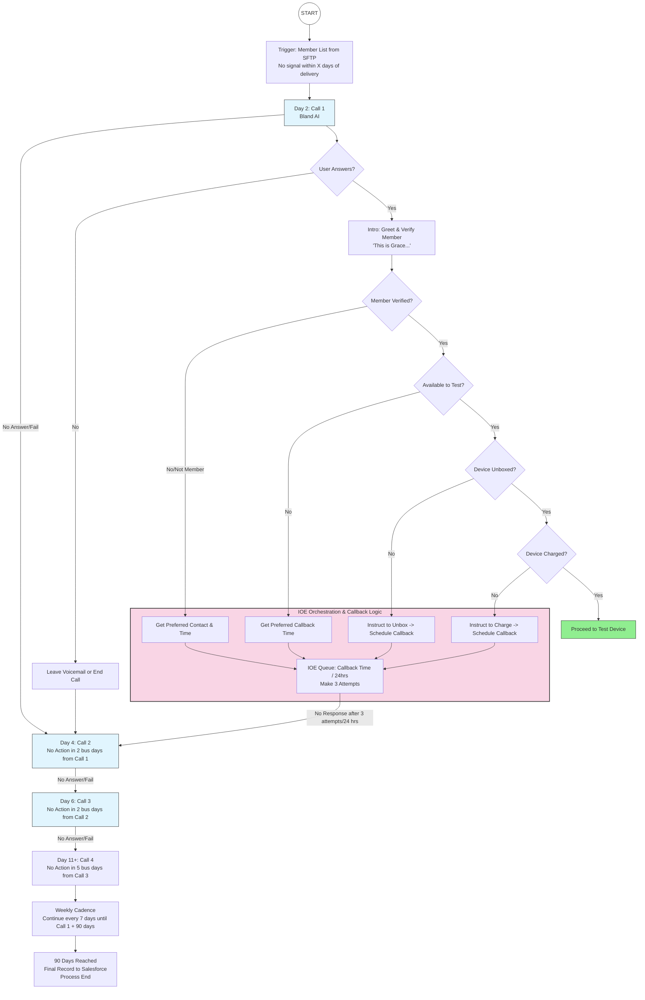

# IOE Device Activation & Outreach System - Flow Documentation

**Purpose:** Understanding the automated device activation outreach process  
**Date:** December 2024  
**Project:** Medical Guardian Device Activation Campaign  

---

## What This Document Covers

This document explains **HOW** the automated device activation system works, step by step, with real-world examples. It focuses on the flow and logic, not technical implementation.

---

## Table of Contents

1. [Overview](#overview)
2. [The Complete Flow Diagram](#the-complete-flow-diagram)
3. [Detailed Flow Explanation](#detailed-flow-explanation)
4. [Example Scenarios](#example-scenarios)
5. [Key Rules & Logic](#key-rules--logic)

---

## Overview

### The Problem
Medical Guardian customers receive their device (MGMini), but some don't turn it on or activate it. The device needs to send a signal to be functional, and if no signal is detected within a certain timeframe, we need to help the customer activate it.

### The Solution
An automated AI voice agent (named "Grace") calls customers to help them activate their device. The system is smart enough to:
- Try multiple times if the customer doesn't answer
- Schedule callbacks if the customer is busy
- Give time for customers to prepare (unbox or charge the device)
- Keep trying for 90 days before giving up
- Track everything and report back to Salesforce

---

## The Complete Flow Diagram

### Visual Representation



---

## Detailed Flow Explanation

### Phase 1: Getting Started - How Members Enter the System

**Trigger Point:**
A customer receives their Medical Guardian device and it gets delivered to their home. However, after a certain number of days (let's say 5 days), the device hasn't sent any signal - meaning the customer hasn't turned it on or activated it.

**What Happens:**
The system gets a list of these customers (members) from a file location (SFTP). This list contains:

**Core Member Information:**
- Salesforce Account ID (unique identifier)
- First name and Last name
- Phone number (E.164 format: +15551234567)
- Email address
- Date of birth

**Service Address:**
- Service address (street)
- City
- State (2-letter code)
- ZIP code

**Device Information:**
- Device UDI (serial number)
- Device name (e.g., "MGMini")
- Brand (e.g., "Medical Guardian")
- Device phone number (if callable)
- Delivery date (critical for calculating "Day 2")
- Fall detection status (Active/Inactive/Not Applicable)
- Battery status (Good/Low/Critical/Unknown)

**Campaign Settings:**
- Customer timezone (for business hours validation)
- Language preference (EN, ES, Other)
- Customer type (DTC = individual customer, MS = business/managed service customer)
- Partner name (organization)

**First Action:**
The system calculates: "Okay, this device was delivered on Monday. We should start calling them on Wednesday (Day 2)."

---

### Phase 2: The Main Calling Pattern (The "Retry Ladder")

Think of this like a patient friend who keeps trying to reach you but gives you more space each time.

**Call 1 - Day 2:**
- System initiates the first call
- AI agent "Grace" calls the member's phone number

**What happens if no answer?**
- Leave a voicemail (or just end the call)
- Wait **2 business days** (Monday to Wednesday, skipping weekends)
- Schedule Call 2

**Call 2 - Day 4:**
- Make second attempt
- If no answer again → Wait **2 more business days** → Schedule Call 3

**Call 3 - Day 6:**
- Make third attempt
- If no answer again → Wait **5 business days** → Schedule Call 4

**Call 4 onwards - Day 11+:**
- After the 4th call, switch to weekly attempts
- Call every **7 days** (once per week)
- Continue until **90 days** from the start date

**End of Campaign - Day 90:**
- Stop calling
- Send final status to Salesforce
- **If DTC customer:** Process ends, no further action
- **If MS customer:** Flag for human agent to follow up

---

### Phase 3: When Someone Actually Answers (The "Decision Tree")

Now let's walk through what happens when Grace successfully reaches someone.

**Step 1: Answer Detection**
```
Grace calls → Phone rings

SCENARIO A: No one answers
→ Leave voicemail
→ Go back to retry ladder (schedule next call)

SCENARIO B: Someone picks up
→ Continue to Step 2
```

**Step 2: Member Verification**
```
Grace: "Hello! This is Grace from Medical Guardian. Am I speaking with [First Name] [Last Name]?"

SCENARIO A: Wrong person answers
Member: "No, this is their spouse/child/friend"
→ Grace: "Can you help me reach [Name]? When would be a good time to call back?"
→ Schedule a callback
→ Enter callback queue (we'll explain this next)

SCENARIO B: Correct person
Member: "Yes, this is me"
→ Continue to Step 3
```

**Step 3: Availability Check**
```
Grace: "Great! Do you have a few minutes right now to help activate your Medical Guardian device?"

SCENARIO A: Not available
Member: "I'm busy right now"
→ Grace: "No problem! When would be a better time to call you back?"
→ Member provides preferred time
→ Schedule callback
→ Enter callback queue

SCENARIO B: Available now
Member: "Yes, I have time"
→ Continue to Step 4
```

**Step 4: Device Unboxed?**
```
Grace: "Perfect! Have you unboxed your device yet?"

SCENARIO A: Not unboxed
Member: "No, it's still in the box"
→ Grace: "That's okay! Can you unbox it now, or would you like me to call back in a couple hours?"
→ Schedule callback for 2 hours later
→ Enter callback queue

SCENARIO B: Already unboxed
Member: "Yes, it's out of the box"
→ Continue to Step 5
```

**Step 5: Device Charged?**
```
Grace: "Great! Is the device charged? Does it have battery power?"

SCENARIO A: Not charged
Member: "No, I haven't charged it yet"
→ Grace: "No worries! Please plug it in to charge. I'll call you back in about 2 hours to help with the next step"
→ Schedule callback for 2 hours later
→ Enter callback queue

SCENARIO B: Already charged
Member: "Yes, it's fully charged"
→ Continue to Step 6
```

**Step 6: Testing the Device**
```
Grace: "Excellent! Now let's test your device. Can you press the button on top?"

Member presses button → Device sends signal → System receives activation confirmation

→ SUCCESS! Device is activated
→ Mark member as "COMPLETED" in the system
→ Send success status to Salesforce
→ Campaign ends for this member
```

---

### Phase 4: The "Smart Callback System" (IOE Orchestration)

This is the intelligence layer that makes the system helpful rather than annoying.

**What is the Callback Queue?**
When a member needs time to prepare (unbox, charge) or is busy, they don't just get abandoned. They enter a special "callback queue" with these rules:

**Callback Rules:**
1. **Preferred Time:** If the member said "call me at 2 PM," the system schedules exactly that time
2. **Default Time:** If member just needs to unbox/charge, system waits 2 hours
3. **Maximum Attempts:** System will try **3 times** to reach them for this specific callback
4. **Time Limit:** If 24 hours pass and still can't reach them, the callback "times out"

**What Happens During Callback Attempts:**

```
Attempt 1: Call at scheduled time
- Answer? → Continue from where we left off (e.g., "Has the device charged now?")
- No answer? → Try again in a few hours

Attempt 2: Call again
- Answer? → Continue process
- No answer? → One more try

Attempt 3: Final attempt
- Answer? → Continue process
- No answer? → Callback fails

AFTER 3 FAILED ATTEMPTS OR 24 HOURS:
→ Member goes BACK to the main retry ladder
→ Treated as if they didn't answer the original call
→ Next call scheduled according to main pattern (Call 2, Call 3, etc.)
```

**Why This Matters:**
The system gives people immediate help when they're ready, but doesn't get stuck waiting forever. If someone isn't responsive, it falls back to the regular calling schedule.

---

## Example Scenarios

Let's walk through some real-world examples to see how this works in practice.

### Scenario 1: The Perfect Path (Everything Works First Try)

**Timeline:**
- **Monday:** Device delivered to Sarah Johnson
- **Wednesday (Day 2):** System initiates Call 1

**The Call:**
```
Grace: "Hello! This is Grace from Medical Guardian. Am I speaking with Sarah Johnson?"
Sarah: "Yes, this is Sarah"

Grace: "Great! Do you have a few minutes to help activate your Medical Guardian device?"
Sarah: "Sure, I have time"

Grace: "Perfect! Have you unboxed your device?"
Sarah: "Yes, it's out of the box"

Grace: "Wonderful! Is it charged?"
Sarah: "Yes, I charged it last night"

Grace: "Excellent! Now press the button on top of the device"
Sarah: *presses button*

[System receives activation signal]

Grace: "Perfect! Your device is now activated and working. You're all set!"
```

**Result:** ✅ Completed in 1 call, campaign ends, success reported to Salesforce

---

### Scenario 2: The Busy Person

**Timeline:**
- **Monday:** Device delivered to John Martinez
- **Wednesday (Day 2):** Call 1 attempt

**The Call:**
```
Grace: "Hello! This is Grace from Medical Guardian. Am I speaking with John Martinez?"
John: "Yes, but I'm in the middle of something. Can you call me back?"

Grace: "Of course! When would be a good time?"
John: "How about this afternoon around 3 PM?"

Grace: "Perfect! I'll call you back at 3 PM today"
```

**What Happens Behind the Scenes:**
- John enters callback queue
- Callback scheduled for 3 PM
- At 3 PM, system initiates callback

**Callback at 3 PM:**
```
Grace: "Hi John, it's Grace from Medical Guardian calling back as scheduled"
John: "Oh great, yes I have time now"

[Continue through verification steps]
→ Device activated successfully
```

**Result:** ✅ Completed in 2 interactions (initial call + 1 callback)

---

### Scenario 3: The Procrastinator

**Timeline:**
- **Monday:** Device delivered to Mary Chen
- **Wednesday (Day 2):** Call 1 attempt

**Call 1:**
```
Grace: "Hello! This is Grace from Medical Guardian. Am I speaking with Mary Chen?"
Mary: "Yes, this is Mary"

Grace: "Do you have time to activate your device?"
Mary: "Yes, I do"

Grace: "Great! Have you unboxed it?"
Mary: "Oh no, it's still in the shipping box. I forgot about it"

Grace: "That's okay! Would you like to unbox it now, or should I call back later?"
Mary: "Um, I'll unbox it later. Can you call me back tomorrow?"

Grace: "Absolutely! I'll call you tomorrow afternoon"
```

**Callback Next Day (Thursday):**
```
Grace: "Hi Mary! This is Grace calling back. Have you had a chance to unbox the device?"
Mary: "Oh shoot, I forgot again. Can you call me back?"
```

**Second Callback (Friday):**
```
Grace: "Hi Mary, checking in again about your device"
Mary: "I'm sorry, I still haven't gotten to it. I've been so busy"
```

**Third Callback Attempt (Saturday):**
- No answer

**What Happens:**
- 3 callback attempts made
- 24+ hours have passed
- Mary moves BACK to the main calling sequence
- System schedules Call 2 (2 business days from the original Call 1)

**Call 2 (Following Wednesday - Day 4):**
```
Grace: "Hi Mary! Checking in again about your Medical Guardian device"
Mary: "Oh yes! I finally unboxed it and charged it yesterday!"

Grace: "Wonderful! Let's test it now"
[Success!]
```

**Result:** ✅ Completed after multiple attempts, combination of callbacks and main sequence

---

### Scenario 4: The Unreachable Person

**Timeline:**
- **Monday:** Device delivered to Robert Williams
- **Wednesday (Day 2):** Call 1 - No answer, voicemail left
- **Friday (Day 4):** Call 2 - No answer
- **Tuesday (Day 6):** Call 3 - No answer
- **Next Tuesday (Day 11):** Call 4 - No answer
- **Every week after:** Calls 5, 6, 7... - No answer

**90 Days Later:**
```
System: Campaign duration reached (90 days)
Action: Mark as "TERMINATED - Unable to Contact"
Send to Salesforce: "Customer never answered after 15+ attempts"

Customer Type Check:
- If DTC: End process
- If MS: Flag for human sales rep to reach out through other channels
```

**Result:** ❌ Campaign ended without success, flagged for alternative outreach

---

### Scenario 5: Wrong Person Answers

**Timeline:**
- **Monday:** Device delivered to Betty Thompson (elderly customer)
- **Wednesday (Day 2):** Call 1

**The Call:**
```
Grace: "Hello! This is Grace from Medical Guardian. Am I speaking with Betty Thompson?"
Voice: "No, this is her daughter Jessica. My mom doesn't usually answer unknown numbers"

Grace: "I understand! I'm calling to help Betty activate her Medical Guardian device. Would you be able to connect me with her, or let me know a better way to reach her?"
Jessica: "Oh yes! She's here. Let me get her. Or actually, she's usually home in the mornings around 10 AM"

Grace: "Perfect! Should I call back at 10 AM tomorrow morning? And is this the best number to reach her?"
Jessica: "Yes, call this same number at 10 AM, I'll make sure she answers"

Grace: "Wonderful! I'll call tomorrow at 10 AM"
```

**Callback Next Day at 10 AM:**
```
Grace: "Hello! May I speak with Betty Thompson?"
Betty: "This is Betty"

Grace: "Hi Betty! This is Grace from Medical Guardian. Your daughter Jessica mentioned you'd be available now to help activate your device"
Betty: "Oh yes! She told me you'd call!"

[Process continues successfully]
```

**Result:** ✅ Completed with help from family member

---

## Key Rules & Logic

### Rule 1: Business Days vs Calendar Days

**Business Days** (Monday-Friday, excluding weekends and federal holidays):
- Used for Call 1 → Call 2: Wait 2 business days
- Used for Call 2 → Call 3: Wait 2 business days
- Used for Call 3 → Call 4: Wait 5 business days
- **Federal holidays are automatically skipped** (e.g., Christmas, Thanksgiving, New Year's, Independence Day)
- Uses US federal holiday calendar with "observed" dates
- If holiday falls on weekend, the observed date (typically Friday or Monday) is skipped

**Calendar Days** (includes weekends):
- Used for Call 4 onwards: Wait 7 calendar days

**Example:**
```
Call 1: Wednesday
Call 2: Friday (2 business days = Wed, Thu, Fri - skipping weekend)
Call 3: Tuesday (2 business days from Friday = Mon, Tue)
Call 4: Next Tuesday (5 business days)
Call 5: Next Tuesday (7 calendar days)
```

**Example with Holiday:**
```
Call 1: Wednesday, December 24, 2025 (day before Christmas)
Call 2: Monday, December 29, 2025 (2 business days, skipping Christmas Day Dec 25 and Dec 26)

If July 4th (Independence Day) falls on Saturday:
- Observed holiday: Friday, July 3rd
- System skips Friday July 3rd as a holiday
```

---

### Rule 2: Business Hours Only

Calls are ONLY made when ALL of the following conditions are met:

**1. Business Day Requirement:**
- **Days:** Monday through Friday
- **Exclusions:** US federal holidays (Christmas, Thanksgiving, New Year's, Memorial Day, Independence Day, Labor Day, etc.)

**2. Medical Guardian Business Hours (EST):**
- **Timezone:** Eastern Time (America/New_York)
- **Hours:** 9:00 AM - 5:00 PM EST
- **Reason:** Medical Guardian customer care operates in EST timezone

**3. Member Business Hours (Local Timezone):**
- **Timezone:** Member's local timezone (EST, CST, MST, PST, etc.)
- **Hours:** 9:00 AM - 5:00 PM (member's local time)
- **Reason:** Respect member's local business hours for call convenience

**Dual-Timezone Validation:**
The system validates that the call time is within business hours for **BOTH** Medical Guardian (EST) and the member's local timezone. This ensures:
- Medical Guardian staff are available to support if needed
- Members receive calls during their local daytime hours
- No calls are made too early or too late in either timezone

**Examples:**

**Example 1: Member in Pacific Time (PST)**
```
Proposed call: 2:00 PM EST
- Medical Guardian time: 2:00 PM EST ✅ (within 9 AM - 5 PM EST)
- Member time: 11:00 AM PST ✅ (within 9 AM - 5 PM PST)
- Result: VALID ✅ Call can be made
```

**Example 2: Member in Pacific Time (PST) - Too Late**
```
Proposed call: 5:30 PM EST
- Medical Guardian time: 5:30 PM EST ❌ (outside 9 AM - 5 PM EST)
- Member time: 2:30 PM PST ✅ (within 9 AM - 5 PM PST)
- Result: INVALID ❌ - Outside MG business hours
```

**Example 3: Member in Pacific Time (PST) - Too Early for Member**
```
Proposed call: 9:00 AM EST
- Medical Guardian time: 9:00 AM EST ✅ (within 9 AM - 5 PM EST)
- Member time: 6:00 AM PST ❌ (outside 9 AM - 5 PM PST)
- Result: INVALID ❌ - Outside member business hours
```

**Example 4: Holiday**
```
Proposed call: Thursday, December 25, 2025 (Christmas Day) at 2:00 PM EST
- Business day: ❌ Federal holiday
- Result: INVALID ❌ - Call automatically rescheduled to next business day
```

**What happens if a call is scheduled outside valid hours?**
```
Scheduled time: Saturday 2 PM
Action: Automatically moved to Monday 9 AM (member's local time)

Scheduled time: Friday 6 PM EST (member in EST)
Action: Automatically moved to Monday 9 AM EST

Scheduled time: Thursday, Thanksgiving Day
Action: Automatically moved to Friday 9 AM (if Friday is not also a holiday)

Scheduled time: 9 AM EST, member in PST (6 AM PST - too early for member)
Action: Automatically adjusted to 12 PM EST (9 AM PST) to respect member timezone
```

---

### Rule 3: The 90-Day Hard Stop

No matter what, every campaign ends after 90 days from the start date.

```
Start Date: January 1st
End Date: April 1st (90 days later)

Even if:
- Member is in the middle of a callback attempt
- They answered on day 89 but device isn't charged yet
- Anything else

Result: Campaign terminated, final status sent to Salesforce
```

---

### Rule 4: Callback Priority vs Main Sequence

**If a member is in BOTH queues:**
- Callback queue takes priority
- Main sequence calls are paused
- Once callback completes (success or failure), main sequence resumes

**Example:**
```
Day 2: Call 1 → Member says "call me back tomorrow"
Day 3: Callback scheduled
Day 4: Call 2 was also scheduled → SKIP (callback in progress)
Day 5: Callback succeeds → Resume normal flow
```

---

### Rule 5: Customer Type Matters at the End

**DTC (Direct-to-Consumer) Customers:**
- Individual people who bought device themselves
- At 90 days: Campaign just ends, no further action

**MS (Managed Services) Customers:**
- Business accounts, corporate clients, facility residents
- At 90 days: Flag sent to human sales/support team for manual follow-up
- Higher priority because it's a business relationship

---

### Rule 6: Federal Holiday Calendar

The system automatically skips the following US federal holidays when calculating business days:

**Annual Federal Holidays:**
1. **New Year's Day** - January 1
2. **Martin Luther King Jr. Day** - Third Monday in January
3. **Presidents' Day** - Third Monday in February
4. **Memorial Day** - Last Monday in May
5. **Independence Day** - July 4
6. **Labor Day** - First Monday in September
7. **Columbus Day** - Second Monday in October
8. **Veterans Day** - November 11
9. **Thanksgiving Day** - Fourth Thursday in November
10. **Christmas Day** - December 25

**Observed Holidays:**
If a holiday falls on a weekend, the "observed" date is used:
- **Saturday holiday:** Observed on Friday
- **Sunday holiday:** Observed on Monday

**Example:**
```
If Independence Day (July 4) falls on Saturday:
- Observed date: Friday, July 3
- System treats Friday July 3 as a holiday
- No calls scheduled for Friday July 3

If Christmas (December 25) falls on Sunday:
- Observed date: Monday, December 26
- System treats Monday December 26 as a holiday
- No calls scheduled for Monday December 26
```

**Impact on Call Scheduling:**
- Business day calculations automatically skip holidays
- Call 1 → Call 2 (2 business days) excludes holidays in the count
- Callbacks scheduled on holidays are automatically moved to next business day
- Holiday information logged in Application Insights for debugging

**2025 Federal Holiday Dates:**
```
New Year's Day: Wednesday, January 1, 2025
Martin Luther King Jr. Day: Monday, January 20, 2025
Presidents' Day: Monday, February 17, 2025
Memorial Day: Monday, May 26, 2025
Independence Day: Friday, July 4, 2025
Labor Day: Monday, September 1, 2025
Columbus Day: Monday, October 13, 2025
Veterans Day: Tuesday, November 11, 2025
Thanksgiving Day: Thursday, November 27, 2025
Christmas Day: Thursday, December 25, 2025
```

---

## Summary: The Three Paths

### Path 1: Quick Success
Member answers → Verified → Available → Device ready → Test succeeds
**Result:** 1-2 calls, device activated

### Path 2: Needs Assistance
Member answers → Needs time to prepare → Enters callback queue → Eventually succeeds
**Result:** Multiple interactions over days/weeks, device activated

### Path 3: Unable to Reach
Never answers OR answers but never completes after 90 days
**Result:** Campaign terminated, escalated appropriately based on customer type

---

**End of Flow Documentation**
