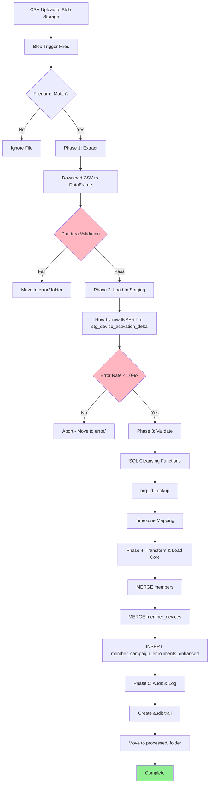
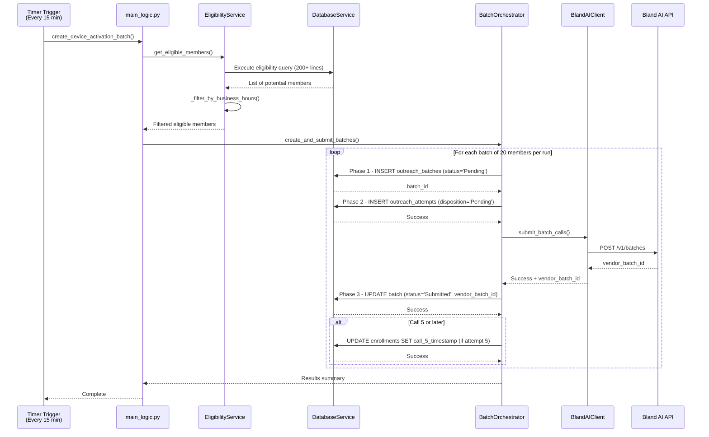
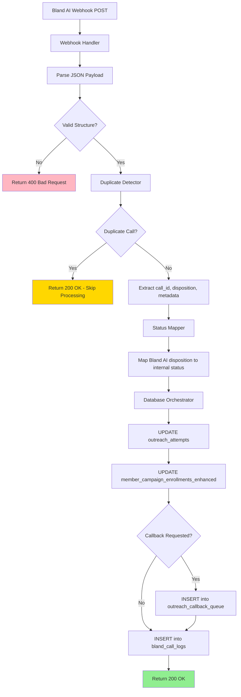
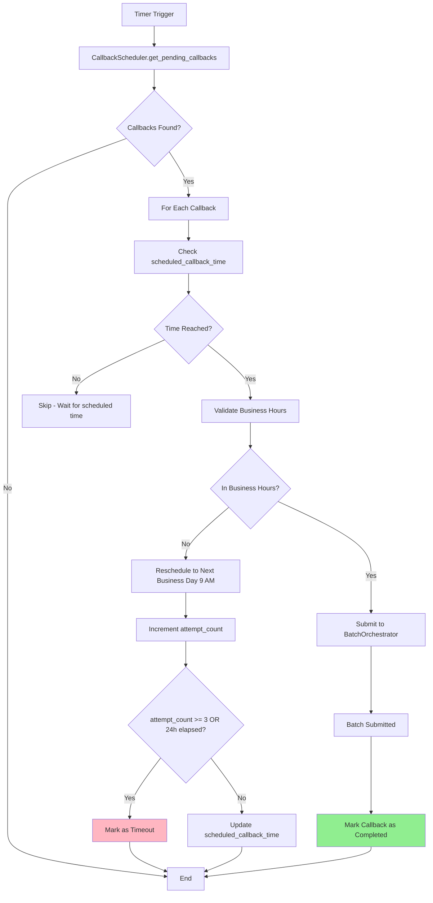
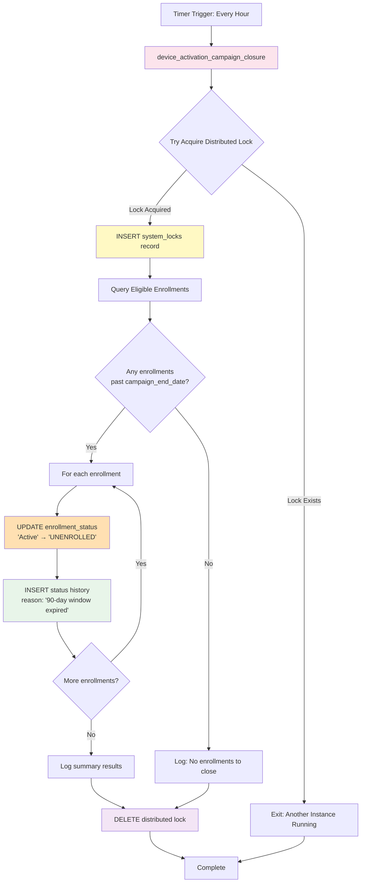

# Device Activation - Data Flow Diagrams

**BusinessCaseID:** BC-DA-002 (File Processing), BC-DA-003 (Eligibility), BC-DA-004 (Batch Orchestration), BC-DA-007 (Campaign Closure)
**Created:** 2025-12-24
**Purpose:** Visual documentation of data flows through Device Activation system

---

## Table of Contents

1. [Diagram 1: CSV Upload to Database Flow](#diagram-1-csv-upload-to-database-flow)
2. [Diagram 2: Scheduler to Bland AI Flow](#diagram-2-scheduler-to-bland-ai-flow)
3. [Diagram 3: Webhook Processing Flow](#diagram-3-webhook-processing-flow)
4. [Diagram 4: Callback Processing Flow](#diagram-4-callback-processing-flow)
5. [Diagram 5: Campaign Closure Flow (90-Day Auto-Unenroll)](#diagram-5-campaign-closure-flow-90-day-auto-unenroll)

---

## Diagram 1: CSV Upload to Database Flow

**Purpose:** Shows the 5-phase ETL pipeline for processing Device Activation CSV files

**BusinessCaseID:** BC-DA-002 (File Processing & ETL Pipeline)

**Related Code:**
- `af_code/af_device_activation_logic.py` (2,104 lines)
- `functions/device_activation_file_processor.py` (Blob trigger)

### Mermaid Diagram



### ASCII Diagram

```
CSV Upload → Blob Storage (landing/)
                 ↓
         Blob Trigger Fires
                 ↓
         Filename Match?
          ├─ No → Ignore File
          └─ Yes → PHASE 1: EXTRACT
                      ↓
                Download CSV
                      ↓
              Pandera Validation
               ├─ Fail → error/ folder
               └─ Pass → PHASE 2: STAGING
                             ↓
                     Row-by-row INSERT
                   (stg_device_activation_delta)
                             ↓
                     Error Rate < 10%?
                      ├─ No → Abort (error/)
                      └─ Yes → PHASE 3: VALIDATE
                                   ↓
                            SQL Cleansing
                            (sp_cleanse_data)
                                   ↓
                            org_id Lookup
                                   ↓
                           Timezone Mapping
                                   ↓
                         PHASE 4: TRANSFORM
                                   ↓
                   ┌────────────────┼────────────────┐
                   ↓                ↓                ↓
            MERGE members    MERGE devices    INSERT enrollments
                   │                │                │
                   └────────────────┴────────────────┘
                                   ↓
                          PHASE 5: AUDIT
                                   ↓
                          Create audit trail
                         (file_processing_log)
                                   ↓
                       Move to processed/ folder
                                   ↓
                              Complete ✓
```

### Key Points

**Phase 1 - Extract:**
- Trigger: Blob upload to `fs-ops/landing/` (PRIMARY) or `fs-device-activation/landing/` (LEGACY)
- Filename patterns:
  - PRIMARY: `MedicalGuardian_DeviceActivationMedicaid_YYYYMMDD_DELTA.csv`, `MedicalGuardian_DeviceActivationDTCMA_YYYYMMDD_DELTA.csv`
  - LEGACY: `MedicalGuardian_DeviceActivation_*_Delta.csv`
- Validation: Pandera schema (23 required columns)
- Error handling: Move to `error/` folder if validation fails

**Phase 2 - Load to Staging:**
- Target: `engage360_stg.stg_device_activation_delta`
- Process: Row-by-row INSERT with try/except
- Threshold: Max 10% error rate (if exceeded, abort entire file)
- Purpose: Temporary staging for validation

**Phase 3 - Validate:**
- SQL Procedure: `sp_cleanse_device_activation_data`
- Operations:
  - Phone validation (E.164 format)
  - Email validation (regex)
  - Timezone mapping ('Eastern' → 'America/New_York')
  - Language mapping ('eng' → 'EN')
  - org_id lookup from org_name
- Output: `processing_status='Validated'` or `'Invalid'`

**Phase 4 - Transform & Load Core:**
- **MERGE members**: UPSERT pattern (match on member_id)
- **MERGE member_devices**: UPSERT pattern (match on device_id)
- **INSERT enrollments**: Always new records
- Business day calculation: `activation_start_date = delivery_date + 2 business days`
- Campaign window: `campaign_end_date = activation_start_date + 90 days`

**Phase 5 - Audit & Log:**
- INSERT into `file_processing_log` with full statistics
- Move blob: `landing/file.csv` → `processed/file.csv`
- Log final summary with emoji indicators

---

## Diagram 2: Scheduler to Bland AI Flow

**Purpose:** Shows how the scheduler creates batches and submits to Bland AI

**BusinessCaseID:** BC-DA-001 (Orchestration), BC-DA-003 (Eligibility), BC-DA-004 (Batch Creation)

**Related Code:**
- `af_code/device_activation_scheduler/main_logic.py` (230 lines)
- `af_code/device_activation_scheduler/services/eligibility_service.py` (414 lines)
- `af_code/device_activation_scheduler/services/batch_orchestrator.py` (809 lines)

### Mermaid Diagram



### ASCII Diagram

```
Timer (Every 15 min) → main_logic.py::create_device_activation_batch()
                              ↓
                    ┌─────────────────────┐
                    │ STEP 1: ELIGIBILITY │
                    └─────────────────────┘
                              ↓
              EligibilityService.get_eligible_members()
                              ↓
              DatabaseService: Execute SQL query
                    (200+ line eligibility query)
                              ↓
                      Potential members found
                              ↓
                  Filter by business hours
                  (dual-timezone validation)
                              ↓
                      Eligible members list
                              ↓
                    ┌─────────────────────┐
                    │ STEP 2: BATCH       │
                    │ CREATION            │
                    └─────────────────────┘
                              ↓
           BatchOrchestrator.create_and_submit_batches()
                              ↓
        ┌──── For each batch of 20 members per run ────┐
        │                                         │
        │  Phase 1: INSERT outreach_batches      │
        │           (status='Pending')            │
        │           ↓                             │
        │  Phase 2: INSERT outreach_attempts     │
        │           (disposition='Pending')       │
        │           ↓                             │
        │  Submit to Bland AI API                │
        │  POST /v1/batches                      │
        │           ↓                             │
        │  Receive vendor_batch_id               │
        │           ↓                             │
        │  Phase 3: UPDATE batch                 │
        │           (status='Submitted',         │
        │            vendor_batch_id)            │
        │           ↓                             │
        │  If Call 5: UPDATE call_5_timestamp    │
        │             campaign_end_date          │
        │                                         │
        └─────────────────────────────────────────┘
                              ↓
                      Results summary
                    (batches, calls submitted)
                              ↓
                         Complete ✓
```

### Key Points

**Timer Trigger:**
- Schedule: Every 15 minutes (`0 */15 * * * *`)
- Run on startup: False (prevents duplicate processing)
- Also available via HTTP POST for manual execution

**Eligibility Determination:**
- SQL Query: 200+ lines joining 5 tables
- Filters:
  - current_status = 'ENROLLED'
  - device_activated = 0
  - activation_start_date <= today
  - Frequency rules (2 BUSINESS days for Calls 2-3, 5 BUSINESS days for Call 4, 7 CALENDAR days for Call 5+)
  - 90-day window for Call 5+ only
- Business hours: Validates both MG EST and member timezone

**3-Phase Tracking Pattern:**
1. **Phase 1**: Create batch record BEFORE Bland AI call
   - Enables transaction rollback if submission fails
2. **Phase 2**: Create attempt records BEFORE Bland AI call
   - Links attempts to batch_id from Phase 1
3. **Phase 3**: Update batch with vendor_batch_id AFTER Bland AI response
   - Changes status to 'Submitted'

**Call 5 Timestamp Logic:**
- When call_attempt_number = 5:
  - Set `call_5_timestamp = NOW()`
  - Update `campaign_end_date = call_5_timestamp + 90 days`
- Purpose: 90-day window for Call 5+ starts FROM Call 5, not activation_start_date

---

## Diagram 3: Webhook Processing Flow

**Purpose:** Shows how Bland AI webhook results are processed and update the database

**BusinessCaseID:** BC-DA-007 (Webhook Processing & Status Updates)

**Related Code:**
- `af_code/bland_ai_webhook/services/database_orchestrator.py` (webhook processing)

### Mermaid Diagram



### ASCII Diagram

```
Bland AI Webhook → POST /api/bland-ai-webhook
                         ↓
                   Webhook Handler
                         ↓
                   Parse JSON Payload
                         ↓
                   Valid Structure?
                    ├─ No → 400 Bad Request
                    └─ Yes → Duplicate Detector
                                 ↓
                          Duplicate Call?
                           ├─ Yes → 200 OK (skip processing)
                           └─ No → Extract Data
                                      ↓
                                  Status Mapper
                                      ↓
                            Map disposition:
                            - INTERESTED → Completed
                            - NOT_INTERESTED → Completed
                            - NO_ANSWER → NoAnswer
                            - CALL_BACK_SCHEDULED → Callback
                                      ↓
                         Database Orchestrator
                                      ↓
                    ┌─────────────────┴─────────────────┐
                    ↓                                   ↓
         UPDATE outreach_attempts          UPDATE enrollments
         (disposition, call_duration)       (device_activated,
                                             current_status)
                    │                                   │
                    └─────────────────┬─────────────────┘
                                      ↓
                          Callback Requested?
                           ├─ Yes → INSERT callback_queue
                           │         (scheduled_callback_time,
                           │          callback_reason)
                           │
                           └─ No → INSERT bland_call_logs
                                    (call_id, from/to numbers,
                                     disposition, metadata)
                                      ↓
                                  200 OK ✓
```

### Key Points

**Webhook Endpoint:**
- URL: `POST /api/bland-ai-webhook`
- Authentication: Validates Bland AI signature headers
- Idempotency: Uses DuplicateDetector to skip repeat calls

**Disposition Mapping:**
- `INTERESTED` → internal: Completed, action: Follow_Up
- `NOT_INTERESTED` → internal: Completed, action: Close
- `NO_ANSWER` → internal: NoAnswer, action: Retry
- `CALL_BACK_SCHEDULED` → internal: Completed, action: Scheduled
- `DO_NOT_CONTACT` → internal: OptOut, action: Close
- `FAILED` → internal: Failed, action: Retry

**Database Updates:**
1. **UPDATE outreach_attempts:**
   - Set disposition from webhook
   - Set call_duration, call_end_time
   - Set metadata (call_id, recording_url)

2. **UPDATE member_campaign_enrollments_enhanced:**
   - If device_activated = 1: Set current_status = 'COMPLETED'
   - If opt-out: Set current_status = 'OPTED_OUT'
   - Otherwise: Keep current_status = 'ENROLLED'

3. **INSERT outreach_callback_queue** (if callback requested):
   - Set scheduled_callback_time (member's requested time)
   - Set callback_reason (e.g., "Call me in 2 hours")
   - Set status = 'PENDING', attempt_count = 0

4. **INSERT bland_call_logs:**
   - Complete audit trail of call
   - Includes metadata (from_number, to_number, duration)
   - Used for reconciliation and reporting

---

## Diagram 4: Callback Processing Flow

**Purpose:** Shows how scheduled callbacks are processed and rescheduled

**BusinessCaseID:** BC-DA-005 (Callback Scheduling & Queue Management)

**Related Code:**
- `af_code/device_activation_scheduler/services/callback_scheduler.py` (566 lines)

### Mermaid Diagram



### ASCII Diagram

```
Timer → CallbackScheduler.get_pending_callbacks()
              ↓
       SELECT FROM outreach_callback_queue
       WHERE status = 'PENDING'
         AND scheduled_callback_time <= NOW()
         AND attempt_count < max_attempts
         AND created_ts + 24h > NOW()
              ↓
       Callbacks Found?
        ├─ No → End
        └─ Yes → For Each Callback
                      ↓
              scheduled_callback_time reached?
                ├─ No → Skip (wait for scheduled time)
                └─ Yes → Validate Business Hours
                              ↓
                        In Business Hours?
                        (MG EST + Member TZ)
                          ├─ No → Reschedule
                          │           ↓
                          │   Calculate next valid time:
                          │   - Member's timezone
                          │   - Tomorrow 9:00 AM
                          │           ↓
                          │   Increment attempt_count
                          │           ↓
                          │   Check timeout:
                          │   - attempt >= 3?
                          │   - OR created + 24h elapsed?
                          │    ├─ Yes → Mark TIMEOUT
                          │    │         (member returns
                          │    │          to main sequence)
                          │    └─ No → UPDATE scheduled_time
                          │
                          └─ Yes → Submit to Bland AI
                                      ↓
                              BatchOrchestrator creates:
                              - outreach_batches
                              - outreach_attempts
                              - Submits to Bland AI
                                      ↓
                              Mark callback COMPLETED
                                      ↓
                                    End ✓
```

### Key Points

**Callback Lifecycle:**
1. **Creation**: Webhook receives `CALL_BACK_SCHEDULED` disposition
2. **Queuing**: INSERT into `outreach_callback_queue` with `scheduled_callback_time`
3. **Processing**: CallbackScheduler checks every 15 minutes
4. **Validation**: Business hours check before calling
5. **Rescheduling**: Move to next business day if outside hours
6. **Timeout**: After 24 hours OR 3 attempts

**Timeout Logic (OR Condition):**
- **Time-based**: created_ts + 24 hours <= NOW()
- **Attempt-based**: attempt_count >= max_attempts (default 3)
- **Either condition triggers timeout** (not AND)

**Rescheduling:**
- Trigger: Callback due outside business hours
- Action: Calculate next business day at 9:00 AM (member's timezone)
- Impact: Increment attempt_count (counts as an attempt)
- Limit: Max 3 reschedule attempts before timeout

**Priority:**
- Callbacks are processed BEFORE regular call sequence members
- Ensures promised callback times are honored
- Member expectations are met

**Return to Main Sequence:**
- After timeout, member returns to normal call flow
- Next eligible for Call 2, 3, 4, or 5+ based on attempt history
- Callback history preserved in outreach_callback_queue for audit

---

## Diagram 5: Campaign Closure Flow (90-Day Auto-Unenroll)

**Purpose:** Shows hourly automatic unenrollment when members reach 90-day campaign window expiration

**BusinessCaseID:** BC-DA-007 (Campaign Closure)

**Related Code:**
- `functions/device_activation_campaign_closure.py` (200 lines)
- `af_code/device_activation_scheduler/services/campaign_closure_service.py` (300+ lines)

### Mermaid Diagram



### ASCII Diagram

```
┌───────────────────────────────────────────────────────────────────────┐
│ Timer Trigger: 0 0 * * * * (Every hour at :00 minutes)               │
└───────────────────┬───────────────────────────────────────────────────┘
                    ↓
    ┌───────────────────────────────────────────────────────────────┐
    │ device_activation_campaign_closure                            │
    │ • HTTP: GET/POST /api/device_activation_campaign_closure      │
    │ • Function: Auto-unenroll after 90-day window expires         │
    └───────────────────────┬───────────────────────────────────────┘
                            ↓
            ┌───────────────────────────────┐
            │ 1. Distributed Lock Check     │
            │    Try INSERT system_locks    │
            │    lock_name = 'campaign_    │
            │                 _closure'     │
            └────────┬──────────────────────┘
                     │
        ┌────────────┴────────────┐
        │                         │
  Lock Exists?              Lock Acquired
  (concurrent run)         (INSERT success)
        │                         │
        ↓                         ↓
    ┌───────┐         ┌─────────────────────────────┐
    │ EXIT  │         │ 2. Query Eligible          │
    │       │         │    Enrollments             │
    └───────┘         │                            │
                      │ SELECT * FROM              │
                      │   member_campaign_         │
                      │   enrollments_enhanced     │
                      │ WHERE                      │
                      │   campaign_id IN           │
                      │     (Medicaid, DTCMA)      │
                      │   AND enrollment_status    │
                      │     = 'Active'             │
                      │   AND campaign_end_date    │
                      │     IS NOT NULL            │
                      │   AND campaign_end_date    │
                      │     < CURRENT_DATE         │
                      └────────┬────────────────────┘
                               │
                      ┌────────┴────────┐
                      │                 │
            No enrollments       Enrollments found
              to close           (past end_date)
                      │                 │
                      ↓                 ↓
                ┌──────────┐   ┌────────────────────┐
                │ Log: 0   │   │ FOR EACH          │
                │ closures │   │ enrollment:       │
                └────┬─────┘   └────┬───────────────┘
                     │              │
                     │              ↓
                     │      ┌───────────────────────┐
                     │      │ 3. UPDATE enrollment  │
                     │      │    enrollment_status  │
                     │      │    = 'UNENROLLED'     │
                     │      └────┬──────────────────┘
                     │           │
                     │           ↓
                     │      ┌───────────────────────┐
                     │      │ 4. INSERT status      │
                     │      │    history           │
                     │      │    • enrollment_id    │
                     │      │    • old_status:      │
                     │      │      'Active'         │
                     │      │    • new_status:      │
                     │      │      'UNENROLLED'     │
                     │      │    • reason: '90-day  │
                     │      │      window expired'  │
                     │      └────┬──────────────────┘
                     │           │
                     └───────────┴───────────────────┐
                                 │                   │
                                 ↓                   ↓
                        ┌────────────────────────────┐
                        │ 5. Log Summary Results    │
                        │    • enrollments_closed   │
                        │    • campaigns_affected   │
                        │    • members_unenrolled   │
                        │    • execution_duration   │
                        └────────┬───────────────────┘
                                 ↓
                        ┌────────────────────────────┐
                        │ 6. Release Lock           │
                        │    DELETE FROM            │
                        │      system_locks         │
                        │    WHERE lock_name =      │
                        │      'campaign_closure'   │
                        └────────┬───────────────────┘
                                 ↓
                            Complete ✓
```

### Key Points

**Timer Trigger:**
- Schedule: Every hour (`0 0 * * * *`)
- Run on startup: False
- Also available via HTTP GET/POST for manual execution

**Eligibility Criteria:**
- enrollment_status = 'Active' (only active members)
- campaign_id IN (Medicaid, DTCMA) (Device Activation campaigns)
- campaign_end_date IS NOT NULL (only members with Call 5+)
- campaign_end_date < CURRENT_DATE (90-day window expired)

**Distributed Locking:**
- Prevents concurrent executions (multiple timer instances)
- Lock record: `system_locks` table with `lock_name = 'device_activation_campaign_closure'`
- Lock lifetime: Duration of closure execution (typically 2-5 seconds)
- If lock exists: Exit gracefully (another instance running)

**Database Operations:**
1. **Query**: SELECT eligible enrollments (Active + past end_date)
2. **Update**: SET enrollment_status = 'UNENROLLED' for all eligible
3. **Audit**: INSERT status change history with reason
4. **Lock**: DELETE lock to allow next execution

**Campaign End Date Calculation:**
- Set when Call 5 is created: `campaign_end_date = call_5_timestamp + 90 days`
- Calls 1-4: No end date (can continue indefinitely until Call 5)
- Call 5+: 90-day limit enforced via campaign_end_date

**Monitoring:**
- Execution frequency: 24 times per day (hourly)
- Typical enrollments closed per run: 5-20
- Peak closure days: ~90 days after major file uploads
- Log pattern: `[DA-CLOSURE] Successfully unenrolled X members`

**Return Value (HTTP endpoint):**
```json
{
  "success": true,
  "request_id": "da-closure-http-20260122-143000",
  "timestamp": "2026-01-22T14:30:00Z",
  "result": {
    "enrollments_closed": 15,
    "campaigns_affected": ["Device Activation - Medicaid", "Device Activation - DTC/MA"],
    "members_unenrolled": 15,
    "execution_duration_seconds": 2.45
  }
}
```

---

## Related Documentation

- **Code Documentation:**
  - `af_code/af_device_activation_logic.py` - 5-phase ETL pipeline
  - `af_code/device_activation_scheduler/main_logic.py` - Main orchestration
  - `af_code/device_activation_scheduler/services/eligibility_service.py` - Eligibility logic
  - `af_code/device_activation_scheduler/services/batch_orchestrator.py` - Batch creation
  - `af_code/device_activation_scheduler/services/callback_scheduler.py` - Callback processing

- **Architecture Documentation:**
  - [Complete Architecture](../ARCHITECTURE/DEVICE_ACTIVATION_COMPLETE_ARCHITECTURE.md)
  - [Database Operations](../ARCHITECTURE/DEVICE_ACTIVATION_DATABASE_OPERATIONS.md)
  - [Scheduler Internals](../ARCHITECTURE/DEVICE_ACTIVATION_SCHEDULER_INTERNALS.md)

- **Other Flow Diagrams:**
  - [Call Sequence Diagrams](DEVICE_ACTIVATION_CALL_SEQUENCE.md)
  - [State Machine Diagrams](DEVICE_ACTIVATION_STATE_MACHINES.md)
  - [System Architecture](DEVICE_ACTIVATION_SYSTEM_ARCHITECTURE.md)

---

**Document Version:** 1.0
**Last Updated:** 2025-12-24
**Maintained By:** AI-POD Team - Data Science
