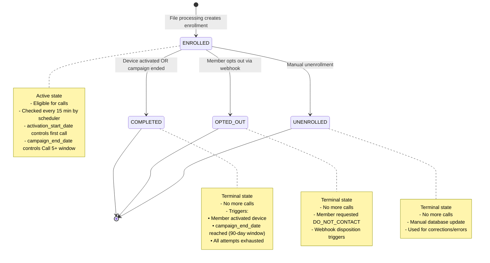
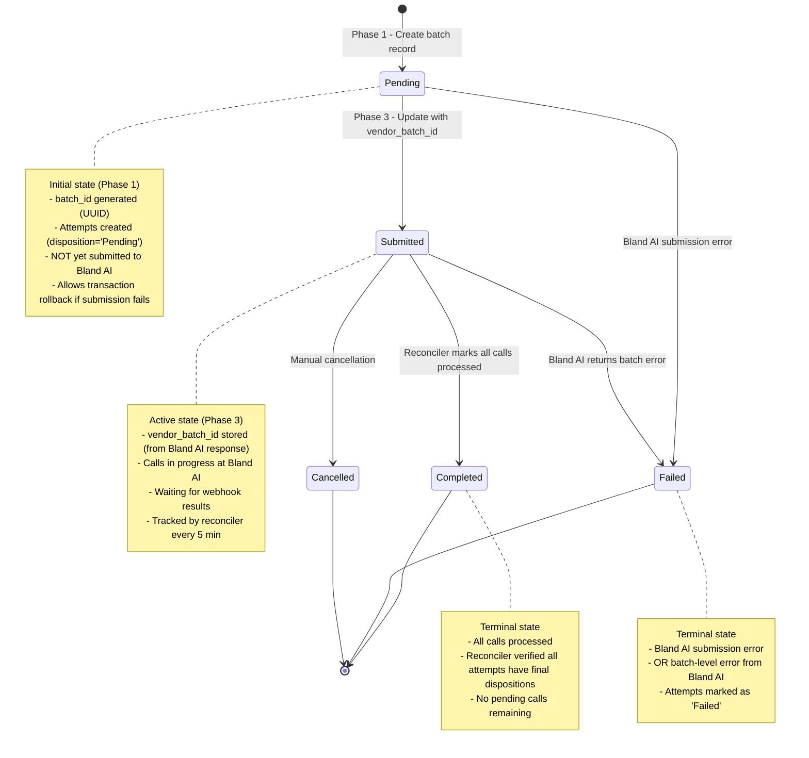
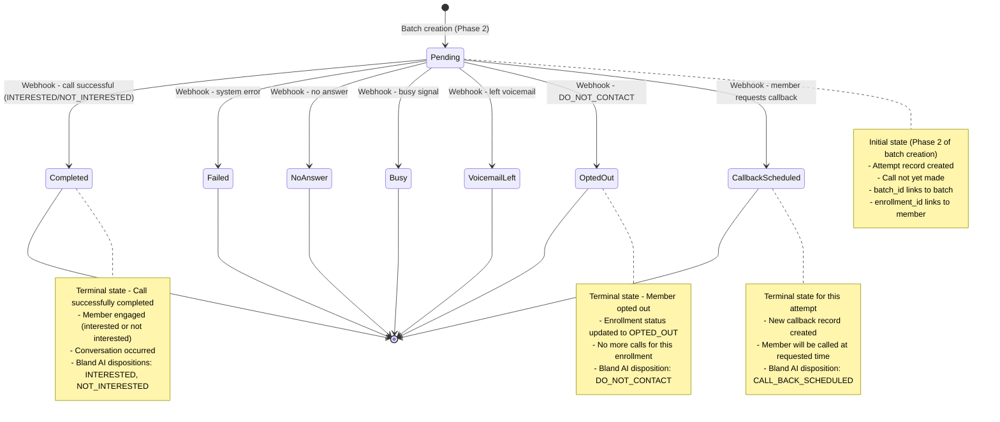
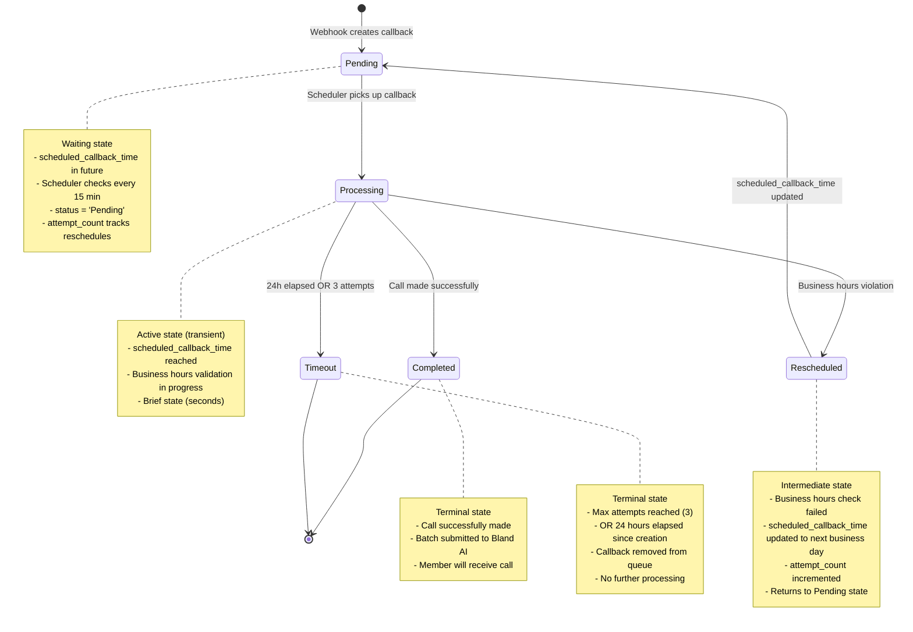

# Device Activation - State Machine Diagrams

**Date:** 2025-12-24
**BusinessCaseID:** BC-DA-002 (File Processing), BC-DA-004 (Batch Orchestration), BC-DA-007 (Campaign Closure), BC-102 (Webhook Processing)
**Purpose:** Visual documentation of state transitions for enrollments, batches, attempts, and callbacks throughout the Device Activation lifecycle

---

## Table of Contents

1. [Diagram 1: Enrollment Status State Machine](#diagram-1-enrollment-status-state-machine)
2. [Diagram 2: Batch Status State Machine](#diagram-2-batch-status-state-machine)
3. [Diagram 3: Attempt Disposition State Machine](#diagram-3-attempt-disposition-state-machine)
4. [Diagram 4: Callback Status State Machine](#diagram-4-callback-status-state-machine)

---

## Overview

Device Activation uses four primary state machines to track the lifecycle of different entities:

- **Enrollment Status:** Tracks member's campaign participation (ENROLLED → COMPLETED/OPTED_OUT/UNENROLLED)
- **Batch Status:** Tracks Bland AI batch submission state (Pending → Submitted → Completed/Failed)
- **Attempt Disposition:** Tracks individual call outcomes (Pending → Completed/Failed/NoAnswer/etc.)
- **Callback Status:** Tracks callback request lifecycle (Pending → Completed/Timeout)

All state transitions are logged to maintain complete audit trails and enable troubleshooting.

---

## Diagram 1: Enrollment Status State Machine

### Purpose
Shows the possible status transitions for a member's Device Activation enrollment from creation through completion or opt-out.

### Mermaid Diagram



### ASCII Diagram

```
             ┌─────────────┐
             │  [START]    │
             └──────┬──────┘
                    │ File processing creates enrollment
                    │ (Phase 4 of ETL - Transform)
                    ↓
             ┌─────────────┐
        ┌────│  ENROLLED   │────┐
        │    │             │    │
        │    │ Current     │    │
        │    │ State for   │    │
        │    │ active      │    │
        │    │ members     │    │
        │    └─────────────┘    │
        │            │           │
        │            │           │
        │  Device    │  Manual   │  Opt-out
        │  activated │  action   │  webhook
        │  OR        │           │  (DO_NOT_
        │  campaign  │           │  CONTACT)
        │  ended     │           │
        │            │           │
        ↓            ↓           ↓
    ┌──────────┐ ┌──────────┐ ┌─────────┐
    │COMPLETED │ │UNENROLL- │ │ OPTED_  │
    │          │ │ED        │ │ OUT     │
    │Terminal  │ │Terminal  │ │Terminal │
    └──┬───────┘ └────┬─────┘ └────┬────┘
       │              │             │
       └──────────────┴─────────────┘
                      │
               ┌──────▼──────┐
               │   [END]     │
               └─────────────┘

State Transition Rules:
━━━━━━━━━━━━━━━━━━━━━━━━━━━━━━━━━━━━━━━━━━━━━━━━━━
ENROLLED → COMPLETED:
  Triggers:
  • device_activated = TRUE (manual flag update)
  • campaign_end_date reached (90-day window expires)
  • All call attempts exhausted with no success

  SQL Check:
  WHERE current_status = 'ENROLLED'
    AND (device_activated = 1
         OR SYSDATETIMEOFFSET() >= campaign_end_date)

ENROLLED → OPTED_OUT:
  Triggers:
  • Webhook receives disposition = 'DO_NOT_CONTACT'
  • StatusMapper maps to 'OptOut' internal status

  SQL Update:
  UPDATE member_campaign_enrollments_enhanced
  SET current_status = 'OPTED_OUT', updated_at = SYSDATETIMEOFFSET()
  WHERE enrollment_id = @enrollment_id

ENROLLED → UNENROLLED:
  Triggers:
  • Manual database update (human intervention)
  • Used for corrections, errors, duplicate enrollments

  SQL Update:
  UPDATE member_campaign_enrollments_enhanced
  SET current_status = 'UNENROLLED', updated_at = SYSDATETIMEOFFSET()
  WHERE enrollment_id = @enrollment_id

Terminal States (No Further Transitions):
  • COMPLETED - Member finished campaign (successfully or time limit)
  • OPTED_OUT - Member explicitly requested no contact
  • UNENROLLED - Enrollment removed/cancelled
```

### Key Points

1. **Initial State: ENROLLED**
   - Created during file processing (Phase 4 - Transform)
   - SQL: `INSERT INTO member_campaign_enrollments_enhanced ... VALUES (..., 'ENROLLED', ...)`
   - Member immediately eligible for calls once activation_start_date reached
   - Code: `af_code/af_device_activation_logic.py` (transform_and_load_core function)

2. **Active State Behavior:**
   - Scheduler queries for `current_status = 'ENROLLED'` every 15 minutes
   - Eligibility rules apply (Call 1-4, Call 5+, business hours, etc.)
   - No calls made if status is not 'ENROLLED'
   - Code: `af_code/device_activation_scheduler/services/eligibility_service.py:91`

3. **Transition to COMPLETED:**
   - **Manual Flag:** `device_activated = TRUE` (updated manually or via integration)
   - **Time-Based:** `campaign_end_date` reached (90-day window from Call 5)
   - **Attempt Limit:** All attempts exhausted (rare, since Call 5+ is unlimited)
   - Status history logged to `member_enrollment_status_history` table
   - Code: Webhook processing or manual SQL update

4. **Transition to OPTED_OUT:**
   - Triggered by Bland AI webhook with disposition `DO_NOT_CONTACT`
   - StatusMapper converts to internal status 'OptOut'
   - DatabaseOrchestrator updates enrollment status
   - Immediate effect: Member excluded from future eligibility queries
   - Code: `af_code/bland_ai_webhook/services/database_orchestrator.py:_build_update_enrollment()`

5. **Transition to UNENROLLED:**
   - Manual database update only (not webhook-driven)
   - Used for error correction, duplicate removal, or administrative unenrollment
   - Requires direct SQL UPDATE statement
   - No automated process triggers this transition

6. **Terminal States:**
   - Once in COMPLETED, OPTED_OUT, or UNENROLLED, no further status changes
   - Member permanently excluded from eligibility queries
   - Enrollment record preserved for audit trail and reporting
   - No automated "reactivation" - requires new enrollment creation

### SQL Queries

**Check Active Enrollments:**
```sql
SELECT enrollment_id, member_id, current_status, activation_start_date, campaign_end_date
FROM engage360.member_campaign_enrollments_enhanced
WHERE current_status = 'ENROLLED'
  AND activation_start_date IS NOT NULL
  AND activation_start_date <= CAST(SYSDATETIMEOFFSET() AS DATE);
```

**Update to COMPLETED (Time-Based):**
```sql
UPDATE engage360.member_campaign_enrollments_enhanced
SET current_status = 'COMPLETED',
    updated_at = SYSDATETIMEOFFSET()
WHERE current_status = 'ENROLLED'
  AND campaign_end_date IS NOT NULL
  AND SYSDATETIMEOFFSET() >= campaign_end_date;
```

**Update to OPTED_OUT (Webhook):**
```sql
UPDATE engage360.member_campaign_enrollments_enhanced
SET current_status = 'OPTED_OUT',
    updated_at = SYSDATETIMEOFFSET()
WHERE enrollment_id = @enrollment_id
  AND current_status = 'ENROLLED';
```

### Related Code Files

- **Enrollment Creation:** `af_code/af_device_activation_logic.py` (Phase 4 - Transform)
- **Status Update (Webhook):** `af_code/bland_ai_webhook/services/database_orchestrator.py:_build_update_enrollment()`
- **Eligibility Check:** `af_code/device_activation_scheduler/services/eligibility_service.py:91`
- **Status Mapping:** `af_code/bland_ai_webhook/services/status_mapper.py`

---

## Diagram 2: Batch Status State Machine

### Purpose
Shows the 3-phase tracking pattern for Bland AI batch submissions, from creation through completion or failure.

### Mermaid Diagram



### ASCII Diagram

```
    ┌─────────┐
    │[START]  │
    └────┬────┘
         │ Phase 1: Create batch
         │ INSERT into outreach_batches (status='Pending')
         ↓
    ┌─────────┐
    │ Pending │ ← Initial state
    └────┬────┘
         │
         ├─────────────────────┐
         │ Phase 3: vendor_id  │ Bland AI error
         │ UPDATE batch        │ (submission failed)
         ↓                     ↓
    ┌──────────┐          ┌────────┐
    │Submitted │ ← Active │ Failed │ ← Terminal
    └────┬─────┘          └────┬───┘
         │                     │
         ├──────┬──────┬───────┘
         │      │      │
    Compl │ Fail │ Canc │
    (all  │ (err)│(man) │
    done) │      │      │
         ↓      ↓      ↓
    ┌─────────────────┐
    │     [END]       │
    └─────────────────┘

3-Phase Tracking Pattern:
━━━━━━━━━━━━━━━━━━━━━━━━━━━━━━━━━━━━━━━━━━━━━━━━━━
Phase 1: Create Batch (status='Pending')
  Purpose: Generate batch_id BEFORE submitting to Bland AI
  SQL: INSERT INTO outreach_batches (batch_id, campaign_id, batch_status, ...)
       VALUES (@batch_id, @campaign_id, 'Pending', ...)
  Code: batch_orchestrator.py:_create_outreach_batch()

Phase 2: Create Attempts (disposition='Pending')
  Purpose: Create attempt records BEFORE submitting to Bland AI
  SQL: INSERT INTO outreach_attempts (attempt_id, batch_id, enrollment_id, disposition, ...)
       VALUES (@attempt_id, @batch_id, @enrollment_id, 'Pending', ...)
  Code: batch_orchestrator.py:_create_outreach_attempts()
  Note: Creates one attempt per member in batch

Phase 3: Update Batch (status='Submitted')
  Purpose: Store vendor_batch_id AFTER successful Bland AI submission
  SQL: UPDATE outreach_batches
       SET vendor_batch_id = @vendor_batch_id, batch_status = 'Submitted'
       WHERE batch_id = @batch_id
  Code: batch_orchestrator.py:_update_batch_with_vendor_id()

State Transitions:
━━━━━━━━━━━━━━━━━━━━━━━━━━━━━━━━━━━━━━━━━━━━━━━━━━
Pending → Submitted:
  Trigger: Bland AI API returns vendor_batch_id successfully
  Action: UPDATE batch_status = 'Submitted', vendor_batch_id = '...'

Pending → Failed:
  Trigger: Bland AI API returns error during submission
  Action: UPDATE batch_status = 'Failed', error logged
  Attempts: All marked as 'Failed'

Submitted → Completed:
  Trigger: Reconciler detects all attempts have final dispositions
  Check: No attempts with disposition = 'Pending' for this batch_id
  Action: UPDATE batch_status = 'Completed'
  Code: batch_completion_reconciler function

Submitted → Failed:
  Trigger: Bland AI returns batch-level error via webhook/API
  Action: UPDATE batch_status = 'Failed'

Submitted → Cancelled:
  Trigger: Manual database update or Bland AI cancellation
  Action: UPDATE batch_status = 'Cancelled'
```

### Key Points

1. **Phase 1: Create Batch (Pending State):**
   - Batch ID generated as UUID before any Bland AI call
   - Allows transaction rollback if submission fails
   - Members grouped into batches of max 100 (Bland AI limit)
   - Code: `af_code/device_activation_scheduler/services/batch_orchestrator.py:_create_outreach_batch()`

2. **Phase 2: Create Attempts (Still Pending):**
   - One attempt record per member in batch
   - All attempts have `disposition = 'Pending'`
   - Links attempts to batch via `batch_id` foreign key
   - Allows tracking of individual call outcomes
   - Code: `af_code/device_activation_scheduler/services/batch_orchestrator.py:_create_outreach_attempts()`

3. **Phase 3: Update to Submitted:**
   - Only occurs after successful Bland AI API response
   - Stores Bland AI's `vendor_batch_id` for webhook matching
   - Status changes from 'Pending' to 'Submitted'
   - Indicates calls are in progress at Bland AI
   - Code: `af_code/device_activation_scheduler/services/batch_orchestrator.py:_update_batch_with_vendor_id()`

4. **Transition to Completed:**
   - Batch completion reconciler runs every 5 minutes
   - Checks: All attempts for batch have non-Pending dispositions
   - SQL: `SELECT COUNT(*) FROM outreach_attempts WHERE batch_id = @batch_id AND disposition = 'Pending'`
   - If count = 0 → Update batch_status to 'Completed'
   - Code: `functions/batch_completion_reconciler.py`

5. **Transition to Failed:**
   - **Submission Failure:** Bland AI API returns error during initial submission
   - **Batch-Level Error:** Bland AI reports entire batch failed via webhook
   - All associated attempts marked as 'Failed'
   - Error details logged for troubleshooting

6. **Why 3-Phase Pattern:**
   - **Atomicity:** Transaction can be rolled back if submission fails
   - **Traceability:** Complete audit trail from creation to completion
   - **Reconciliation:** Enables verification of batch vs attempt status consistency
   - **Debugging:** Clear state transitions help troubleshoot failures

### SQL Queries

**Create Batch (Phase 1):**
```sql
INSERT INTO engage360.outreach_batches (
    batch_id, campaign_id, batch_status, batch_size, created_at
)
VALUES (
    @batch_id,           -- Generated UUID
    @campaign_id,        -- Device Activation campaign ID
    'Pending',           -- Initial status
    @batch_size,         -- Number of members in batch (1-100)
    SYSDATETIMEOFFSET()
);
```

**Update to Submitted (Phase 3):**
```sql
UPDATE engage360.outreach_batches
SET batch_status = 'Submitted',
    vendor_batch_id = @vendor_batch_id,  -- From Bland AI response
    updated_at = SYSDATETIMEOFFSET()
WHERE batch_id = @batch_id
  AND batch_status = 'Pending';  -- Safety check
```

**Check for Completion (Reconciler):**
```sql
-- Find batches ready to be marked as Completed
SELECT b.batch_id, b.vendor_batch_id
FROM engage360.outreach_batches b
WHERE b.batch_status = 'Submitted'
  AND NOT EXISTS (
      SELECT 1
      FROM engage360.outreach_attempts oa
      WHERE oa.batch_id = b.batch_id
        AND oa.disposition = 'Pending'
  );
```

### Related Code Files

- **Phase 1 (Create Batch):** `af_code/device_activation_scheduler/services/batch_orchestrator.py:_create_outreach_batch()`
- **Phase 2 (Create Attempts):** `af_code/device_activation_scheduler/services/batch_orchestrator.py:_create_outreach_attempts()`
- **Phase 3 (Update Submitted):** `af_code/device_activation_scheduler/services/batch_orchestrator.py:_update_batch_with_vendor_id()`
- **Reconciler (Mark Completed):** `functions/batch_completion_reconciler.py`
- **Bland AI Submission:** `af_code/shared/bland_ai_client.py:submit_batch_calls()`

---

## Diagram 3: Attempt Disposition State Machine

### Purpose
Shows the possible disposition transitions for individual call attempts, from creation through final outcome (success, failure, no answer, opt-out, etc.).

### Mermaid Diagram



### ASCII Diagram

```
         ┌─────────┐
         │[START]  │
         └────┬────┘
              │ Phase 2: Create attempt
              │ INSERT into outreach_attempts (disposition='Pending')
              ↓
         ┌─────────┐
         │ Pending │ ← Initial state
         └────┬────┘
              │
              │ Webhook receives call result
              │ (Bland AI → DatabaseOrchestrator)
              │
    ┌─────────┼─────────┬──────────┬──────────┬──────────┬──────────┬──────────┐
    │         │         │          │          │          │          │          │
    ↓         ↓         ↓          ↓          ↓          ↓          ↓          ↓
Completed  Failed  NoAnswer    Busy    Voicemail  OptedOut  Callback   [More...]
  (Talk)   (Error)  (Ring)   (Busy)    (VM)      (DNC)    (Schedule)
    │         │         │          │          │          │          │
    │         │         │          │          │          │          │
Terminal  Terminal Terminal  Terminal  Terminal  Terminal  Terminal
    │         │         │          │          │          │          │
    └─────────┴─────────┴──────────┴──────────┴──────────┴──────────┴──────────┘
                                      │
                               ┌──────▼──────┐
                               │   [END]     │
                               └─────────────┘

Disposition Mapping (Bland AI → Internal):
━━━━━━━━━━━━━━━━━━━━━━━━━━━━━━━━━━━━━━━━━━━━━━━━━━
Bland AI Disposition    →  Internal Disposition    →  Enrollment Action
────────────────────────────────────────────────────────────────────────
INTERESTED              →  Completed                →  No status change
NOT_INTERESTED          →  Completed                →  No status change
NO_ANSWER               →  NoAnswer                 →  No status change
BUSY                    →  Busy                     →  No status change
VOICEMAIL               →  VoicemailLeft            →  No status change
DO_NOT_CONTACT          →  OptedOut                 →  Set status = OPTED_OUT
CALL_BACK_SCHEDULED     →  CallbackScheduled        →  Create callback record
FAILED                  →  Failed                   →  No status change
CANCELED                →  Failed                   →  No status change
UNKNOWN                 →  Failed                   →  No status change

Terminal States (All Final):
━━━━━━━━━━━━━━━━━━━━━━━━━━━━━━━━━━━━━━━━━━━━━━━━━━
All dispositions except 'Pending' are terminal:
• Completed - Member engaged, conversation occurred
• Failed - System error, call couldn't complete
• NoAnswer - Phone rang, no pickup
• Busy - Busy signal received
• VoicemailLeft - Voicemail system answered
• OptedOut - Member requested do not contact
• CallbackScheduled - Member requested callback at specific time

No automatic retries from terminal states.
Frequency protection uses ALL terminal dispositions (not just Completed).
```

### Key Points

1. **Initial State: Pending**
   - Created during Phase 2 of batch orchestration
   - SQL: `INSERT INTO outreach_attempts (attempt_id, batch_id, enrollment_id, disposition, ...) VALUES (..., 'Pending', ...)`
   - Indicates call has been queued but not yet made
   - Code: `af_code/device_activation_scheduler/services/batch_orchestrator.py:_create_outreach_attempts()`

2. **Webhook-Driven Transitions:**
   - Bland AI sends webhook POST with call results
   - Payload includes: call_id, disposition, metadata
   - DatabaseOrchestrator processes webhook and updates attempt
   - SQL: `UPDATE outreach_attempts SET disposition = @disposition WHERE attempt_id = @attempt_id`
   - Code: `af_code/bland_ai_webhook/services/database_orchestrator.py:_build_update_attempt()`

3. **Disposition Mapping:**
   - StatusMapper translates Bland AI dispositions to internal format
   - Bland AI uses: INTERESTED, NOT_INTERESTED, NO_ANSWER, BUSY, VOICEMAIL, DO_NOT_CONTACT, etc.
   - Internal uses: Completed, Failed, NoAnswer, Busy, VoicemailLeft, OptedOut, CallbackScheduled
   - Code: `af_code/bland_ai_webhook/services/status_mapper.py`

4. **Special Dispositions:**
   - **OptedOut:** Triggers enrollment status update to 'OPTED_OUT' (see Diagram 1)
   - **CallbackScheduled:** Creates new record in `outreach_callback_queue` table
   - **Completed:** Covers both INTERESTED and NOT_INTERESTED (conversation occurred)
   - **Failed:** Covers system errors, cancellations, and unknown outcomes

5. **Frequency Protection:**
   - Partner campaign eligibility excludes members with ANY non-Pending attempt today
   - Device Activation eligibility uses time-based rules (BUSINESS days for Calls 1-4: 2 days for Calls 2-3, 5 days for Call 4; 7 CALENDAR days for Calls 5+)
   - NoAnswer, Busy, VoicemailLeft all trigger frequency protection (no same-day retry)
   - Code: `af_code/device_activation_scheduler/services/eligibility_service.py`

6. **Terminal States:**
   - Once disposition changes from 'Pending', no further automatic updates
   - Attempt record preserved for audit trail and reporting
   - No "retry" logic - new attempts created for follow-up calls
   - Reconciler uses non-Pending dispositions to mark batches as Completed

### SQL Queries

**Create Attempt (Pending):**
```sql
INSERT INTO engage360.outreach_attempts (
    attempt_id,
    enrollment_id,
    batch_id,
    disposition,
    attempt_ts,
    created_at
)
VALUES (
    @attempt_id,         -- Generated UUID
    @enrollment_id,      -- Links to member enrollment
    @batch_id,           -- Links to batch
    'Pending',           -- Initial disposition
    SYSDATETIMEOFFSET(), -- Scheduled attempt time
    SYSDATETIMEOFFSET()
);
```

**Update Disposition (Webhook):**
```sql
UPDATE engage360.outreach_attempts
SET disposition = @disposition,        -- From StatusMapper
    completed_at = SYSDATETIMEOFFSET(),
    updated_at = SYSDATETIMEOFFSET()
WHERE attempt_id = @attempt_id
  AND disposition = 'Pending';  -- Safety check (idempotency)
```

**Check Frequency Protection:**

⚠️ **NOTE: Business day filtering now happens in PYTHON, not SQL.**
See: `eligibility_service.py:666-730` (uses `get_business_days_between()` function)

```sql
-- ⚠️ DEPRECATED SQL APPROACH (For reference only)
-- Business day filtering is now handled in Python code

-- Device Activation: Check last attempt time for Calls 2-3 (2 BUSINESS days)
-- NOW DONE IN PYTHON: eligibility_service.py:666-730
SELECT COUNT(*)
FROM engage360.outreach_attempts
WHERE enrollment_id = @enrollment_id
  -- Business day check removed - filtered in Python
  AND (SELECT COUNT(*) FROM engage360.outreach_attempts WHERE enrollment_id = @enrollment_id) BETWEEN 1 AND 2;

-- Device Activation: Check last attempt time for Call 4 (5 BUSINESS days)
-- NOW DONE IN PYTHON: eligibility_service.py:666-730
SELECT COUNT(*)
FROM engage360.outreach_attempts
WHERE enrollment_id = @enrollment_id
  -- Business day check removed - filtered in Python
  AND (SELECT COUNT(*) FROM engage360.outreach_attempts WHERE enrollment_id = @enrollment_id) = 3;

-- Python filtering logic determines eligibility based on business days
```

### Related Code Files

- **Create Attempt:** `af_code/device_activation_scheduler/services/batch_orchestrator.py:_create_outreach_attempts()`
- **Update Disposition:** `af_code/bland_ai_webhook/services/database_orchestrator.py:_build_update_attempt()`
- **Disposition Mapping:** `af_code/bland_ai_webhook/services/status_mapper.py`
- **Frequency Protection:** `af_code/device_activation_scheduler/services/eligibility_service.py`

---

## Diagram 4: Callback Status State Machine

### Purpose
Shows the lifecycle of callback requests from creation through execution or timeout, including rescheduling logic for business hours violations.

### Mermaid Diagram



### ASCII Diagram

```
    ┌─────────┐
    │[START]  │
    └────┬────┘
         │ Webhook: CALL_BACK_SCHEDULED
         │ INSERT into outreach_callback_queue
         ↓
    ┌─────────┐
    │ Pending │←──────────┐
    └────┬────┘           │
         │                │ Reschedule
         │ Time reached   │ (business hours fail)
         ↓                │
    ┌───────────┐         │
    │Processing │─────────┘
    └─────┬─────┘
          │
    ┌─────┼─────┬────────┐
    │     │     │        │
    ↓     ↓     ↓        ↓
Compl  Rsch  Timeout  [More]
(call) (fail) (24h/3x)
    │     │     │
    └─────┴─────┴────────┘
             │
      ┌──────▼──────┐
      │   [END]     │
      └─────────────┘

State Flow Details:
━━━━━━━━━━━━━━━━━━━━━━━━━━━━━━━━━━━━━━━━━━━━━━━━━━
Pending → Processing:
  Trigger: scheduled_callback_time <= SYSDATETIMEOFFSET()
  Action: Scheduler picks up callback for processing
  Check: status = 'Pending' AND timeout not reached
  Code: callback_scheduler.py:get_pending_callbacks()

Processing → Completed:
  Trigger: Business hours validation passes
  Action: Submit to BatchOrchestrator, update status = 'Completed'
  Result: Member will receive callback
  Code: callback_scheduler.py:process_callbacks()

Processing → Rescheduled:
  Trigger: Business hours validation fails
  Action: Calculate next business day at operating_start_time
         Increment attempt_count
         Update scheduled_callback_time
  Result: Returns to Pending state
  Code: callback_scheduler.py:_reschedule_callback()

Processing → Timeout:
  Trigger: attempt_count >= 3 OR created_at + 24h <= NOW
  Action: Update status = 'Timeout'
  Result: Callback removed from queue permanently
  Code: callback_scheduler.py:_handle_callback_timeouts()

Timeout Conditions (OR Logic):
━━━━━━━━━━━━━━━━━━━━━━━━━━━━━━━━━━━━━━━━━━━━━━━━━━
Condition 1: 24-Hour Timeout (Time-Based)
  SQL: DATEDIFF(HOUR, created_at, SYSDATETIMEOFFSET()) >= 24
  Example: Callback created Monday 2 PM → Timeout Tuesday 2 PM

Condition 2: 3-Attempt Timeout (Attempt-Based)
  SQL: attempt_count >= 3
  Example: Rescheduled 3 times → Timeout on 4th check

Either condition triggers timeout (OR logic, not AND).
Prevents callback queue buildup from repeated business hours failures.

Reschedule Logic:
━━━━━━━━━━━━━━━━━━━━━━━━━━━━━━━━━━━━━━━━━━━━━━━━━━
When business hours check fails:
1. Calculate next business day (skip weekends/holidays)
2. Set time to operating_start_time (e.g., 9:00 AM EST)
3. Increment attempt_count
4. Update scheduled_callback_time
5. Keep status = 'Pending'

Example:
  Friday 6:00 PM: scheduled_callback_time (after hours)
  → Reschedule to Monday 9:00 AM
  → attempt_count = 1
```

### Key Points

1. **Creation: Pending State**
   - Created by webhook when disposition = 'CALL_BACK_SCHEDULED'
   - SQL: `INSERT INTO outreach_callback_queue (enrollment_id, scheduled_callback_time, status, ...) VALUES (..., 'Pending', ...)`
   - scheduled_callback_time set to member's requested time
   - Code: `af_code/bland_ai_webhook/services/database_orchestrator.py:_build_insert_callback_queue()`

2. **Polling: Pending → Processing**
   - Scheduler runs every 15 minutes
   - Query: `WHERE status = 'Pending' AND scheduled_callback_time <= SYSDATETIMEOFFSET()`
   - Callbacks with reached times picked up for processing
   - Code: `af_code/device_activation_scheduler/services/callback_scheduler.py:get_pending_callbacks()`

3. **Business Hours Validation (Dual-Timezone):**
   - **Campaign hours:** Check if current time in `operating_tz` is within `operating_start_time` - `operating_end_time`
   - **Member hours:** Check if current time in member's `timezone` is within 9 AM - 5 PM local
   - **Both must pass** (AND condition)
   - Code: `af_code/device_activation_scheduler/services/callback_scheduler.py:_validate_callback_business_hours()`

4. **Rescheduling (Business Hours Fail):**
   - Calculate next business day (skip weekends and holidays)
   - Set time to campaign's `operating_start_time` (e.g., 9:00 AM EST)
   - Increment `attempt_count`
   - Update `scheduled_callback_time` to new date/time
   - Status remains 'Pending' (loops back to polling)
   - Code: `af_code/device_activation_scheduler/services/callback_scheduler.py:_reschedule_callback()`

5. **Timeout Protection (OR Condition):**
   - **24-Hour Timeout:** `DATEDIFF(HOUR, created_at, SYSDATETIMEOFFSET()) >= 24`
   - **3-Attempt Timeout:** `attempt_count >= 3`
   - **Either condition** triggers timeout (prevents infinite rescheduling)
   - When timeout occurs: Update status to 'Timeout', remove from queue
   - Code: `af_code/device_activation_scheduler/services/callback_scheduler.py:_handle_callback_timeouts()`

6. **Successful Execution:**
   - Business hours validation passes
   - Callback submitted to BatchOrchestrator as single-member batch
   - Status updated to 'Completed'
   - Normal 3-phase batch tracking applies
   - Code: `af_code/device_activation_scheduler/services/callback_scheduler.py:process_callbacks()`

7. **Why Timeout is Necessary:**
   - Prevents callback queue from growing indefinitely
   - Handles edge cases (member timezone incorrect, permanent business hours mismatch)
   - Balances member service with operational efficiency
   - 24-hour window is reasonable for callback fulfillment

### SQL Queries

**Create Callback (Pending):**
```sql
INSERT INTO engage360.outreach_callback_queue (
    callback_id,
    enrollment_id,
    scheduled_callback_time,
    status,
    attempt_count,
    created_at
)
VALUES (
    @callback_id,                  -- Generated UUID
    @enrollment_id,                -- Links to member enrollment
    @scheduled_callback_time,      -- Member's requested time
    'Pending',                     -- Initial status
    0,                             -- No attempts yet
    SYSDATETIMEOFFSET()
);
```

**Get Pending Callbacks:**
```sql
SELECT callback_id, enrollment_id, scheduled_callback_time, attempt_count, created_at
FROM engage360.outreach_callback_queue
WHERE status = 'Pending'
  AND scheduled_callback_time <= SYSDATETIMEOFFSET()
  AND (
      DATEDIFF(HOUR, created_at, SYSDATETIMEOFFSET()) < 24  -- Not timed out (24h)
      OR attempt_count < 3                                   -- Not timed out (3 attempts)
  );
```

**Reschedule Callback:**
```sql
UPDATE engage360.outreach_callback_queue
SET scheduled_callback_time = @new_scheduled_time,  -- Next business day 9 AM
    attempt_count = attempt_count + 1,
    updated_at = SYSDATETIMEOFFSET()
WHERE callback_id = @callback_id
  AND status = 'Pending';
```

**Mark Timeout:**
```sql
UPDATE engage360.outreach_callback_queue
SET status = 'Timeout',
    updated_at = SYSDATETIMEOFFSET()
WHERE status = 'Pending'
  AND (
      DATEDIFF(HOUR, created_at, SYSDATETIMEOFFSET()) >= 24  -- 24-hour timeout
      OR attempt_count >= 3                                   -- 3-attempt timeout
  );
```

**Mark Completed:**
```sql
UPDATE engage360.outreach_callback_queue
SET status = 'Completed',
    completed_at = SYSDATETIMEOFFSET(),
    updated_at = SYSDATETIMEOFFSET()
WHERE callback_id = @callback_id
  AND status = 'Pending';
```

### Related Code Files

- **Create Callback:** `af_code/bland_ai_webhook/services/database_orchestrator.py:_build_insert_callback_queue()`
- **Get Pending Callbacks:** `af_code/device_activation_scheduler/services/callback_scheduler.py:get_pending_callbacks()`
- **Business Hours Validation:** `af_code/device_activation_scheduler/services/callback_scheduler.py:_validate_callback_business_hours()`
- **Reschedule Logic:** `af_code/device_activation_scheduler/services/callback_scheduler.py:_reschedule_callback()`
- **Timeout Handling:** `af_code/device_activation_scheduler/services/callback_scheduler.py:_handle_callback_timeouts()`
- **Execute Callback:** `af_code/device_activation_scheduler/services/callback_scheduler.py:process_callbacks()`

---

## Summary

These four state machine diagrams illustrate the complete lifecycle management for Device Activation:

1. **Enrollment Status:** Member's campaign participation (ENROLLED → terminal states)
2. **Batch Status:** 3-phase tracking for Bland AI submissions (Pending → Submitted → Completed/Failed)
3. **Attempt Disposition:** Individual call outcomes (Pending → 7+ possible terminal states)
4. **Callback Status:** Callback request handling (Pending → Completed/Timeout with rescheduling)

**Key Architectural Patterns:**

- **Immutable Terminal States:** Once reached, no further transitions (audit trail preservation)
- **3-Phase Tracking:** Batch creation before submission enables atomicity and rollback
- **Webhook-Driven Transitions:** External Bland AI events trigger state changes
- **Timeout Protection:** Prevents infinite loops in callback processing
- **Audit Trail:** All state transitions logged to `*_status_history` tables
- **Idempotency:** Duplicate webhook calls don't cause incorrect state transitions

**State Transition Triggers:**

- **Webhook Processing:** Attempt dispositions, enrollment opt-outs, callback creation
- **Reconciler (Timer):** Batch completion detection every 5 minutes
- **Scheduler (Timer):** Callback processing every 15 minutes
- **Manual Updates:** Administrative corrections for enrollments

**Related Documentation:**

- [Data Flow Diagrams](DEVICE_ACTIVATION_DATA_FLOW.md) - CSV processing, scheduler flow, webhook processing
- [Call Sequence Diagrams](DEVICE_ACTIVATION_CALL_SEQUENCE.md) - Call timing and frequency patterns
- [System Architecture](DEVICE_ACTIVATION_SYSTEM_ARCHITECTURE.md) - Component overview, database schema
- [Complete Architecture](../ARCHITECTURE/DEVICE_ACTIVATION_COMPLETE_ARCHITECTURE.md) - Master reference document

---

**End of Document**
