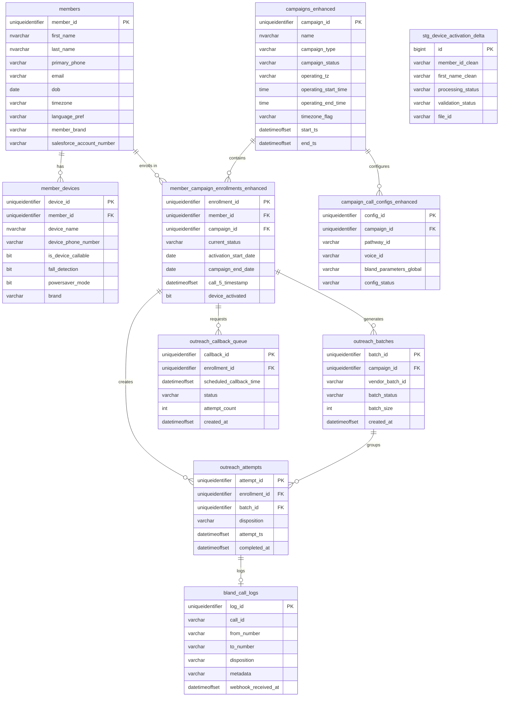

```mermaid
graph TB
    subgraph "Azure Functions"
        subgraph "File Processors (Blob Triggers)"
            FP1[device_activation_file_processor<br/>Blob: fs-device-activation/landing<br/>Filename: MedicalGuardian_DeviceActivation_*.csv]
            FP2[operations_device_activation_file_processor<br/>Blob: fs-ops/landing<br/>Campaigns: Medicaid, DTC/MA]
        end

        subgraph "Scheduler (Timer: Every 15 min)"
            SCHED[device_activation_scheduler<br/>Timer: 0 */15 * * * *<br/>HTTP: Manual execution]

            subgraph "Scheduler Services"
                ELIG[EligibilityService<br/>Business: Get eligible members]
                BATCH[BatchOrchestrator<br/>Business: 3-phase batch creation]
                CB[CallbackScheduler<br/>Business: Callback processing]
            end

            SCHED --> ELIG
            SCHED --> BATCH
            SCHED --> CB
        end

        subgraph "Webhook Processor (HTTP POST)"
            WH[bland_ai_webhook<br/>Endpoint: /api/bland_ai_webhook<br/>Auth: API key validation]

            subgraph "Webhook Services"
                DUP[DuplicateDetector<br/>Business: Prevent duplicate processing]
                STATUS[StatusMapper<br/>Business: Map dispositions]
                DORCH[DatabaseOrchestrator<br/>Business: Update all tables]
            end

            WH --> DUP
            WH --> STATUS
            WH --> DORCH
        end

        subgraph "Batch Reconciler (Timer: Every 5 min)"
            RECON[batch_completion_reconciler<br/>Timer: 0 */5 * * * *<br/>Business: Mark batches completed]
        end

        subgraph "Campaign Closure (Timer: Every hour)"
            CLOSURE[device_activation_campaign_closure<br/>Timer: 0 0 * * * *<br/>HTTP: Manual execution<br/>Business: Auto-unenroll 90-day expiry]

            subgraph "Closure Services"
                CLOSESVC[CampaignClosureService<br/>Business: 90-day window check]
                LOCK[DistributedLocking<br/>Business: Prevent concurrent runs]
            end

            CLOSURE --> CLOSESVC
            CLOSURE --> LOCK
        end
    end

    subgraph "Data Stores"
        BLOB[(Azure Blob Storage<br/>Containers:<br/>- fs-device-activation<br/>- fs-ops)]
        DB[(Azure SQL Database<br/>Schema: engage360<br/>Tables: 8 core + 1 staging)]
    end

    subgraph "External APIs"
        BLAND[Bland AI API<br/>Endpoint: /v1/batches<br/>Auth: 3-header pattern]
    end

    subgraph "Shared Services"
        CONFIG[ConfigManager<br/>Business: Azure Key Vault integration]
        DBSVC[DatabaseService<br/>Business: pymssql connection pool]
        BLANDCLIENT[BlandAIClient<br/>Business: Batch submission]
        TZCLIENT[TimezoneConverter<br/>Business: Timezone standardization]
    end

    FP1 --> BLOB
    FP2 --> BLOB
    FP1 --> DB
    FP2 --> DB
    FP1 --> CONFIG
    FP2 --> CONFIG
    FP1 --> DBSVC
    FP2 --> DBSVC

    ELIG --> DB
    ELIG --> DBSVC
    BATCH --> DB
    BATCH --> DBSVC
    BATCH --> BLAND
    BATCH --> BLANDCLIENT
    CB --> DB
    CB --> DBSVC
    CB --> TZCLIENT

    BLAND -.Webhook POST.-> WH
    WH --> DB
    WH --> DBSVC

    RECON --> DB
    RECON --> DBSVC

    CLOSESVC --> DB
    CLOSESVC --> DBSVC
    LOCK --> DB

    BLANDCLIENT --> CONFIG
    DBSVC --> CONFIG

    style FP1 fill:#E1F5FF
    style FP2 fill:#E1F5FF
    style SCHED fill:#FFF4E1
    style WH fill:#E8F5E9
    style RECON fill:#F3E5F5
    style CLOSURE fill:#FCE4EC
    style DB fill:#FFE0B2
    style BLAND fill:#FFF9C4
    style CONFIG fill:#E0E0E0
```

# Device Activation - System Architecture Diagrams

**Date:** 2025-12-24
**BusinessCaseID:** BC-DA-001 (Core Orchestration), BC-DA-002 (File Processing), BC-DA-004 (Batch Orchestration), BC-DA-007 (Campaign Closure), BC-102 (Webhook Processing - Shared)
**Purpose:** Visual documentation of Device Activation system components, database schema, and integration points

---

## Table of Contents

1. [Diagram 1: Component Architecture](#diagram-1-component-architecture)
2. [Diagram 2: Database Schema (ERD)](#diagram-2-database-schema-erd)
3. [Diagram 3: Integration Points & Data Flow](#diagram-3-integration-points--data-flow)

---

## Overview

The Device Activation system is built on Microsoft Azure using serverless Azure Functions for scalability and cost-efficiency. The architecture follows these principles:

- **Event-Driven:** Blob triggers for file processing, timer triggers for scheduling
- **Serverless:** Azure Functions with automatic scaling
- **Database-Centric:** SQL Server (engage360 schema) as source of truth
- **External Integration:** Bland AI for voice calls, Azure Blob Storage for file ingestion
- **3-Phase Tracking:** All batch submissions follow Pending → Submitted → Completed pattern

---

## Diagram 1: Component Architecture

### Purpose
Shows the Azure Functions, services, and their relationships for the Device Activation system.

### Mermaid Diagram



### ASCII Diagram

```
┌──────────────────────────────────────────────────────────────────────────────┐
│                           AZURE FUNCTIONS                                     │
├──────────────────────────────────────────────────────────────────────────────┤
│                                                                               │
│  ┌─────────────────────────────────────────────────────────────────────┐    │
│  │ FILE PROCESSORS (Blob Triggers)                                      │    │
│  ├─────────────────────────────────────────────────────────────────────┤    │
│  │                                                                       │    │
│  │  📂 device_activation_file_processor                                 │    │
│  │     • Blob Container: fs-device-activation/landing                   │    │
│  │     • Filename Pattern: MedicalGuardian_DeviceActivation_*.csv       │    │
│  │     • BusinessCaseID: BC-DA-002                                      │    │
│  │     • Function: 5-phase ETL pipeline                                 │    │
│  │                                                                       │    │
│  │  📂 operations_device_activation_file_processor                      │    │
│  │     • Blob Container: fs-ops/landing                                 │    │
│  │     • Campaigns: Medicaid (hardcoded), DTC/MA (hardcoded)            │    │
│  │     • BusinessCaseID: BC-DA-002, BC-DA-008                           │    │
│  │     • Function: Same 5-phase ETL, different campaign IDs             │    │
│  │                                                                       │    │
│  └─────────────────────────────────────────────────────────────────────┘    │
│                                  ↓                                            │
│  ┌─────────────────────────────────────────────────────────────────────┐    │
│  │ SCHEDULER (Timer Trigger: Every 15 minutes)                          │    │
│  ├─────────────────────────────────────────────────────────────────────┤    │
│  │                                                                       │    │
│  │  ⏰ device_activation_scheduler                                      │    │
│  │     • Timer: 0 */15 * * * * (every 15 min)                           │    │
│  │     • HTTP: /api/device_activation_scheduler (manual trigger)        │    │
│  │     • BusinessCaseID: BC-DA-001                                      │    │
│  │                                                                       │    │
│  │  ┌──────────────────────────────────────────────────────────┐       │    │
│  │  │ STEP 1: EligibilityService                               │       │    │
│  │  ├──────────────────────────────────────────────────────────┤       │    │
│  │  │ • Get eligible members (200+ line SQL query)             │       │    │
│  │  │ • Call 1-4 logic (2 biz days for Calls 2-3, 5 for Call 4│       │    │
│  │  │ • Call 5+ logic (7 CALENDAR days, 90-day window)         │       │    │
│  │  │ • Business hours validation (dual-timezone)              │       │    │
│  │  │ • Callback priority handling                             │       │    │
│  │  │ • BusinessCaseID: BC-DA-003, BC-DA-006                   │       │    │
│  │  └──────────────────────────────────────────────────────────┘       │    │
│  │                            ↓                                          │    │
│  │  ┌──────────────────────────────────────────────────────────┐       │    │
│  │  │ STEP 2: BatchOrchestrator                                │       │    │
│  │  ├──────────────────────────────────────────────────────────┤       │    │
│  │  │ • Split members into batches of 100 (Bland AI limit)     │       │    │
│  │  │ • Phase 1: Create batch (status='Pending')               │       │    │
│  │  │ • Phase 2: Create attempts (disposition='Pending')       │       │    │
│  │  │ • Submit to Bland AI via BlandAIClient                   │       │    │
│  │  │ • Phase 3: Update vendor_batch_id (status='Submitted')   │       │    │
│  │  │ • Update call_5_timestamp for Call 5+ enrollments        │       │    │
│  │  │ • BusinessCaseID: BC-DA-004, BC-DA-006                   │       │    │
│  │  └──────────────────────────────────────────────────────────┘       │    │
│  │                            ↓                                          │    │
│  │  ┌──────────────────────────────────────────────────────────┐       │    │
│  │  │ STEP 3: CallbackScheduler                                │       │    │
│  │  ├──────────────────────────────────────────────────────────┤       │    │
│  │  │ • Get pending callbacks (scheduled_time reached)         │       │    │
│  │  │ • Business hours validation (dual-timezone)              │       │    │
│  │  │ • Reschedule if business hours fail                      │       │    │
│  │  │ • Handle timeouts (24h OR 3 attempts)                    │       │    │
│  │  │ • Submit callbacks to BatchOrchestrator                  │       │    │
│  │  │ • BusinessCaseID: BC-DA-005                              │       │    │
│  │  └──────────────────────────────────────────────────────────┘       │    │
│  │                                                                       │    │
│  └─────────────────────────────────────────────────────────────────────┘    │
│                                  ↓                                            │
│  ┌─────────────────────────────────────────────────────────────────────┐    │
│  │ WEBHOOK PROCESSOR (HTTP POST)                                        │    │
│  ├─────────────────────────────────────────────────────────────────────┤    │
│  │                                                                       │    │
│  │  📨 bland_ai_webhook                                                 │    │
│  │     • Endpoint: /api/bland_ai_webhook                                │    │
│  │     • Auth: API key validation                                       │    │
│  │     • BusinessCaseID: BC-102 (Webhook - Shared across campaigns)    │    │
│  │                                                                       │    │
│  │  ┌──────────────────────────────────────────────────────────┐       │    │
│  │  │ Processing Pipeline:                                     │       │    │
│  │  ├──────────────────────────────────────────────────────────┤       │    │
│  │  │ 1. DuplicateDetector → Check call_id in bland_call_logs │       │    │
│  │  │ 2. StatusMapper → Map Bland AI disposition to internal  │       │    │
│  │  │ 3. DatabaseOrchestrator → Update 4-5 tables atomically  │       │    │
│  │  │    • outreach_attempts (disposition)                    │       │    │
│  │  │    • member_campaign_enrollments_enhanced (status)      │       │    │
│  │  │    • outreach_callback_queue (if callback requested)    │       │    │
│  │  │    • bland_call_logs (complete audit trail)             │       │    │
│  │  │    • member_enrollment_status_history (if status change)│       │    │
│  │  └──────────────────────────────────────────────────────────┘       │    │
│  │                                                                       │    │
│  └─────────────────────────────────────────────────────────────────────┘    │
│                                  ↓                                            │
│  ┌─────────────────────────────────────────────────────────────────────┐    │
│  │ BATCH RECONCILER (Timer Trigger: Every 5 minutes)                    │    │
│  ├─────────────────────────────────────────────────────────────────────┤    │
│  │                                                                       │    │
│  │  🔄 batch_completion_reconciler                                      │    │
│  │     • Timer: 0 */5 * * * * (every 5 min)                             │    │
│  │     • Function: Mark batches as Completed when all attempts done     │    │
│  │     • BusinessCaseID: BC-DA-004 (shared with BatchOrchestrator)      │    │
│  │     • Check: No 'Pending' attempts → Update batch_status             │    │
│  │                                                                       │    │
│  └─────────────────────────────────────────────────────────────────────┘    │
│                                  ↓                                            │
│  ┌─────────────────────────────────────────────────────────────────────┐    │
│  │ CAMPAIGN CLOSURE (Timer Trigger: Every hour)                         │    │
│  ├─────────────────────────────────────────────────────────────────────┤    │
│  │                                                                       │    │
│  │  🔒 device_activation_campaign_closure                               │    │
│  │     • Timer: 0 0 * * * * (every hour at :00 minutes)                 │    │
│  │     • HTTP: /api/device_activation_campaign_closure (manual trigger) │    │
│  │     • Function: Auto-unenroll members after 90-day window expires    │    │
│  │     • BusinessCaseID: BC-DA-007 (Campaign Closure)                   │    │
│  │                                                                       │    │
│  │  ┌──────────────────────────────────────────────────────────┐       │    │
│  │  │ Closure Pipeline:                                        │       │    │
│  │  ├──────────────────────────────────────────────────────────┤       │    │
│  │  │ 1. Distributed Lock → Prevent concurrent executions     │       │    │
│  │  │ 2. Query eligible enrollments → campaign_end_date passed│       │    │
│  │  │ 3. Update enrollment_status → 'Active' to 'UNENROLLED'  │       │    │
│  │  │ 4. Insert audit trail → member_enrollment_status_history│       │    │
│  │  │ 5. Release lock → Allow next execution                  │       │    │
│  │  └──────────────────────────────────────────────────────────┘       │    │
│  │                                                                       │    │
│  └─────────────────────────────────────────────────────────────────────┘    │
│                                                                               │
└──────────────────────────────────────────────────────────────────────────────┘
                                       ↕
┌──────────────────────────────────────────────────────────────────────────────┐
│                            DATA STORES                                        │
├──────────────────────────────────────────────────────────────────────────────┤
│                                                                               │
│  📦 Azure Blob Storage                                                       │
│     • Container: fs-device-activation (primary CSV uploads)                  │
│     • Container: fs-ops (operations team CSV uploads)                        │
│     • Subfolders: landing/, processed/, error/                               │
│                                                                               │
│  🗄️  Azure SQL Database                                                      │
│     • Server: ioe-sql-server.database.windows.net                            │
│     • Database: engage360                                                    │
│     • Core Tables: 8 (see Diagram 2)                                         │
│     • Staging Tables: 1 (engage360_stg.stg_device_activation_delta)          │
│                                                                               │
└──────────────────────────────────────────────────────────────────────────────┘
                                       ↕
┌──────────────────────────────────────────────────────────────────────────────┐
│                         EXTERNAL APIS                                         │
├──────────────────────────────────────────────────────────────────────────────┤
│                                                                               │
│  🤖 Bland AI API                                                             │
│     • Endpoint: https://api.bland.ai/v1/batches                              │
│     • Auth: 3-header pattern (authorization, encrypted_key, request_id)      │
│     • Function: Voice call automation                                        │
│     • Batch Limit: 100 calls per batch                                       │
│     • Webhook: POST to /api/bland_ai_webhook with call results               │
│                                                                               │
└──────────────────────────────────────────────────────────────────────────────┘
                                       ↕
┌──────────────────────────────────────────────────────────────────────────────┐
│                         SHARED SERVICES                                       │
├──────────────────────────────────────────────────────────────────────────────┤
│                                                                               │
│  🔑 ConfigManager (af_code/bland_ai_webhook/services/config_manager.py)     │
│     • Function: Retrieve secrets from Azure Key Vault                        │
│     • Secrets: SqlConnectionStringIOE, BlandAIkey, Blandaitwilio             │
│                                                                               │
│  🗄️  DatabaseService (af_code/bland_ai_webhook/services/database_service.py)│
│     • Function: pymssql connection pooling and query execution               │
│     • Pattern: execute_query(), execute_transaction()                        │
│                                                                               │
│  📞 BlandAIClient (af_code/shared/bland_ai_client.py)                        │
│     • Function: Submit batch calls to Bland AI                               │
│     • Pattern: submit_batch_calls(BatchRequest)                              │
│                                                                               │
│  🌍 TimezoneConverter (af_code/shared/timezone_utils.py)                    │
│     • Function: Standardize timezone names to pytz format                    │
│     • Example: 'EST' → 'America/New_York'                                    │
│                                                                               │
└──────────────────────────────────────────────────────────────────────────────┘
```

### Key Points

1. **Azure Functions (Serverless Architecture):**
   - **File Processors:** Event-driven blob triggers for CSV ingestion
   - **Scheduler:** Time-driven timer triggers every 15 minutes for call orchestration
   - **Webhook Processor:** HTTP endpoint for Bland AI call result callbacks
   - **Reconciler:** Housekeeping timer trigger every 5 minutes to mark batches completed
   - **Campaign Closure:** Timer trigger every hour to auto-unenroll expired 90-day campaigns

2. **File Processing Pattern:**
   - Two separate blob triggers for different campaigns (regular vs operations)
   - Operations processor has hardcoded campaign IDs for Medicaid and DTC/MA
   - Both use same 5-phase ETL pipeline (Extract → Load → Validate → Transform → Audit)
   - Code: `af_code/af_device_activation_logic.py` (shared), `functions/device_activation_file_processor.py`, `functions/operations_device_activation_file_processor.py`

3. **Scheduler Pattern (3-Step Orchestration):**
   - **Step 1: EligibilityService** - Query database for eligible members
   - **Step 2: BatchOrchestrator** - Create batches, submit to Bland AI, track results
   - **Step 3: CallbackScheduler** - Process pending callbacks with business hours validation
   - Code: `af_code/device_activation_scheduler/main_logic.py`

4. **Webhook Pattern (Atomic Updates):**
   - **Duplicate Detection:** Prevent processing same call_id twice
   - **Disposition Mapping:** Convert Bland AI dispositions to internal format
   - **Database Orchestration:** Update 4-5 tables in single transaction
   - Code: `af_code/bland_ai_webhook/` services

5. **Shared Services (Reusability):**
   - **ConfigManager:** Single source for Azure Key Vault secrets
   - **DatabaseService:** Connection pooling and transaction management
   - **BlandAIClient:** Standardized Bland AI API integration
   - **TimezoneConverter:** Consistent timezone handling across all functions
   - Code: `af_code/shared/`, `af_code/bland_ai_webhook/services/`

6. **Scalability:**
   - Azure Functions auto-scale based on load (blob uploads, timer triggers)
   - Database connection pooling prevents connection exhaustion
   - Batch size limit (100) prevents Bland AI API overload
   - Timer intervals (15 min scheduler, 5 min reconciler) balance responsiveness vs cost

### Related Code Files

- **Function Registration:** `function_app.py` (registers all blueprints)
- **File Processors:** `functions/device_activation_file_processor.py`, `functions/operations_device_activation_file_processor.py`
- **Scheduler:** `functions/device_activation_scheduler.py`, `af_code/device_activation_scheduler/main_logic.py`
- **Webhook:** `functions/bland_ai_webhook.py`, `af_code/bland_ai_webhook/` services
- **Reconciler:** `functions/batch_completion_reconciler.py`
- **Shared Services:** `af_code/shared/`, `af_code/bland_ai_webhook/services/`

---

## Diagram 2: Database Schema (ERD)

### Purpose
Shows the Entity-Relationship Diagram for the 8 core tables and 1 staging table used by Device Activation.

### Mermaid Diagram



### ASCII Diagram

```
┌─────────────────┐                 ┌──────────────────┐
│    members      │                 │ member_devices   │
├─────────────────┤                 ├──────────────────┤
│ PK member_id    │────────────────<│ FK member_id     │
│    first_name   │   1:N           │ PK device_id     │
│    last_name    │                 │    device_name   │
│    primary_phone│                 │    device_phone  │
│    email        │                 │    fall_detect.  │
│    dob          │                 │    powersaver    │
│    timezone     │                 │    brand         │
│    language_pref│                 └──────────────────┘
│    member_brand │
│    sf_acct_num  │
└────────┬────────┘
         │
         │ 1:N
         ↓
┌─────────────────────────────────┐        ┌──────────────────┐
│ member_campaign_enrollments_    │        │ campaigns_       │
│ enhanced                        │        │ enhanced         │
├─────────────────────────────────┤        ├──────────────────┤
│ PK enrollment_id                │────────>│ PK campaign_id   │
│ FK member_id                    │   N:1  │    name          │
│ FK campaign_id                  │        │    campaign_type │
│    current_status               │        │    status        │
│    activation_start_date        │        │    operating_tz  │
│    campaign_end_date            │        │    start_time    │
│    call_5_timestamp             │        │    end_time      │
│    device_activated             │        │    timezone_flag │
└────────┬────────────────────────┘        │    start_ts      │
         │                                  │    end_ts        │
         │                                  └────────┬─────────┘
         │                                           │
         │                                           │ 1:N
         │                                           ↓
         │                          ┌──────────────────────────────┐
         │                          │ campaign_call_configs_       │
         │                          │ enhanced                     │
         │                          ├──────────────────────────────┤
         │                          │ PK config_id                 │
         │                          │ FK campaign_id               │
         │                          │    pathway_id (Bland AI)     │
         │                          │    voice_id (Bland AI)       │
         │                          │    bland_params_global (JSON)│
         │                          │    config_status             │
         │                          └──────────────────────────────┘
         │
         ├─────────────────────────┬──────────────────┐
         │ 1:N                     │ 1:N              │ 1:N
         ↓                         ↓                  ↓
┌──────────────┐        ┌──────────────┐    ┌──────────────────┐
│outreach_     │        │outreach_     │    │outreach_callback_│
│batches       │        │attempts      │    │queue             │
├──────────────┤        ├──────────────┤    ├──────────────────┤
│PK batch_id   │───────<│FK batch_id   │    │PK callback_id    │
│FK campaign_id│  1:N   │PK attempt_id │    │FK enrollment_id  │
│vendor_batch  │        │FK enrollment │    │scheduled_time    │
│batch_status  │        │disposition   │    │status            │
│batch_size    │        │attempt_ts    │    │attempt_count     │
│created_at    │        │completed_at  │    │created_at        │
└──────────────┘        └──────┬───────┘    └──────────────────┘
                               │
                               │ 1:0..1
                               ↓
                        ┌──────────────────┐
                        │ bland_call_logs  │
                        ├──────────────────┤
                        │ PK log_id        │
                        │    call_id       │
                        │    from_number   │
                        │    to_number     │
                        │    disposition   │
                        │    metadata (JSON│
                        │    webhook_rx_at │
                        └──────────────────┘

Staging Table (Temporary):
┌─────────────────────────────┐
│ stg_device_activation_delta │
├─────────────────────────────┤
│ PK id (bigint)              │
│    member_id_clean          │
│    first_name_clean         │
│    last_name_clean          │
│    ... (23 total columns)   │
│    processing_status        │
│    validation_status        │
│    file_id                  │
│    created_at               │
└─────────────────────────────┘

Table Relationships:
━━━━━━━━━━━━━━━━━━━━━━━━━━━━━━━━━━━━━━━━━━━━━━━━━━
members (1) → (N) member_devices
  - One member can have multiple devices
  - FK: member_devices.member_id → members.member_id

members (1) → (N) member_campaign_enrollments_enhanced
  - One member can enroll in multiple campaigns
  - FK: member_campaign_enrollments_enhanced.member_id → members.member_id

campaigns_enhanced (1) → (N) member_campaign_enrollments_enhanced
  - One campaign contains multiple member enrollments
  - FK: member_campaign_enrollments_enhanced.campaign_id → campaigns_enhanced.campaign_id

campaigns_enhanced (1) → (N) campaign_call_configs_enhanced
  - One campaign has one or more Bland AI configurations
  - FK: campaign_call_configs_enhanced.campaign_id → campaigns_enhanced.campaign_id

member_campaign_enrollments_enhanced (1) → (N) outreach_batches
  - One enrollment generates multiple batches (over time)
  - FK: outreach_batches.enrollment_id → member_campaign_enrollments_enhanced.enrollment_id

member_campaign_enrollments_enhanced (1) → (N) outreach_attempts
  - One enrollment creates multiple call attempts
  - FK: outreach_attempts.enrollment_id → member_campaign_enrollments_enhanced.enrollment_id

outreach_batches (1) → (N) outreach_attempts
  - One batch contains 1-100 call attempts
  - FK: outreach_attempts.batch_id → outreach_batches.batch_id

outreach_attempts (1) → (0..1) bland_call_logs
  - Each attempt may have 0 or 1 call log (log created after webhook)
  - Relationship via call_id (not enforced FK due to timing)

member_campaign_enrollments_enhanced (1) → (N) outreach_callback_queue
  - One enrollment can have multiple callback requests (over time)
  - FK: outreach_callback_queue.enrollment_id → member_campaign_enrollments_enhanced.enrollment_id
```

### Key Points

1. **Core Tables (engage360 Schema):**
   - **members:** Master member/patient table (23 references across codebase)
   - **member_devices:** Device information (fall detection, powersaver mode, etc.)
   - **campaigns_enhanced:** Campaign configuration (operating hours, timezones)
   - **campaign_call_configs_enhanced:** Bland AI pathway and voice configuration
   - **member_campaign_enrollments_enhanced:** Junction table tracking member-campaign relationships
   - **outreach_batches:** Batch-level tracking for Bland AI submissions
   - **outreach_attempts:** Individual call attempt tracking
   - **outreach_callback_queue:** Callback request queue with timeout logic
   - **bland_call_logs:** Complete audit trail of all Bland AI webhook data

2. **Staging Table (engage360_stg Schema):**
   - **stg_device_activation_delta:** Temporary storage during CSV processing
   - Row lifecycle: CSV → Staging → Validation → Core tables
   - Supports error threshold logic (10% for staging, 50% for validation)
   - Cleaned after successful processing

3. **Key Foreign Key Relationships:**
   - All `member_id` foreign keys link to `members.member_id`
   - All `campaign_id` foreign keys link to `campaigns_enhanced.campaign_id`
   - All `enrollment_id` foreign keys link to `member_campaign_enrollments_enhanced.enrollment_id`
   - All `batch_id` foreign keys link to `outreach_batches.batch_id`

4. **UUID Primary Keys:**
   - All primary keys use `uniqueidentifier` (SQL Server UUID type)
   - Generated in Python as `uuid.uuid4()`, converted to string before SQL insert
   - Enables distributed ID generation without collisions

5. **Critical Columns:**
   - **activation_start_date:** Triggers Call 1 eligibility (delivery_date + 2 business days)
   - **call_5_timestamp:** Starts 90-day window for Call 5+ (NOT activation_start_date)
   - **campaign_end_date:** End of 90-day window (call_5_timestamp + 90 days)
   - **timezone_flag:** Controls timezone mode ('operating_tz' or 'member_tz')
   - **vendor_batch_id:** Links batch to Bland AI's internal ID (for webhook matching)

6. **Audit Trail:**
   - **bland_call_logs:** Complete webhook payload for every call (JSON metadata)
   - **member_enrollment_status_history:** Status change log (when current_status updates)
   - **outreach_attempts:** Complete call attempt history with timestamps
   - All tables have `created_at` and `updated_at` (DATETIMEOFFSET)

### SQL Table Definitions

See schema files for complete DDL:
- Core schema: `database/Context Engage360 schema.txt`
- Staging schema: `database/Context Engage360_stg schema.txt`

**Example: Get table schema using Grep:**
```bash
grep -i -A 50 "CREATE TABLE.*\[member_campaign_enrollments_enhanced\]" "database/Context Engage360 schema.txt"
```

### Related Code Files

- **Members Table:** Used in `af_code/af_device_activation_logic.py` (MERGE statement), `af_code/device_activation_scheduler/services/eligibility_service.py`
- **Enrollments Table:** Central to all scheduler logic, eligibility queries, status updates
- **Batches Table:** `af_code/device_activation_scheduler/services/batch_orchestrator.py` (3-phase tracking)
- **Attempts Table:** `af_code/bland_ai_webhook/services/database_orchestrator.py` (webhook updates)
- **Callback Queue:** `af_code/device_activation_scheduler/services/callback_scheduler.py`
- **Staging Table:** `af_code/af_device_activation_logic.py` (Phase 2 - Load to Staging)

---

## Diagram 3: Integration Points & Data Flow

### Purpose
Shows how data flows between external systems (Bland AI, Azure Blob Storage) and the Device Activation platform.

### Mermaid Diagram

```mermaid
sequenceDiagram
    participant VENDOR as External Vendor
    participant BLOB as Azure Blob Storage
    participant FILEPROC as File Processor Function
    participant DB as SQL Database
    participant SCHED as Scheduler Function
    participant BLAND as Bland AI API
    participant WH as Webhook Function

    Note over VENDOR,WH: Device Activation Data Flow (End-to-End)

    VENDOR->>BLOB: 1. Upload CSV file<br/>MedicalGuardian_DeviceActivation_YYYYMMDD_Delta.csv
    BLOB->>FILEPROC: 2. Blob trigger fires<br/>(blob created event)

    activate FILEPROC
    FILEPROC->>BLOB: 3. Download CSV to DataFrame
    FILEPROC->>FILEPROC: 4. Phase 1: Extract (Pandera validation)
    FILEPROC->>DB: 5. Phase 2: Load to Staging<br/>(INSERT into stg_device_activation_delta)
    DB-->>FILEPROC: 6. Row count, error count
    FILEPROC->>DB: 7. Phase 3: Validate (SQL cleansing)
    DB-->>FILEPROC: 8. Validation results
    FILEPROC->>DB: 9. Phase 4: Transform & Load Core<br/>(MERGE members, devices; INSERT enrollments)
    DB-->>FILEPROC: 10. Success confirmation
    FILEPROC->>BLOB: 11. Phase 5: Audit & Log<br/>(Move to processed/ folder)
    deactivate FILEPROC

    Note over SCHED,BLAND: Scheduler Runs Every 15 Minutes

    activate SCHED
    SCHED->>DB: 12. EligibilityService: Get eligible members<br/>(200+ line SQL query)
    DB-->>SCHED: 13. List of eligible members (Call 1-4, Call 5+, Callbacks)
    SCHED->>SCHED: 14. BatchOrchestrator: Split into batches of 100

    loop For each batch
        SCHED->>DB: 15. Phase 1: Create batch (status='Pending')
        DB-->>SCHED: 16. batch_id
        SCHED->>DB: 17. Phase 2: Create attempts (disposition='Pending')
        DB-->>SCHED: 18. Success
        SCHED->>BLAND: 19. Submit batch calls<br/>(POST /v1/batches)
        BLAND-->>SCHED: 20. vendor_batch_id, success
        SCHED->>DB: 21. Phase 3: Update vendor_batch_id (status='Submitted')
        DB-->>SCHED: 22. Success

        alt Call 5 or later
            SCHED->>DB: 23. Update call_5_timestamp<br/>(triggers 90-day window)
            DB-->>SCHED: 24. Success
        end
    end
    deactivate SCHED

    Note over BLAND,WH: Bland AI Makes Calls & Sends Webhooks

    activate BLAND
    BLAND->>BLAND: 25. Make voice calls to members
    BLAND->>WH: 26. POST /api/bland_ai_webhook<br/>(call results)
    deactivate BLAND

    activate WH
    WH->>WH: 27. DuplicateDetector: Check call_id
    WH->>WH: 28. StatusMapper: Map disposition
    WH->>DB: 29. DatabaseOrchestrator: Atomic update<br/>(4-5 tables in transaction)
    DB-->>WH: 30. Success
    WH-->>BLAND: 31. 200 OK (acknowledge webhook)
    deactivate WH

    Note over VENDOR,WH: Complete - Member contacted, results logged
```

### ASCII Diagram

```
External Vendor (CSV Source)
         │
         │ 1. Upload CSV file
         │    MedicalGuardian_DeviceActivation_20250115_Delta.csv
         ↓
┌──────────────────┐
│ Azure Blob       │
│ Storage          │
│                  │
│ Container:       │
│ fs-device-       │
│ activation/      │
│ landing/         │
└────────┬─────────┘
         │
         │ 2. Blob trigger fires (blob created event)
         ↓
┌──────────────────────────────────────────────────┐
│ File Processor Function                          │
│ (device_activation_file_processor)               │
├──────────────────────────────────────────────────┤
│ 3. Download CSV                                  │
│ 4. Phase 1: Extract (Pandera validation)        │
│ 5. Phase 2: Load to Staging                     │
│ 6. Check error threshold (<10%)                 │
│ 7. Phase 3: Validate (SQL cleansing)            │
│ 8. Phase 4: Transform & Load Core               │
│    • MERGE members                               │
│    • MERGE member_devices                        │
│    • INSERT member_campaign_enrollments_enhanced │
│ 9. Phase 5: Audit & Log                          │
│    • Move to processed/ folder                   │
└─────────────┬────────────────────────────────────┘
              │
              │ 10. Data now in database
              ↓
      ┌───────────────┐
      │ SQL Database  │
      │ (engage360)   │
      └───────┬───────┘
              │
              │ 11. Timer trigger fires (every 15 min)
              ↓
┌──────────────────────────────────────────────────┐
│ Scheduler Function                               │
│ (device_activation_scheduler)                    │
├──────────────────────────────────────────────────┤
│ 12. EligibilityService:                          │
│     • Execute 200+ line SQL query                │
│     • Filter by business hours (dual-timezone)   │
│     • Return eligible members                    │
│                                                  │
│ 13. BatchOrchestrator:                           │
│     • Split members into batches of 100          │
│     FOR EACH BATCH:                              │
│       ├─ Phase 1: Create batch (Pending)         │
│       ├─ Phase 2: Create attempts (Pending)      │
│       ├─ Submit to Bland AI ───────────┐         │
│       ├─ Receive vendor_batch_id       │         │
│       ├─ Phase 3: Update (Submitted)   │         │
│       └─ If Call 5: Update timestamp   │         │
│                                         │         │
│ 14. CallbackScheduler:                 │         │
│     • Get pending callbacks             │         │
│     • Validate business hours           │         │
│     • Reschedule or submit              │         │
└─────────────────────────────────────────┼─────────┘
                                          │
                                          │ 15. POST /v1/batches
                                          ↓
                                  ┌───────────────┐
                                  │ Bland AI API  │
                                  │               │
                                  │ • Make calls  │
                                  │ • Track calls │
                                  │ • Send results│
                                  └───────┬───────┘
                                          │
                                          │ 16. POST /api/bland_ai_webhook
                                          ↓
                          ┌───────────────────────────┐
                          │ Webhook Function          │
                          │ (bland_ai_webhook)        │
                          ├───────────────────────────┤
                          │ 17. DuplicateDetector     │
                          │     • Check call_id       │
                          │ 18. StatusMapper          │
                          │     • Map disposition     │
                          │ 19. DatabaseOrchestrator  │
                          │     • UPDATE attempts     │
                          │     • UPDATE enrollments  │
                          │     • INSERT callback?    │
                          │     • INSERT call_logs    │
                          │     • INSERT status_hist  │
                          └───────────┬───────────────┘
                                      │
                                      │ 20. Return 200 OK
                                      ↓
                              ┌───────────────┐
                              │ Bland AI API  │
                              │ (acknowledged)│
                              └───────────────┘

Integration Points Summary:
━━━━━━━━━━━━━━━━━━━━━━━━━━━━━━━━━━━━━━━━━━━━━━━━━━
1. Vendor → Blob Storage
   • Protocol: HTTPS upload
   • Format: CSV (23 columns)
   • Trigger: Manual upload or automated integration

2. Blob Storage → File Processor
   • Protocol: Azure Event Grid (blob created)
   • Frequency: Immediate (event-driven)
   • Pattern: MedicalGuardian_DeviceActivation_*.csv

3. File Processor → SQL Database
   • Protocol: pymssql (TDS)
   • Operations: INSERT, MERGE, UPDATE
   • Transaction: Atomic (5-phase pipeline)

4. Scheduler → SQL Database
   • Protocol: pymssql (TDS)
   • Operations: SELECT (eligibility), INSERT (batches/attempts), UPDATE (timestamps)
   • Frequency: Every 15 minutes

5. Scheduler → Bland AI API
   • Protocol: HTTPS POST
   • Endpoint: /v1/batches
   • Auth: 3-header pattern (authorization, encrypted_key, request_id)
   • Payload: BatchRequest (pathway_id, voice_id, calls, global params)

6. Bland AI API → Webhook Function
   • Protocol: HTTPS POST
   • Endpoint: /api/bland_ai_webhook
   • Auth: API key validation
   • Payload: Call results (call_id, disposition, metadata)
   • Timing: Real-time as calls complete

7. Webhook Function → SQL Database
   • Protocol: pymssql (TDS)
   • Operations: UPDATE (attempts, enrollments), INSERT (callbacks, logs, history)
   • Transaction: Atomic (all or nothing)
```

### Key Points

1. **CSV Upload (Vendor → Blob Storage):**
   - Vendor uploads CSV files via Azure Storage Explorer, AzCopy, or automated integration
   - Filename pattern: `MedicalGuardian_DeviceActivation_YYYYMMDD_Delta.csv`
   - Blob containers: `fs-device-activation/landing/` (primary) or `fs-ops/landing/` (operations)
   - File size: Typically 100-1000 rows per file

2. **File Processing (Blob → Database):**
   - Blob created event triggers Azure Function immediately
   - 5-phase ETL pipeline processes CSV (see Data Flow Diagram 1)
   - Success: File moved to `processed/` folder
   - Failure: File moved to `error/` folder with error log
   - Duration: 30-60 seconds per file (depending on size)

3. **Scheduling (Timer → Database → Bland AI):**
   - Timer trigger runs every 15 minutes (00:00, 00:15, 00:30, 00:45 of each hour)
   - Eligibility query returns 0-1000 members (varies by campaign size and time of day)
   - Batches of 20 members per scheduler run submitted to Bland AI (96 runs/day = max 1,920 members/day capacity)
   - 3-phase tracking ensures database consistency even if Bland AI submission fails
   - Duration: 1-10 minutes (depending on number of eligible members)

4. **Voice Calls (Bland AI → Members):**
   - Bland AI makes outbound voice calls to member phone numbers
   - Calls occur in real-time after batch submission (within minutes)
   - Pathway script guides conversation (device activation assistance)
   - Call duration: 1-5 minutes (varies by member engagement)

5. **Webhook Processing (Bland AI → Webhook Function → Database):**
   - Bland AI sends webhook POST immediately after each call completes
   - Webhook function processes 50-100 webhooks per hour (peak times)
   - Duplicate detection prevents reprocessing if Bland AI retries webhook
   - Atomic transaction updates 4-5 tables simultaneously
   - Duration: <1 second per webhook

6. **Data Consistency:**
   - All database operations use transactions (rollback on error)
   - Foreign key constraints enforce referential integrity
   - 3-phase batch tracking enables reconciliation if issues occur
   - Audit trail (bland_call_logs, status_history) enables troubleshooting

7. **Error Handling:**
   - File processing: 10% error threshold for staging, 50% for validation
   - Bland AI submission: Retry with exponential backoff (handled by BlandAIClient)
   - Webhook processing: 200 OK returned even if duplicate (idempotency)
   - Database errors: Logged to Azure Application Insights, transactions rolled back

### Performance Characteristics

- **File Processing Throughput:** 1 file per minute (parallelized across multiple functions if needed)
- **Scheduler Execution Time:** 1-10 minutes every 15 minutes (depends on eligible member count)
- **Bland AI Batch Submission Time:** 2-5 seconds per batch of 20 members
- **Webhook Processing Time:** <1 second per webhook (non-blocking, async)
- **Database Query Performance:** Eligibility query: 2-5 seconds; Batch creation: <1 second; Webhook updates: <1 second

### Related Code Files

- **Blob → File Processor:** `functions/device_activation_file_processor.py` (blob trigger registration)
- **File Processing Logic:** `af_code/af_device_activation_logic.py` (5-phase ETL)
- **Scheduler → Database:** `af_code/device_activation_scheduler/services/eligibility_service.py` (SQL query)
- **Scheduler → Bland AI:** `af_code/device_activation_scheduler/services/batch_orchestrator.py`, `af_code/shared/bland_ai_client.py`
- **Bland AI → Webhook:** `functions/bland_ai_webhook.py` (HTTP endpoint registration)
- **Webhook Processing:** `af_code/bland_ai_webhook/services/database_orchestrator.py` (atomic updates)

---

## Summary

These three architecture diagrams provide a complete view of the Device Activation system:

1. **Component Architecture:** Shows Azure Functions, services, and their interactions
2. **Database Schema:** Shows the 8 core tables, 1 staging table, and their relationships
3. **Integration Points:** Shows data flow from external vendors through Bland AI and back

**Key Architectural Principles:**

- **Event-Driven:** Blob uploads and timer triggers drive all processing
- **Serverless:** Azure Functions auto-scale based on load
- **Database-Centric:** SQL Server is single source of truth for all state
- **3-Phase Tracking:** All Bland AI batches follow Pending → Submitted → Completed pattern
- **Atomic Transactions:** Database updates are all-or-nothing to prevent inconsistency
- **Audit Trail:** Complete history preserved in bland_call_logs and status_history tables

**Integration Patterns:**

- **Push Model:** Vendors push CSV files to blob storage
- **Poll Model:** Scheduler polls database every 15 minutes for eligible members
- **Webhook Model:** Bland AI pushes call results to webhook endpoint in real-time

**Scalability Considerations:**

- Azure Functions auto-scale horizontally (up to 200 instances)
- Database connection pooling prevents connection exhaustion
- Batch size limit (100) prevents Bland AI API overload
- Timer intervals balance responsiveness (15 min) vs cost

**Related Documentation:**

- [Data Flow Diagrams](DEVICE_ACTIVATION_DATA_FLOW.md) - Detailed process flows
- [Call Sequence Diagrams](DEVICE_ACTIVATION_CALL_SEQUENCE.md) - Call timing and frequency
- [State Machine Diagrams](DEVICE_ACTIVATION_STATE_MACHINES.md) - Status transitions
- [Complete Architecture](../ARCHITECTURE/DEVICE_ACTIVATION_COMPLETE_ARCHITECTURE.md) - Master reference (pending creation)

---

**End of Document**
