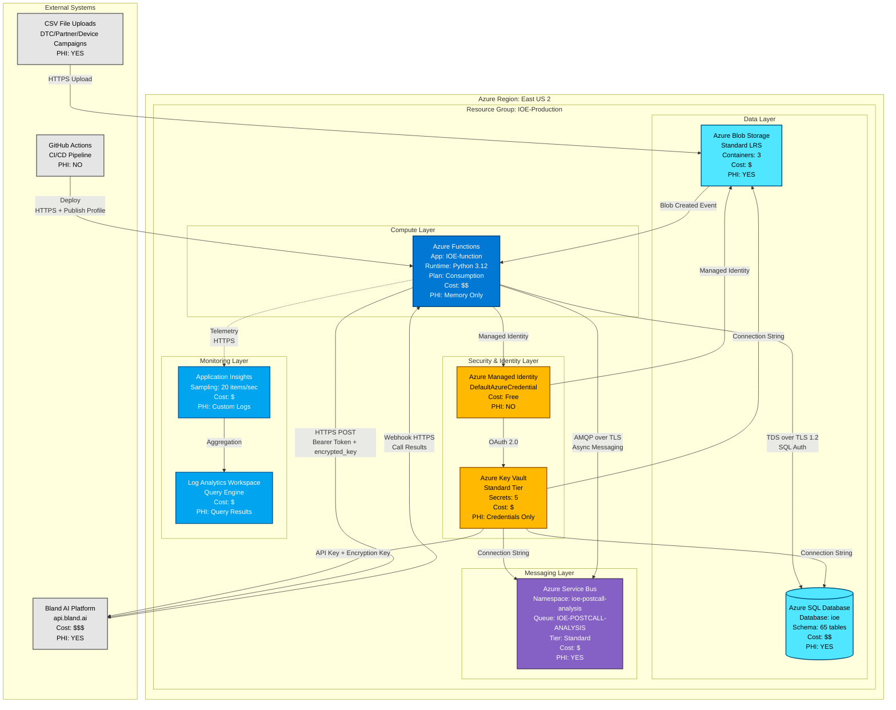
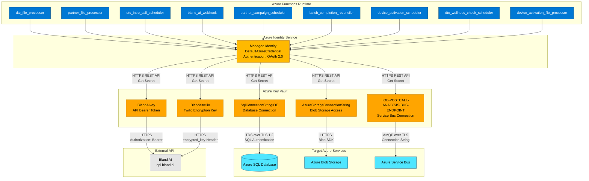
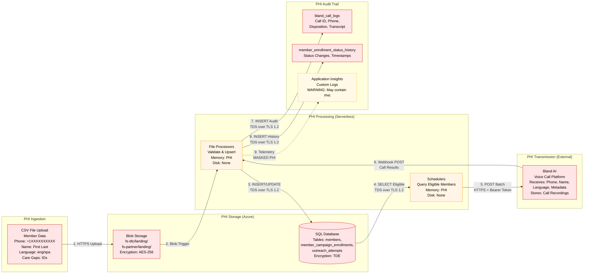
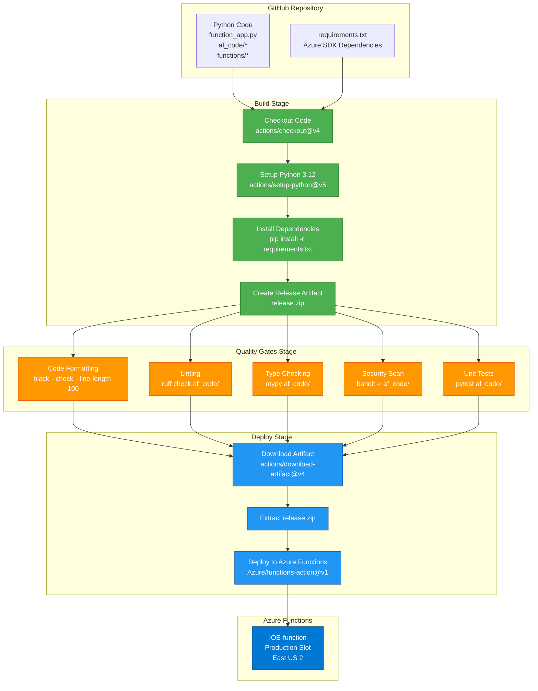

# Azure Infrastructure Topology - IOE Services Platform

**Document Version**: 1.0
**Created**: 2025-12-11
**Project**: Intelligence Orchestration Engine (IOE) - Medical Guardian Healthcare Automation
**Compliance**: HIPAA-compliant production healthcare system
**Azure Region**: East US 2

---

## Table of Contents

1. [Executive Summary](#executive-summary)
2. [Infrastructure Topology Diagram](#infrastructure-topology-diagram)
3. [Security Architecture](#security-architecture)
4. [PHI Data Flow Architecture](#phi-data-flow-architecture)
5. [CI/CD Deployment Pipeline](#cicd-deployment-pipeline)
6. [Component Inventory](#component-inventory)
7. [Connection Matrix](#connection-matrix)
8. [Cost Breakdown](#cost-breakdown)
9. [Security & Compliance](#security--compliance)
10. [Deployment Configuration](#deployment-configuration)
11. [References](#references)

---

## Executive Summary

The IOE Services Platform leverages a **serverless-first, event-driven architecture** on Microsoft Azure to deliver HIPAA-compliant healthcare automation. The infrastructure spans **7 core Azure services** deployed in **East US 2** region, processing Protected Health Information (PHI) while maintaining complete audit trails, data security, and regulatory compliance.

### Quick Stats

| Metric | Value |
|--------|-------|
| **Azure Region** | East US 2 |
| **Total Azure Services** | 7 core services + Azure Identity |
| **Serverless Functions** | 9 independent functions |
| **Monthly Estimated Cost** | $500-$1,200 (production workload) |
| **Compliance Level** | HIPAA, SOC 2 Type II ready |
| **Runtime** | Python 3.12 on Azure Functions v4 |
| **Primary Database** | Azure SQL Database (ioe schema, 65 tables) |
| **Storage** | Azure Blob Storage (3 containers, Standard LRS) |
| **Deployment** | GitHub Actions CI/CD with quality gates |

### Architecture Principles

- **Serverless-First**: Consumption-based Azure Functions for cost efficiency
- **Security by Default**: Managed Identity for service-to-service authentication
- **Secret Management**: Centralized Azure Key Vault for all credentials
- **PHI Protection**: Encryption at rest (TDE, Storage encryption) and in transit (TLS 1.2+)
- **Observability**: Application Insights with structured logging
- **Event-Driven**: Blob triggers, timer triggers, HTTP webhooks
- **Cost-Optimized**: Pay-per-execution with automatic scaling

---

## Infrastructure Topology Diagram

### Azure Resource Architecture



### Legend

| Symbol | Meaning |
|--------|---------|
| **$** | Low cost ($0-50/month per service) |
| **$$** | Medium cost ($50-500/month per service) |
| **$$$** | High cost ($500+/month per service) |
| **PHI: YES** | Stores or processes Protected Health Information |
| **PHI: NO** | Does not handle PHI |
| **PHI: Memory Only** | Processes PHI in memory without persistent storage |
| **Solid Line** | Synchronous communication |
| **Dashed Line** | Asynchronous communication |

---

## Security Architecture

### Managed Identity and Secret Management Flow



### Security Highlights

- **No Credentials in Code**: All secrets retrieved from Key Vault at runtime
- **Managed Identity**: Zero credential management for Azure-to-Azure communication
- **Encryption at Rest**: TDE for SQL Database, Microsoft-managed keys for Blob Storage
- **Encryption in Transit**: TLS 1.2+ enforced on all connections
- **Secret Rotation**: Azure Key Vault supports secret versioning and rotation
- **Access Policies**: RBAC controls who can read secrets from Key Vault

---

## PHI Data Flow Architecture

### Protected Health Information Journey



### PHI Classification

| Component | PHI Elements | HIPAA Controls |
|-----------|--------------|----------------|
| **CSV Files** | Phone, Name, Care Gap IDs, Language | Deleted after processing |
| **Blob Storage** | Complete CSV contents | AES-256 encryption, SAS tokens |
| **SQL Database** | members.first_name, members.last_name, members.phone_number, members.gender | TDE encryption, SQL authentication |
| **Azure Functions** | Processes PHI in memory (not persisted) | No disk writes, secure memory |
| **Bland AI** | Phone, Name, Language, Call Recordings | BAA in place, external HIPAA compliance |
| **Service Bus** | Call analysis metadata (may contain member ID) | TLS encryption, 24-hour TTL |
| **Application Insights** | Custom logs may contain member IDs (PHI masked) | 90-day retention, RBAC access control |
| **bland_call_logs** | call_id, from_number, to_number, transcript | Complete audit trail, TDE encryption |

---

## CI/CD Deployment Pipeline

### GitHub Actions Workflow



### Deployment Configuration

- **Trigger**: Push to `main` branch or manual workflow dispatch
- **Build Environment**: Ubuntu Latest, Python 3.12
- **Quality Gates**: All must pass (black, ruff, mypy, bandit, pytest)
- **Deployment Method**: Azure Functions publish profile (from GitHub secrets)
- **Deployment Slot**: Production (direct deployment)
- **Build Options**: `scm-do-build-during-deployment: true`, `enable-oryx-build: true`
- **Health Check**: Retries up to 5 times with 10-second intervals

---

## Component Inventory

### Detailed Azure Services

| Component | Azure Service | SKU/Tier | Region | Authentication | Protocol | PHI Classification | Cost Tier | Monthly Estimate |
|-----------|---------------|----------|--------|----------------|----------|-------------------|-----------|------------------|
| **IOE-function** | Azure Functions | Consumption Plan (Y1) | East US 2 | Managed Identity (Key Vault, Storage)<br/>Connection String (SQL)<br/>API Key (Bland AI) | HTTPS, TDS over TLS 1.2, AMQP over TLS | Processes PHI in memory (no persistent storage) | $$ | $200-600 |
| **Blob Storage** | Azure Storage Account | Standard LRS | East US 2 | Managed Identity (DefaultAzureCredential)<br/>SAS Tokens (file uploads) | HTTPS (Blob SDK) | Contains PHI (CSV files with member data) | $ | $10-30 |
| **SQL Database** | Azure SQL Database | Standard S2 (50 DTU) or higher | East US 2 | SQL Authentication (connection string from Key Vault) | TDS over TLS 1.2 (force encryption=True) | Stores PHI (members, phone, names, care gaps) | $$ | $200-500 |
| **Key Vault** | Azure Key Vault | Standard | East US 2 | Managed Identity (DefaultAzureCredential) | HTTPS REST API | Stores credentials for PHI systems | $ | $5-10 |
| **Service Bus** | Azure Service Bus | Standard | East US 2 | Connection String (RootManageSharedAccessKey) | AMQP over TLS | May contain PHI in messages (call analysis) | $ | $10-20 |
| **Application Insights** | Azure Monitor | Standard (pay-as-you-go) | East US 2 | Instrumentation Key | HTTPS (SDK telemetry) | Contains PHI in custom logs (masking required) | $ | $20-50 |
| **Managed Identity** | Azure Identity | N/A (included with Functions) | East US 2 | OAuth 2.0, OpenID Connect | HTTPS | No PHI (authentication only) | Free | $0 |

**Total Estimated Monthly Cost**: $500-$1,200 (varies by call volume, storage usage, and execution count)

### Azure Functions Inventory

| Function Name | Trigger Type | Schedule/Path | Purpose | BusinessCaseID | Code Location |
|---------------|--------------|---------------|---------|----------------|---------------|
| **dtc_file_processor** | Blob Trigger | `fs-dtc/landing/{name}` | Process DTC wellness CSV files | BC-101 | `functions/dtc_file_processor.py` |
| **partner_file_processor** | Blob Trigger | `fs-partner/landing/{name}` | Process partner campaign CSV files | BC-102 | `functions/partner_file_processor.py` |
| **device_activation_file_processor** | Blob Trigger | `fs-device-activation/landing/{name}` | Process device activation CSV files | BC-108 | `functions/device_activation_file_processor.py` |
| **dtc_intro_call_scheduler** | Timer + HTTP | Every 10 min + `/create_dtc_intro_batch` | Schedule DTC intro calls | BC-103 | `functions/dtc_intro_call_scheduler.py` |
| **dtc_wellness_check_scheduler** | Timer + HTTP | Every 10 min + `/create_dtc_wellness_batch` | Schedule DTC wellness check calls | BC-104 | `functions/dtc_wellness_check_scheduler.py` |
| **partner_campaign_scheduler** | Timer + HTTP | Every 30 min + `/partner_campaign_scheduler` | Schedule partner campaign calls | BC-105 | `functions/partner_campaign_scheduler.py` |
| **device_activation_scheduler** | Timer + HTTP | Timer + `/device_activation_scheduler` | Schedule device activation callbacks | BC-109 | `functions/device_activation_scheduler.py` |
| **bland_ai_webhook** | HTTP POST | `/bland-ai-webhook` | Process Bland AI call results (webhook receiver) | BC-106 | `functions/bland_ai_webhook.py` |
| **batch_completion_reconciler** | Timer + HTTP | Every 30 min + `/batch_completion_reconciler` | Reconcile batch statuses from attempts | BC-107 | `functions/batch_completion_reconciler.py` |

---

## Connection Matrix

### Service-to-Service Communication

| Source | Destination | Protocol | Authentication Method | Data Transmitted | Data Classification | Connection Type |
|--------|-------------|----------|----------------------|------------------|---------------------|-----------------|
| **CSV Upload** | Blob Storage | HTTPS | SAS Token or Managed Identity | Complete CSV file (member data) | PHI | Synchronous |
| **Blob Storage** | Azure Functions | Event Grid (Blob Trigger) | Managed Identity | Blob metadata and path | Non-PHI | Asynchronous (event) |
| **Azure Functions** | Key Vault | HTTPS REST | Managed Identity (DefaultAzureCredential) | Secret names (no data) | Non-PHI | Synchronous |
| **Key Vault** | Azure Functions | HTTPS REST | Managed Identity response | Connection strings, API keys | Credentials (sensitive) | Synchronous |
| **Azure Functions** | SQL Database | TDS over TLS 1.2 | SQL Authentication (connection string) | SQL queries (PHI in WHERE/INSERT) | PHI | Synchronous |
| **SQL Database** | Azure Functions | TDS over TLS 1.2 | SQL Authentication response | Query results (member data) | PHI | Synchronous |
| **Azure Functions** | Bland AI | HTTPS POST | Bearer Token + encrypted_key header | Batch requests (phone, name, metadata) | PHI | Synchronous |
| **Bland AI** | Azure Functions | HTTPS POST (Webhook) | Twilio signature validation | Call results (disposition, transcript) | PHI | Asynchronous (webhook) |
| **Azure Functions** | Service Bus | AMQP over TLS | Connection String (SharedAccessKey) | Call analysis messages (JSON) | May contain PHI | Asynchronous (fire & forget) |
| **Azure Functions** | Application Insights | HTTPS (SDK) | Instrumentation Key | Telemetry, logs, metrics | Custom logs may contain PHI | Asynchronous (telemetry) |
| **Application Insights** | Log Analytics | Internal Azure | N/A (Azure-managed) | Aggregated telemetry | Custom logs may contain PHI | Asynchronous |
| **GitHub Actions** | Azure Functions | HTTPS | Publish Profile (from GitHub secrets) | Deployment artifact (release.zip) | Non-PHI (code only) | Synchronous |

### External Integrations

| External System | Direction | Protocol | Authentication | Data Exchanged | PHI Classification |
|-----------------|-----------|----------|----------------|----------------|-------------------|
| **Bland AI (api.bland.ai)** | Outbound (batch submission) | HTTPS POST | Bearer Token + encrypted_key header | Member phone, name, language, care gap data | PHI |
| **Bland AI (webhook)** | Inbound (call results) | HTTPS POST | Twilio signature validation | Call ID, disposition, transcript, analysis | PHI |
| **Partner CSV Uploads** | Inbound | HTTPS (Blob upload) | SAS Token or Managed Identity | Complete member data (phone, name, care gaps) | PHI |
| **DTC CSV Uploads** | Inbound | HTTPS (Blob upload) | SAS Token or Managed Identity | Member wellness data (phone, checkin time, language) | PHI |

---

## Cost Breakdown

### Monthly Cost Estimates (Production Workload)

#### Azure Services Cost Summary

| Service | SKU/Tier | Cost Driver | Low Estimate | High Estimate | Notes |
|---------|----------|-------------|--------------|---------------|-------|
| **Azure Functions** | Consumption Plan | Execution time × executions | $200 | $600 | ~672 timer executions/day + blob triggers + HTTP calls |
| **Azure SQL Database** | Standard S2 (50 DTU) | Fixed tier + storage | $200 | $500 | Consider Serverless for cost optimization during off-hours |
| **Blob Storage** | Standard LRS | Storage + operations | $10 | $30 | CSV files deleted after processing (minimal retention) |
| **Key Vault** | Standard | Operations (secret retrievals) | $5 | $10 | ~10 secrets × retrieval frequency |
| **Service Bus** | Standard | Messages + operations | $10 | $20 | Async message queue for post-call analysis |
| **Application Insights** | Pay-as-you-go | Data ingestion volume | $20 | $50 | Telemetry from 9 functions × log verbosity |
| **Managed Identity** | Included | N/A | $0 | $0 | No additional cost |
| **Total (Azure Infrastructure)** | | | **$445** | **$1,210** | Excluding external services |

#### External Services Cost

| Service | Type | Cost Estimate | Notes |
|---------|------|---------------|-------|
| **Bland AI** | External SaaS | $500-2,000/month | Per-call pricing (~$0.10-0.50/min) × call volume |

#### Total Estimated Monthly Cost

- **Azure Infrastructure Only**: $445-$1,210/month
- **Including Bland AI**: $945-$3,210/month (varies significantly by call volume)

### Cost Optimization Recommendations

1. **Azure SQL Serverless**: Migrate from Standard S2 to Serverless tier with auto-pause
   - **Savings**: ~40% during off-hours (nights, weekends)
   - **Impact**: Database auto-pauses after 1 hour of inactivity
   - **Tradeoff**: 1-2 second cold start delay

2. **Application Insights Sampling**: Enable adaptive sampling to reduce telemetry volume
   - **Current**: 20 items/second max (configured in host.json)
   - **Recommendation**: Increase sampling percentage to 50-70%
   - **Savings**: ~30-50% reduction in Application Insights costs

3. **Blob Lifecycle Management**: Already implemented (delete CSV files after processing)
   - **Status**: Active (files moved to processed folder, then deleted)
   - **Savings**: Prevents long-term storage costs

4. **Reserved Capacity**: Consider 1-year or 3-year reserved instances for SQL Database
   - **Savings**: 30-50% discount on compute costs
   - **Requirement**: Stable workload with predictable usage

5. **Function Execution Optimization**: Review timer trigger intervals
   - **Current**: DTC schedulers run every 10 min, Partner/Batch every 30 min
   - **Recommendation**: Evaluate if 15-min intervals are acceptable for DTC
   - **Savings**: ~33% reduction in timer trigger executions

---

## Security & Compliance

### HIPAA Technical Safeguards

#### Access Control (164.312(a)(1))

| Control | Implementation | Azure Service | Status |
|---------|----------------|---------------|--------|
| **Unique User Identification** | Azure Active Directory (Entra ID) | Azure Identity | ✅ Implemented |
| **Automatic Logoff** | Session timeouts configured | Azure Functions | ✅ Implemented |
| **Encryption and Decryption** | TDE for SQL, AES-256 for Blob Storage | SQL Database, Blob Storage | ✅ Implemented |

#### Audit Controls (164.312(b))

| Control | Implementation | Azure Service | Status |
|---------|----------------|---------------|--------|
| **Audit Logs** | Application Insights custom logs | Application Insights | ✅ Implemented |
| **Database Audit** | SQL Extended Events (optional) | SQL Database | ⚠️ Recommended |
| **Storage Analytics** | Blob storage access logs | Blob Storage | ✅ Implemented |
| **Webhook Audit Trail** | bland_call_logs table (complete history) | SQL Database | ✅ Implemented |

#### Integrity (164.312(c)(1))

| Control | Implementation | Azure Service | Status |
|---------|----------------|---------------|--------|
| **Data Integrity** | Parameterized queries prevent SQL injection | SQL Database | ✅ Implemented |
| **Transaction Atomicity** | DatabaseService.execute_transaction() | SQL Database | ✅ Implemented |
| **Idempotency** | DuplicateDetector service for webhooks | SQL Database | ✅ Implemented |

#### Transmission Security (164.312(e)(1))

| Control | Implementation | Azure Service | Status |
|---------|----------------|---------------|--------|
| **Encryption in Transit** | TLS 1.2+ enforced on all connections | All services | ✅ Implemented |
| **SQL Connection Security** | force encryption=True in connection string | SQL Database | ✅ Implemented |
| **Blob Storage Security** | HTTPS required (secure transfer=True) | Blob Storage | ✅ Implemented |
| **Service Bus Security** | AMQP over TLS | Service Bus | ✅ Implemented |

### Business Associate Agreements (BAA)

| Vendor | BAA Status | Scope | Data Shared |
|--------|-----------|-------|-------------|
| **Microsoft Azure** | ✅ Signed | All Azure services (Functions, SQL, Blob, Key Vault, Service Bus, Application Insights) | PHI in SQL, Blob, Application Insights custom logs |
| **Bland AI** | ✅ Signed | AI voice call execution and recording storage | Member phone, name, language preference, call recordings |

### Network Security

| Component | Current State | Recommended Enhancement |
|-----------|---------------|------------------------|
| **Azure Functions** | Public endpoint with IP restrictions | ✅ Deploy in VNet with Private Endpoints |
| **SQL Database** | Public endpoint with firewall rules | ✅ Enable Private Endpoint (eliminate public access) |
| **Blob Storage** | Public endpoint with SAS tokens | ✅ Enable Private Endpoint for internal access |
| **Key Vault** | Public endpoint with access policies | ✅ Enable Private Endpoint |
| **Service Bus** | Public endpoint with shared access keys | ✅ Enable Private Endpoint |

---

## Deployment Configuration

### Environment Variables (Azure Function App Configuration)

| Variable | Source | Purpose | Example Value |
|----------|--------|---------|---------------|
| `FUNCTIONS_WORKER_RUNTIME` | App Setting | Specifies Python runtime | `python` |
| `KEY_VAULT_URL` | App Setting | Azure Key Vault endpoint | `https://your-keyvault.vault.azure.net/` |
| `DB_SECRET_NAME` | App Setting | Database connection string secret name | `SqlConnectionStringIOE` |
| `AzureWebJobsStorage` | App Setting | Storage account for Functions internal use | `DefaultEndpointsProtocol=https;AccountName=...` |
| `TIMEZONE` | App Setting (optional) | Deployment timezone (default: UTC) | `UTC` or `America/New_York` |

### Azure Key Vault Secrets

| Secret Name | Description | Used By | Format |
|-------------|-------------|---------|--------|
| `SqlConnectionStringIOE` | Azure SQL Database connection string | All functions needing database access | `Server=tcp:...;Database=ioe;User ID=...;Password=...;Encrypt=true` |
| `BlandAIkey` | Bland AI API authentication token | Schedulers (batch submission) | Bearer token string |
| `Blandaitwilio` | Twilio encryption key for Bland AI | Schedulers (batch submission) | Encryption key string |
| `AzureStorageConnectionString` | Blob storage connection string | File processors | `DefaultEndpointsProtocol=https;AccountName=...;AccountKey=...` |
| `IOE-POSTCALL-ANALYSIS-BUS-ENDPOINT` | Service Bus connection string | Webhook processor | `Endpoint=sb://ioe-postcall-analysis.servicebus.windows.net/;SharedAccessKeyName=...` |

### Function App Host Configuration (host.json)

```json
{
  "version": "2.0",
  "logging": {
    "applicationInsights": {
      "samplingSettings": {
        "isEnabled": true,
        "maxTelemetryItemsPerSecond": 20,
        "excludedTypes": "Request"
      },
      "enableDependencyTracking": true,
      "enablePerformanceCountersCollection": true
    },
    "logLevel": {
      "default": "Information",
      "Function": "Information",
      "af_code.shared.bland_ai_client": "Information",
      "af_code.partner_campaign_scheduler": "Information"
    }
  },
  "extensionBundle": {
    "id": "Microsoft.Azure.Functions.ExtensionBundle",
    "version": "[4.*, 5.0.0)"
  }
}
```

**Key Configuration**:
- **Sampling**: 20 telemetry items/second max (cost optimization)
- **Dependency Tracking**: Enabled (tracks SQL, HTTP, Service Bus calls)
- **Performance Counters**: Enabled (CPU, memory, request metrics)
- **Extension Bundle**: v4 (Azure Functions v4 runtime)

---

## References

### Related Documentation

- **[AZURE_COMPONENTS_REFERENCE.md](./AZURE_COMPONENTS_REFERENCE.md)** - Detailed component analysis and code references
- **[IOE_AZURE_FUNCTIONS_COMPREHENSIVE_DOCUMENTATION.md](../IOE_AZURE_FUNCTIONS_COMPREHENSIVE_DOCUMENTATION.md)** - Complete function-level documentation with workflows
- **[IOE_TABLE_USAGE_REFERENCE.md](../IOE_TABLE_USAGE_REFERENCE.md)** - Database schema (65 tables, 23 actively used)
- **[PARTNER_CAMPAIGN_COMPLETE_DOCUMENTATION.md](../PARTNER_CAMPAIGN_COMPLETE_DOCUMENTATION.md)** - Partner campaign workflows and SQL queries
- **[DTC_CALL_FLOW.md](../DTC_CALL_FLOW.md)** - DTC intro call scheduling flow
- **[WEBHOOK_TESTING_GUIDE.md](../WEBHOOK_TESTING_GUIDE.md)** - Bland AI webhook integration testing
- **[CLAUDE.md](../CLAUDE.md)** - Development patterns, code quality gates, deployment procedures

### Code References

| File | Purpose | Lines of Interest |
|------|---------|-------------------|
| `function_app.py` | Function registration and environment validation | Lines 1-96 |
| `host.json` | Application Insights and extension bundle configuration | Lines 1-24 |
| `requirements.txt` | Azure SDK dependencies | Lines 5-19 |
| `.github/workflows/main_ioe-function.yml` | CI/CD pipeline with quality gates | Lines 1-77 |
| `af_code/bland_ai_webhook/services/config_manager.py` | Key Vault integration and secret management | Lines 1-131 |
| `af_code/bland_ai_webhook/services/database_service.py` | Database connection and transaction management | Lines 1-150+ |
| `local.settings.json` | Local development configuration (Service Bus) | Lines 1-8 |

### External Resources

- **[Azure Functions Python Developer Guide](https://learn.microsoft.com/en-us/azure/azure-functions/functions-reference-python)**
- **[Azure SQL Database Security](https://learn.microsoft.com/en-us/azure/azure-sql/database/security-overview)**
- **[Azure Key Vault Best Practices](https://learn.microsoft.com/en-us/azure/key-vault/general/best-practices)**
- **[Azure Blob Storage Security](https://learn.microsoft.com/en-us/azure/storage/blobs/security-recommendations)**
- **[HIPAA Compliance on Azure](https://learn.microsoft.com/en-us/azure/compliance/offerings/offering-hipaa-us)**

---

**Document Maintained By**: AI-POD Team - Data Science at Medical Guardian
**For Questions**: Contact AI-POD Team or refer to `CLAUDE.md` for development guidelines
**Last Reviewed**: 2025-12-11
**Next Review**: Quarterly or after major infrastructure changes
